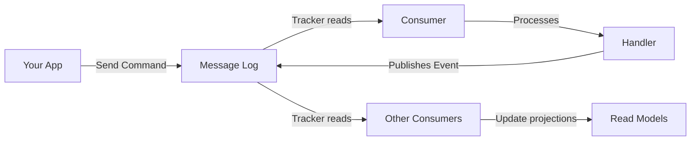
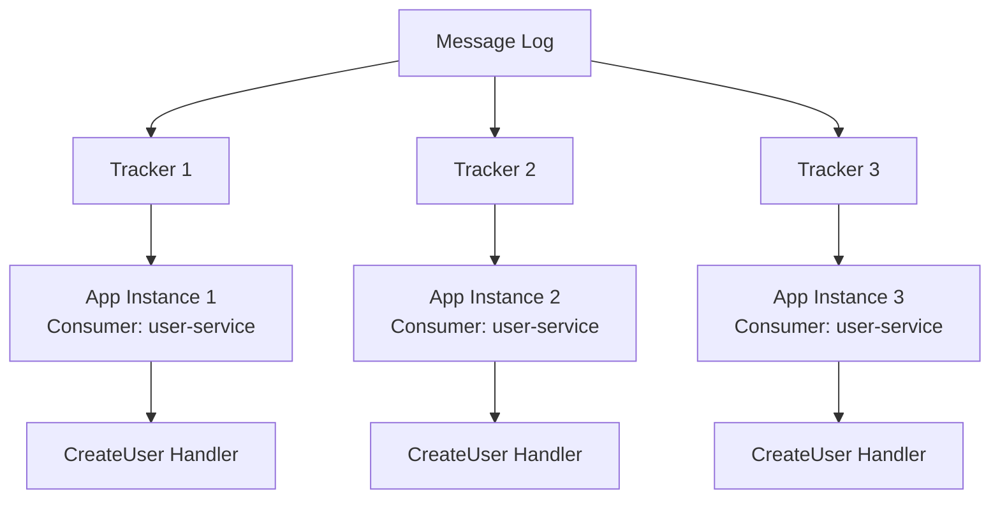
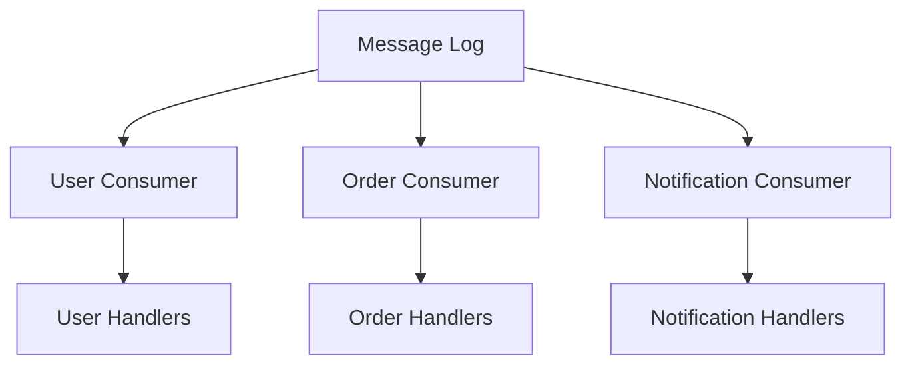

import { Tabs, TabItem, Card, CardGrid, Aside } from '@astrojs/starlight/components';

Fluxzero is a message-driven platform that radically simplifies distributed application development. Instead of dealing with complex service coordination, you focus on business logic while Fluxzero handles the underlying message flow, scaling, and coordination.

## Core Philosophy

Fluxzero is built on the principle that **most distributed system complexity comes from trying to coordinate services directly**. Instead, Fluxzero uses a **message-centric approach** where:

- **Services don't talk to each other directly** - they communicate through messages
- **The platform handles routing, scaling, and reliability** - you focus on business logic
- **Everything is event-driven** - commands, queries, and events flow through the same unified system

<Aside type="tip" title="Think of it like email">
Just as email allows people to communicate asynchronously without being online at the same time, Fluxzero allows services to communicate through messages without being directly connected.
</Aside>

## The Message Flow



Let's break down what happens when you send a message in Fluxzero:

### 1. Message Dispatch
When you call `FluxCapacitor.sendCommand(new CreateUser("Alice"))`, your message is:
- Serialized and given metadata (timestamps, correlation IDs, etc.)
- Sent to the **Message Log** - Fluxzero's distributed message storage
- Immediately returns control to your application

### 2. Message Distribution
The **Message Log** acts as a durable message queue that:
- Stores messages in order
- Guarantees delivery to all interested consumers
- Supports replay for rebuilding state or recovering from failures

### 3. Consumer Processing
**Consumers** are logical groups of message handlers that:
- Read messages from the log using **Trackers**
- Load balance processing across multiple application instances
- Handle different message types independently

### 4. Handler Execution
Your business logic handlers:
- Receive the message and any injected dependencies
- Execute your business logic
- Can publish new events or send commands as a result

## Key Components

<CardGrid>
<Card title="Messages" icon="document">
The data that flows through your system - commands, events, queries, and responses. Each message carries your business data plus metadata for routing and tracking.
</Card>

<Card title="Message Log" icon="list-format">
A distributed, durable log that stores all messages in order. Think of it as the "single source of truth" for everything that happens in your system.
</Card>

<Card title="Trackers" icon="magnifier">
Components that read messages from the log and deliver them to handlers. They track their position in the log and can replay messages from any point.
</Card>

<Card title="Consumers" icon="group">
Logical groups of handlers that process the same types of messages. Multiple application instances can share the same consumer name to load balance work.
</Card>

<Card title="Handlers" icon="rocket">
Your business logic code that processes messages. They're annotated with `@HandleCommand`, `@HandleEvent`, or `@HandleQuery` and contain your application logic.
</Card>

<Card title="Fluxzero Platform" icon="setting">
The infrastructure that manages message routing, persistence, scaling, and coordination. You don't need to manage this directly.
</Card>
</CardGrid>

## Message Types

Fluxzero supports different types of messages for different purposes:

<Tabs>
<TabItem label="Commands">
**Commands** represent a request to change something in the system.

```java
FluxCapacitor.sendCommand(new CreateUser("Alice"));
```

- **Intent**: "Please do something"
- **Routing**: Sent to a specific handler
- **Response**: Can return a result
- **Examples**: CreateUser, ProcessPayment, UpdateProfile
</TabItem>

<TabItem label="Events">
**Events** represent something that has happened in the system.

```java
FluxCapacitor.publishEvent(new UserCreated("Alice", userId));
```

- **Intent**: "Something happened"
- **Routing**: Broadcast to all interested handlers
- **Response**: Fire-and-forget
- **Examples**: UserCreated, PaymentProcessed, ProfileUpdated
</TabItem>

<TabItem label="Queries">
**Queries** represent a request for information.

```java
User user = FluxCapacitor.queryAndWait(new GetUser(userId));
```

- **Intent**: "Please tell me something"
- **Routing**: Sent to a specific handler
- **Response**: Always returns data
- **Examples**: GetUser, FindOrders, CalculateBalance
</TabItem>
</Tabs>

## Scaling and Load Balancing

One of Fluxzero's key strengths is how it handles scaling:

### Multiple Application Instances



When you have multiple instances of your application:
- Each instance gets its own **Tracker** that reads from the Message Log
- Messages are automatically load-balanced across instances
- If one instance fails, others continue processing
- You can scale up by simply starting more instances

### Consumer Groups

Different parts of your application can process different message types:



This allows you to:
- Scale different parts of your system independently
- Deploy updates to specific functionality without affecting others
- Isolate failures to specific domains

## Consistency and Reliability

Fluxzero provides several guarantees:

### Message Ordering
- Messages are processed in the order they were sent
- Per-aggregate consistency is maintained through routing keys
- Global ordering is available when needed

### Exactly-Once Processing
- Messages are processed exactly once, even if handlers fail
- Automatic retry with exponential backoff
- Dead letter handling for permanently failed messages

### Replay and Recovery
- The Message Log keeps all messages indefinitely
- You can replay messages from any point in time
- Perfect for rebuilding projections or recovering from data loss

## Getting Started

To build applications with this architecture:

1. **Define your messages** - Create simple POJOs for commands, events, and queries
2. **Write handlers** - Annotate methods with `@HandleCommand`, `@HandleEvent`, etc.
3. **Send messages** - Use `FluxCapacitor.sendCommand()`, `publishEvent()`, etc.
4. **Let Fluxzero handle the rest** - Scaling, routing, and reliability are automatic

The beauty of this architecture is that you can start simple and scale up without changing your code. Whether you're building a small application or a large distributed system, the patterns remain the same.

## Learn More

- **[Messages](/reference/core-components/message)** - Deep dive into message types and metadata
- **[Trackers](/reference/core-components/tracker)** - Understanding message consumption
- **[Consumers](/reference/core-components/consumer)** - Grouping and scaling handlers
- **[Handlers](/reference/core-components/handler)** - Writing your business logic
- **[Commands](/reference/core-components/command)** - Implementing state changes
- **[Events](/reference/core-components/event)** - Publishing and handling events
- **[Queries](/reference/core-components/query)** - Retrieving data