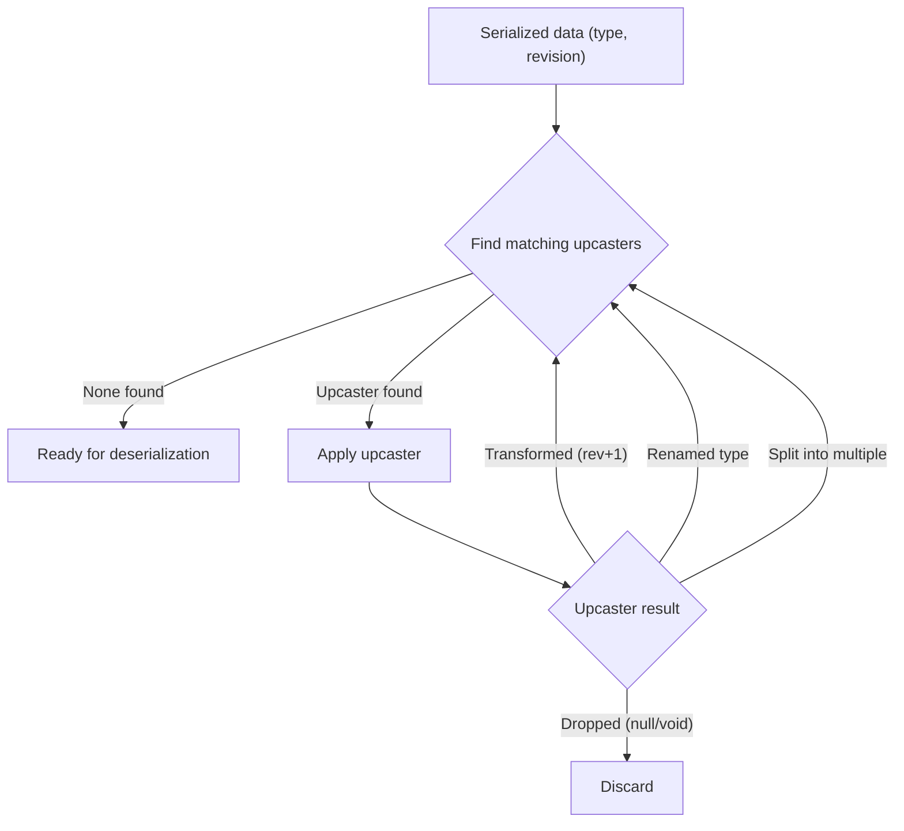

import { Aside, Tabs, TabItem } from '@astrojs/starlight/components';

Fluxzero uses a `Serializer` to convert message payloads, snapshots, key-value entries, and other stored data into
a binary format (typically `byte[]`). By default, the client uses a Jackson-based implementation that serializes objects
to JSON.

The serializer is fully pluggable, and you can supply your own by implementing or extending `AbstractSerializer`.

---

## Revisions

To track changes in your data model, annotate your class with `@Revision`. When deserializing, Fluxzero will use this
revision number to determine whether any transformation is required.

<Tabs>
  <TabItem label="Java">
    ```java
    @Revision(1)
    public record CreateUser(String userId) { // userId renamed from id
    }
    ```
  </TabItem>
  <TabItem label="Kotlin">
    ```kotlin
    @Revision(1)
    data class CreateUser(val userId: String) // userId renamed from id
    ```
  </TabItem>
</Tabs>

---

## Upcasting

Upcasting transforms a serialized object from an older revision to a newer one.

<Tabs>
  <TabItem label="Java">
    ```java
    class CreateUserUpcaster {

        @Upcast(type = "com.example.CreateUser", revision = 0)
        ObjectNode upcastV0toV1(ObjectNode json) {
            json.set("userId", json.remove("id"));
            return json;
        }
    }
    ```
  </TabItem>
  <TabItem label="Kotlin">
    ```kotlin
    class CreateUserUpcaster {

        @Upcast(type = "com.example.CreateUser", revision = 0)
        fun upcastV0toV1(json: ObjectNode): ObjectNode {
            json.set("userId", json.remove("id"))
            return json
        }
    }
    ```
  </TabItem>
</Tabs>

This method is applied before deserialization. The object is transformed as needed so your code always receives the
current version.

To also modify the **type name**, return a `Data<ObjectNode>`:

<Tabs>
  <TabItem label="Java">
    ```java
    @Upcast(type = "com.example.CreateUser", revision = 0)
    Data<ObjectNode> renameType(Data<ObjectNode> data) {
        return data.withType("com.example.RegisterUser");
    }
    ```
  </TabItem>
  <TabItem label="Kotlin">
    ```kotlin
    @Upcast(type = "com.example.CreateUser", revision = 0)
    fun renameType(data: Data<ObjectNode>): Data<ObjectNode> {
        return data.withType("com.example.RegisterUser")
    }
    ```
  </TabItem>
</Tabs>

You can even change a message’s metadata during upcasting:

<Tabs>
  <TabItem label="Java">
    ```java
    @Upcast(type = "com.example.CreateUser", revision = 0)
    SerializedMessage changeMetadata(SerializedMessage message) {
        return message.withMetadata(
                message.getMetadata().add("timestamp",
                        Instant.ofEpochMilli(message.getTimestamp()).toString())
        );
    }
    ```
  </TabItem>
  <TabItem label="Kotlin">
    ```kotlin
    @Upcast(type = "com.example.CreateUser", revision = 0)
    fun changeMetadata(message: SerializedMessage): SerializedMessage {
        return message.withMetadata(
            message.metadata.add("timestamp",
                Instant.ofEpochMilli(message.timestamp).toString()
            )
        )
    }
    ```
  </TabItem>
</Tabs>

This can be useful for retrofitting missing fields, adding tracing info, or migrating older messages to include
required metadata keys.

---

### Dropping or splitting messages

Upcasters can also drop a message by returning `null` or `void`, or split it into multiple new ones:

<Tabs>
  <TabItem label="Java">
    ```java
    @Upcast(type = "com.example.CreateUser", revision = 0)
    void dropIfDeprecated(ObjectNode json) {
        // returning void removes this message from the stream
    }

    @Upcast(type = "com.example.CreateUser", revision = 0)
    Stream<Data<ObjectNode>> split(Data<ObjectNode> data) {
        return Stream.of(data, new Data<>(...));
    }
    ```
  </TabItem>
  <TabItem label="Kotlin">
    ```kotlin
    @Upcast(type = "com.example.CreateUser", revision = 0)
    fun dropIfDeprecated(json: ObjectNode) {
        // returning Unit removes this message from the stream
    }

    @Upcast(type = "com.example.CreateUser", revision = 0)
    fun split(data: Data<ObjectNode>): Stream<Data<ObjectNode>> {
        return Stream.of(data, Data(...))
    }
    ```
  </TabItem>
</Tabs>

This works for any stored data — not just messages, but also snapshots, key-value entries, and documents.

---

## Upcasting flow

When a stored data object is deserialized, Fluxzero uses the object’s **type** and **revision** to traverse the tree of registered upcasters. Each upcaster specifies which type+revision it can handle, and may:

- Transform the data to the next revision,
- Change the type name,
- Split the object into multiple new ones,
- Or drop it entirely.

The traversal continues until no upcasters match the current type+revision, at which point the data is deserialized into a Java/Kotlin object.



<Aside type="note">
Each object may pass through multiple upcasters in sequence. Fluxzero guarantees that your application code only ever sees the latest revision.
</Aside>

---

## Downcasting

Downcasting does the reverse: it converts a newer object into an older format. This is useful for emitting
legacy-compatible data or supporting external systems.

<Tabs>
  <TabItem label="Java">
    ```java
    class CreateUserDowncaster {

        @Downcast(type = "com.example.CreateUser", revision = 1)
        ObjectNode downcastV1toV0(ObjectNode json) {
            json.set("id", json.remove("userId"));
            return json;
        }
    }
    ```
  </TabItem>
  <TabItem label="Kotlin">
    ```kotlin
    class CreateUserDowncaster {

        @Downcast(type = "com.example.CreateUser", revision = 1)
        fun downcastV1toV0(json: ObjectNode): ObjectNode {
            json.set("id", json.remove("userId"))
            return json
        }
    }
    ```
  </TabItem>
</Tabs>

To downcast an object to a desired revision, use:

<Tabs>
  <TabItem label="Java">
    ```java
    Fluxzero.downcast(object, revision);
    ```
  </TabItem>
  <TabItem label="Kotlin">
    ```kotlin
    Fluxzero.downcast(object, revision)
    ```
  </TabItem>
</Tabs>

<Aside type="note">
This returns the downcasted version of the object in serialized form (e.g., as an <code>ObjectNode</code>), allowing you to
inspect or persist the object as it would appear in an earlier revision.
</Aside>

---

## Registration

When using Spring, any bean containing `@Upcast` or `@Downcast` methods is automatically registered with the
serializer.

Outside of Spring, register them manually:

<Tabs>
  <TabItem label="Java">
    ```java
    serializer.registerCasters(new CreateUserUpcaster(), new CreateUserDowncaster());
    ```
  </TabItem>
  <TabItem label="Kotlin">
    ```kotlin
    serializer.registerCasters(CreateUserUpcaster(), CreateUserDowncaster())
    ```
  </TabItem>
</Tabs>

---

## How it works

- On deserialization:
  - Fluxzero detects the revision of the stored object
  - Applies all applicable `@Upcast` methods (in order)
  - Then deserializes into the latest version

- On serialization:
  - Fluxzero stores the latest type and revision
  - If needed, a `@Downcast` can adapt it for external use

All casting occurs in your application, not in the Fluxzero Runtime. Stored messages remain unchanged.

---

## Best practices

- Use `@Revision` to version any payloads that are stored or transmitted
- Use `ObjectNode` for simple structural changes, or `Data<ObjectNode>` to modify metadata
- Chain upcasters one revision at a time (`v0 → v1`, `v1 → v2`, etc.)
- Ensure upcasters are side-effect free and deterministic

<Aside type="note">
Upcasting is essential when using event sourcing or durable message storage — these messages may live for years.
</Aside>