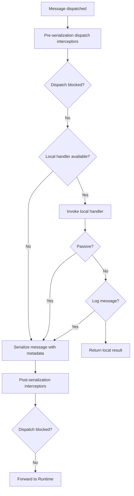

import { Tabs, TabItem } from '@astrojs/starlight/components';
import { Aside } from '@astrojs/starlight/components';

Fluxzero provides a unified way to send all types of messages — **commands**, **events**, **queries**, **schedules**, **web requests**, **metrics**, and more.

All messages are routed through the same infrastructure, with built-in support for:

- **Location transparency** — handlers may run locally or remotely, but behave the same
- **Dispatch interceptors** — for enriching, logging, suppressing, or validating messages
- **Local-first handling** — handlers in the current process are invoked directly
- **Automatic forwarding** to the Fluxzero Runtime if no local handler is present
- **Serialization and correlation** — all messages carry metadata for tracing, retries, and audit

---

## Sending a message

The simplest way to send messages is via static methods on the `Fluxzero` class:

<Tabs>
<TabItem value="Java" label="Java">

```java
Fluxzero.sendCommand(new CreateUser("Alice")); // Async command
Fluxzero.queryAndWait(new GetUser("user-123")); // Blocking query
Fluxzero.publishEvent(new UserSignedUp(...)); // Fire-and-forget event
Fluxzero.schedule(new RetryPayment(...), Duration.ofMinutes(5)); // Delayed schedule
```

</TabItem>
<TabItem value="Kotlin" label="Kotlin">

```kotlin
Fluxzero.sendCommand(CreateUser("Alice"))
Fluxzero.queryAndWait(GetUser("user-123"))
Fluxzero.publishEvent(UserSignedUp(...))
Fluxzero.schedule(RetryPayment(...), Duration.ofMinutes(5))
```

</TabItem>
</Tabs>

Messages can include metadata:

```java
Fluxzero.sendCommand(new CreateUser("Bob"),
                     Metadata.of("source", "admin-ui"));
```

<Aside type="tip">
  Messages are not addressed to specific destinations. Fluxzero handles routing based on message type, not location.
</Aside>

---

### Commands

Commands trigger domain behavior and optionally return a result.

**Fire-and-forget:**

```java
Fluxzero.sendAndForgetCommand(new CreateUser("Alice"));
```

**Send and wait:**

```java
UserId id = Fluxzero.sendCommandAndWait(new CreateUser("Charlie"));
```

**Async:**

```java
CompletableFuture<UserId> future =
    Fluxzero.sendCommand(new CreateUser("Bob"));
```

---

### Queries

Queries retrieve state from read models or projections.

**Blocking:**

```java
UserProfile profile =
    Fluxzero.queryAndWait(new GetUserProfile("user456"));
```

**Async:**

```java
CompletableFuture<UserProfile> result =
    Fluxzero.query(new GetUserProfile("user123"));
```

---

### Events

Events can be published via:

```java
Fluxzero.publishEvent(new UserLoggedIn("user789"));
```

By default:

- ✅ Events are **persisted** in the event log for downstream processing.
- ⚠️ If a **local handler exists**, the event will not be forwarded unless `@LocalHandler(logMessage = true)`.

<Aside type="tip">
  To publish an event for an entity, use <code>entity.apply(...)</code>. This ensures the event is conditionally logged and published according to entity configuration.
</Aside>

---

### Schedules

Schedule messages for future delivery:

```java
Fluxzero.schedule(new ReminderFired(), Duration.ofMinutes(5));
```

Schedule periodic tasks:

```java
Fluxzero.schedulePeriodic(new PollExternalApi());
```

---

### Web requests

Send outbound HTTP calls through the Fluxzero Runtime:

```java
WebRequest request = WebRequest
    .get("https://api.example.com/data").build();
WebResponse response = Fluxzero.get()
    .webRequestGateway().sendAndWait(request);
```

---

### Metrics

Send custom metric messages:

```java
Fluxzero.publishMetrics(
    new SystemLoadMetric(cpu, memory));
```

---

## Dispatch interceptors

A `DispatchInterceptor` lets you hook into the message pipeline before it’s published to Fluxzero or handled locally. Interceptors are a powerful way to enrich, validate, log, or even block messages at dispatch time.

<Tabs>
  <TabItem label="Java">
    ```java
    public class LoggingInterceptor implements DispatchInterceptor {
        @Override
        public Message interceptDispatch(Message message, MessageType type,
                                         String topic) {
            log.info("Dispatching: {} to topic {}", type, topic);
            return message;
        }
    }
    ```
  </TabItem>
  <TabItem label="Kotlin">
    ```kotlin
    class LoggingInterceptor : DispatchInterceptor {
        override fun interceptDispatch(message: Message, type: MessageType,
                                       topic: String): Message {
            log.info("Dispatching: {} to topic {}", type, topic)
            return message
        }
    }
    ```
  </TabItem>
</Tabs>

**What you can do with an interceptor:**

- `interceptDispatch(...)` — inspect, modify, or block a message before it’s dispatched
- `modifySerializedMessage(...)` — adjust the serialized form of a message before it’s sent across the wire
- `monitorDispatch(...)` — observe or log the final message as it leaves the system

To block dispatch, simply return `null` from the `interceptDispatch` method.

**Registering an interceptor globally**
<Tabs>
  <TabItem label="Java">
    ```java
    FluxzeroBuilder
        .addDispatchInterceptor(new LoggingInterceptor(), MessageType.COMMAND, MessageType.EVENT);
    ```
  </TabItem>
  <TabItem label="Kotlin">
    ```kotlin
    FluxzeroBuilder
        .addDispatchInterceptor(LoggingInterceptor(), MessageType.COMMAND, MessageType.EVENT)
    ```
  </TabItem>
</Tabs>

See [Configuring Fluxzero](/docs/guides/configuration/configuring-fluxzero) for details on registration.

---

## What happens after dispatch?

Fluxzero processes the message through the following pipeline:

### 1. Pre-serialization interceptors

All configured `DispatchInterceptor`s run first. They may:

- Inject or modify metadata
- Validate or mutate the message
- Block or suppress delivery

### 2. Local handlers

If a local handler matches the message type/topic, it’s invoked immediately. Otherwise, the message is forwarded.

<Aside type="tip">
  Local handlers with <code>@LocalHandler(logMessage = true)</code> allow messages to be both handled and forwarded.
</Aside>

### 3. Serialization

The message is serialized (typically via Jackson), tagged with metadata, and versioned for transport.

### 4. Post-serialization interceptors

A second pass of interceptors may adjust or enrich the serialized form before sending.

### 5. Runtime forwarding

Messages not handled locally are published to the Fluxzero Runtime. From there, delivery guarantees, retries, rate limits, and remote handler routing apply.

### Full dispatch flow

The diagram below illustrates the full dispatch pipeline. At each step, processing may end early if the message is blocked or suppressed.



---

## Routing keys

Sometimes you need all messages with the same identifier to be processed in order, while still allowing parallelism across unrelated entities. Fluxzero supports this through the <code>@RoutingKey</code> annotation.


Apply <code>@RoutingKey</code> to a field in your message payload (or metadata) to ensure that all messages sharing the same key are handled sequentially. This is especially useful for per-customer, per-order, or per-entity consistency.

Routing keys are converted into a hash using **consistent hashing** at dispatch time. This ensures even distribution across segments while maintaining order for messages that share the same key.

Handlers may also override the routing key for finer control. See [Custom routing keys](/docs/guides/messaging/message-tracking/#custom-routing-keys) for details.

### Examples
You can place the annotation directly on a field, or point it to a nested property path:

<Tabs>
<TabItem value="Java" label="Java">

```java
public record ShipOrder(@RoutingKey OrderId orderId) {
}
```

```java
@RoutingKey("customer/id")
public record OrderPlaced(Customer customer) {
}
```

</TabItem>
<TabItem value="Kotlin" label="Kotlin">

```kotlin
data class ShipOrder(
    @RoutingKey val orderId: OrderId
)
```

```kotlin
@RoutingKey("customer/id")
data class OrderPlaced(
    val customer: Customer
)
```

</TabItem>
</Tabs>

---

## Request timeouts

Apply `@Timeout` to a payload class (command or query) to enforce maximum wait time for blocking calls:

```java
@Timeout(value = 3, timeUnit = TimeUnit.SECONDS)
public record CalculatePremium(UserProfile profile)
    implements Request<BigDecimal> {}
```

When sent using `queryAndWait(...)`, this timeout is respected:

```java
BigDecimal result = Fluxzero
    .queryAndWait(new CalculatePremium(user));
```

If no response arrives in time, a `TimeoutException` is thrown.

<Aside type="tip">
  Asynchronous requests like <code>send(...)</code> don’t enforce timeouts automatically. Use <code>orTimeout(...)</code> on the returned `CompletableFuture` if needed.
</Aside>