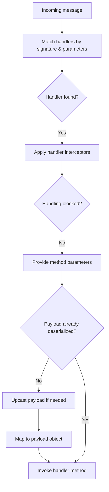

import { Aside, Tabs, TabItem } from '@astrojs/starlight/components';

Fluxzero is centered around sending and receiving messages — such as **commands**, **events**, **queries**, and **web requests**. These messages can originate from your own application or any other client connected to the same Fluxzero Runtime.

Handlers are simply methods annotated with `@HandleCommand`, `@HandleEvent`, `@HandleQuery`, etc. Here’s a basic example of an event handler that dispatches a command to send a welcome email when a user is created:

<Tabs>
<TabItem value="Java" label="Java">

```java
class UserEventHandler {
    @HandleEvent
    void handle(CreateUser event) {
        Fluxzero.sendCommand(new SendWelcomeEmail(event.getUserProfile()));
    }
}
```

</TabItem>
<TabItem value="Kotlin" label="Kotlin">

```kotlin
class UserEventHandler {
    @HandleEvent
    fun handle(event: CreateUser) {
        Fluxzero.sendCommand(SendWelcomeEmail(event.userProfile))
    }
}
```

</TabItem>
</Tabs>

This handler uses the static `sendCommand` method on Fluxzero, which works because the client is automatically injected into the thread-local context before message handling begins. This eliminates the need to inject `Fluxzero` into every handler.

---

To receive that command, define a corresponding command handler:

<Tabs>
<TabItem value="Java" label="Java">

```java
class EmailCommandHandler {
    @HandleCommand
    void handle(SendWelcomeEmail command) {
        // send welcome email to user
    }
}
```

</TabItem>
<TabItem value="Kotlin" label="Kotlin">

```kotlin
class EmailCommandHandler {
    @HandleCommand
    fun handle(command: SendWelcomeEmail) {
        // send welcome email to user
    }
}
```

</TabItem>
</Tabs>

Handlers can return a result (e.g., from queries or commands). The result is automatically published as a **Result** message and sent back to the originating client:

<Tabs>
<TabItem value="Java" label="Java">

```java
class UserQueryHandler {
    @HandleQuery
    UserProfile handle(GetUserProfile query) {
        // return the user profile
        return new UserProfile(...);
    }
}
```

</TabItem>
<TabItem value="Kotlin" label="Kotlin">

```kotlin
class UserQueryHandler {
    @HandleQuery
    fun handle(query: GetUserProfile): UserProfile {
        // return the user profile
        return UserProfile(...)
    }
}
```

</TabItem>
</Tabs>

To perform a query and wait synchronously for its result:

<Tabs>
<TabItem value="Java" label="Java">

```java
class PasswordEventHandler {
    @HandleEvent
    void handle(ResetPassword event) {
        UserProfile user = Fluxzero.queryAndWait(new GetUserProfile(event.getUserId()));
        // perform reset using user
    }
}
```

</TabItem>
<TabItem value="Kotlin" label="Kotlin">

```kotlin
class PasswordEventHandler {
    @HandleEvent
    fun handle(event: ResetPassword) {
        val user = Fluxzero.queryAndWait(GetUserProfile(event.userId))
        // perform reset using user
    }
}
```

</TabItem>
</Tabs>

## Returning futures

Handler methods may also return a `CompletableFuture<T>` instead of a direct value. Fluxzero will publish the result when the future completes:

<Tabs>
<TabItem value="Java" label="Java">

```java
class AsyncUserQueryHandler {
    @HandleQuery
    CompletableFuture<UserProfile> handle(GetUserProfile query) {
        return userService.fetchAsync(query.getUserId());
    }
}
```

</TabItem>
<TabItem value="Kotlin" label="Kotlin">

```kotlin
class AsyncUserQueryHandler {
    @HandleQuery
    fun handle(query: GetUserProfile): java.util.concurrent.CompletableFuture<UserProfile> {
        return userService.fetchAsync(query.userId)
    }
}
```

</TabItem>
</Tabs>

<Aside type="caution">
    Returning a future means Fluxzero considers the message *handled* when the future is returned, not when it completes. For business-critical flows, prefer synchronous returns (or `join()` explicitly) to keep back-pressure and acknowledgment semantics straightforward.
</Aside>

## Handler matching & passive handlers

Fluxzero resolves which handler(s) should run based on **message type** and **specificity**.

### Most specific handler wins

If multiple methods in the *same class* match a message, only the most specific one is invoked.

<Tabs>
<TabItem value="Java" label="Java">

```java
class SpecificityExample {
    @HandleEvent
    void handle(Object event) { /* generic fallback */ }

    @HandleEvent
    void handle(CreateUser event) { /* specific handler */ }
}
```

</TabItem>
<TabItem value="Kotlin" label="Kotlin">

```kotlin
class SpecificityExample {
    @HandleEvent
    fun handle(event: Any) { /* generic fallback */ }

    @HandleEvent
    fun handle(event: CreateUser) { /* specific handler */ }
}
```

</TabItem>
</Tabs>

### Multiple classes are all invoked

When different classes handle the same payload, each eligible handler runs independently.

<Tabs>
<TabItem value="Java" label="Java">

```java
class BusinessHandler {
    @HandleEvent
    void handle(CreateUser event) { /* business logic */ }
}

class LoggingHandler {
    @HandleEvent
    void log(Object event) { /* audit/metrics */ }
}
```

</TabItem>
<TabItem value="Kotlin" label="Kotlin">

```kotlin
class BusinessHandler {
    @HandleEvent
    fun handle(event: CreateUser) { /* business logic */ }
}

class LoggingHandler {
    @HandleEvent
    fun log(event: Any) { /* audit/metrics */ }
}
```

</TabItem>
</Tabs>

### Requests prefer a single active handler

For **commands**, **queries**, and **web requests**, a single non-passive handler should produce the response. Additional passive handlers can observe for metrics/auditing.

<Tabs>
<TabItem value="Java" label="Java">

```java
class UserHandler {
    @HandleQuery
    UserAccount handle(GetUser query) {
        return userRepository.find(query.getUserId());
    }
}

class QueryMetricsHandler {
    @HandleQuery(passive = true)
    void record(Object query) {
        metrics.increment("queries." + query.getClass().getSimpleName());
    }
}
```

</TabItem>
<TabItem value="Kotlin" label="Kotlin">

```kotlin
class UserHandler {
    @HandleQuery
    fun handle(query: GetUser): UserAccount {
        return userRepository.find(query.userId)
    }
}

class QueryMetricsHandler {
    @HandleQuery(passive = true)
    fun record(query: Any) {
        metrics.increment("queries.${query::class.simpleName}")
    }
}
```

</TabItem>
</Tabs>

## Parameter resolvers

Fluxzero allows fine-grained control over handler method parameters using the `ParameterResolver` interface. This lets you inject any value into annotated handler methods — beyond just the payload or Message metadata.

When a message is dispatched to a handler (e.g. via `@HandleEvent`, `@HandleCommand`, etc.), the framework inspects the method’s parameters and resolves each one using the configured `ParameterResolvers`.

By default, Fluxzero supports injection of the following:

- The message payload (automatically matched by parameter type)
- The full **`Message`**, **`Schedule`**, or **`WebRequest`**
- The raw **`DeserializingMessage`** (for low-level access)
- The message **`Metadata`**
- The currently authenticated **`User`** (if available)
- The associated **`Entity`** wrapper or the entity value itself
- The triggering message (annotated with `@Trigger`)
- Any Spring bean (when Spring integration is enabled)

Other contextual values like message ID or timestamp can be obtained from the `Message`:

<Tabs>
  <TabItem label="Java">
    ```java
    @HandleEvent
    void handle(CreateUser event, Message message) {
        log.info("User created at {}", message.getTimestamp());
    }
    ```
  </TabItem>
  <TabItem label="Kotlin">
    ```kotlin
    @HandleEvent
    fun handle(event: CreateUser, message: Message) {
        log.info("User created at {}", message.timestamp)
    }
    ```
  </TabItem>
</Tabs>

### Writing your own resolver

You can create a custom resolver to inject arbitrary values, such as headers, timestamps, or contextual objects:

<Tabs>
  <TabItem label="Java">
    ```java
    public class TimestampParameterResolver implements ParameterResolver<DeserializingMessage> {
        @Override
        public Function<DeserializingMessage, Object> resolve(Parameter parameter, Annotation methodAnnotation) {
            if (parameter.getType().equals(Instant.class)) {
                return DeserializingMessage::getTimestamp;
            }
            return null;
        }
    }
    ```
  </TabItem>
  <TabItem label="Kotlin">
    ```kotlin
    class TimestampParameterResolver : ParameterResolver<DeserializingMessage> {
        override fun resolve(parameter: Parameter, methodAnnotation: Annotation): Function<DeserializingMessage, Any>? {
            return if (parameter.type == Instant::class.java) {
                Function { msg -> msg.timestamp }
            } else null
        }
    }
    ```
  </TabItem>
</Tabs>

Then register it via your builder:

<Tabs>
  <TabItem label="Java">
    ```java
    DefaultFluxzero.builder()
        .addParameterResolver(new TimestampParameterResolver())
        .build();
    ```
  </TabItem>
  <TabItem label="Kotlin">
    ```kotlin
    DefaultFluxzero.builder()
        .addParameterResolver(TimestampParameterResolver())
        .build()
    ```
  </TabItem>
</Tabs>

And use it in your handler:

<Tabs>
  <TabItem label="Java">
    ```java
    @HandleCommand
    void handle(CreateOrder command, Instant timestamp) {
        log.info("Command received at {}", timestamp);
    }
    ```
  </TabItem>
  <TabItem label="Kotlin">
    ```kotlin
    @HandleCommand
    fun handle(command: CreateOrder, timestamp: Instant) {
        log.info("Command received at {}", timestamp)
    }
    ```
  </TabItem>
</Tabs>

### Use cases

- Injecting request-specific context (e.g. tracing info)
- Supporting custom annotations (e.g. `@FromHeader`)
- Enabling access to correlated data (e.g. parent entity)
- Binding to environment or system values

Custom parameter injection is a powerful tool for modular, contextual logic. It works seamlessly with all handler annotations (`@HandleEvent`, `@HandleCommand`, `@HandleQuery`, `@HandleError`, etc.) and helps avoid boilerplate argument passing.

## Handler interceptors

A `HandlerInterceptor` lets you wrap or intercept the execution of handler methods. This gives you a central place to add cross‑cutting behavior such as:

- **Authorization & access control** — block or allow messages depending on the current user
- **Auditing & logging** — capture details about incoming messages, handler calls, or results
- **Validation** — enforce extra business rules before or after handler execution
- **Blocking** — stop the handler from being invoked entirely
- **Result transformation** — adjust or enrich results before they are published
- **Thread context propagation** — set up thread‑local state (e.g. correlation IDs, security principals)

<Tabs>
  <TabItem label="Java">
    ```java
    public class AuthorizationInterceptor implements HandlerInterceptor {
        @Override
        public Function<DeserializingMessage, Object> interceptHandling(
                Function<DeserializingMessage, Object> next, HandlerInvoker invoker) {
            return message -> {
                if (!isAuthorized(message)) {
                    throw new UnauthorizedException();
                }
                return next.apply(message);
            };
        }
    }
    ```
  </TabItem>
  <TabItem label="Kotlin">
    ```kotlin
    class AuthorizationInterceptor : HandlerInterceptor {
        override fun interceptHandling(
            next: Function<DeserializingMessage, Any>, invoker: HandlerInvoker
        ): Function<DeserializingMessage, Any> {
            return Function { message ->
                if (!isAuthorized(message)) {
                    throw UnauthorizedException()
                }
                next.apply(message)
            }
        }
    }
    ```
  </TabItem>
</Tabs>

You can register handler interceptors either per class (via `@Consumer` annotation) or globally across the application.
See [Configuring Fluxzero](/docs/guides/configuration-and-support/configuring-fluxzero) for details.

## Handler invocation flow

The diagram below shows how Fluxzero selects and invokes handlers for an incoming message:



- Handlers are selected based on method signatures and parameter types.
- Interceptors can wrap the call or block invocation altogether.
- On invocation, the message payload is deserialized if needed, which may include **upcasting** followed by **mapping** to the target object type.