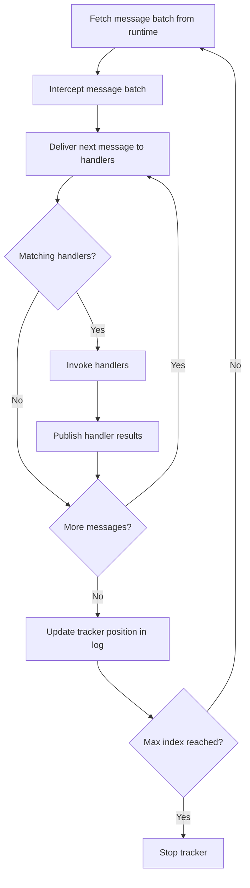

import { Tabs, TabItem } from '@astrojs/starlight/components';

Fluxzero handles message dispatch asynchronously by default. Messages are first written to the Fluxzero Runtime, where they are logged durably and made available to all subscribed consumers. From there, **consumers**, **trackers**, and **handlers** work together to process them.

- **Consumers** define a named subscription to a message type (commands, events, queries, etc.). Each consumer has its own position in the log and its own configuration (threads, fetch size, backpressure strategy).
- **Trackers** are the worker threads belonging to a consumer. A tracker fetches batches of messages from the Runtime and delivers them to handler methods. Multiple trackers per consumer enable parallelism.
- **Handlers** functionally process messages using annotated methods like `@HandleCommand`. You can configure which handlers belong to which consumers.

This separation makes Fluxzero highly flexible: you can isolate workloads into dedicated consumers, scale them independently, or run multiple consumers side by side in the same application.

## Tracking flow

The following diagram shows the lifecycle flow of a single tracker, responsible for fetching messages from the log and invoking the right handlers.
The process repeats in a continuous loop:



## Default Consumer Behavior

By default, handlers join the **default consumer** for a given message type. For example:

<Tabs>
<TabItem value="Java" label="Java">

```java
class MyHandler {
    @HandleCommand
    void handle(SomeCommand command) {
        // business logic here
    }
}
```

</TabItem>
<TabItem value="Kotlin" label="Kotlin">

```kotlin
class MyHandler {
    @HandleCommand
    fun handle(command: SomeCommand) {
        // business logic here
    }
}
```

</TabItem>
</Tabs>

This handler will automatically join the **default command consumer**. This means you get safe sequential processing with minimal configuration. However, you can also define your own isolated consumer with `@Consumer` to control concurrency, batch size, and fault isolation. This is useful when certain message flows require dedicated resources or stricter ordering.

## Custom Consumers with @Consumer

The `@Consumer` annotation creates a new, named consumer that runs independently of the default one. Each consumer maintains its own trackers and log position. This lets you:

- Isolate heavy or latency-sensitive message flows into their own consumer.
- Tune concurrency (via `threads`) and throughput (via `maxFetchSize`) separately.
- Deploy multiple consumers side by side in the same app, each with dedicated resources.

<Tabs>
<TabItem value="Java" label="Java">

```java
@Consumer(name = "MyConsumer")
class MyHandler {
    @HandleCommand
    void handle(SomeCommand command) {
        // business logic
    }
}
```

</TabItem>
<TabItem value="Kotlin" label="Kotlin">

```kotlin
@Consumer(name = "MyConsumer")
class MyHandler {
    @HandleCommand
    fun handle(command: SomeCommand) {
        // business logic
    }
}
```

</TabItem>
</Tabs>

To apply this to an entire package (and its subpackages), add a `package-info.java` file:

```java
@Consumer(name = "MyConsumer")
package com.example.handlers;
```

### Customizing consumer configuration

You can also tune the behavior using additional attributes on the `@Consumer` annotation:

<Tabs>
<TabItem value="Java" label="Java">

```java
@Consumer(name = "MyConsumer", threads = 2, maxFetchSize = 100)
class MyHandler {
    @HandleCommand
    void handle(SomeCommand command) {
        // business logic
    }
}
```

</TabItem>
<TabItem value="Kotlin" label="Kotlin">

```kotlin
@Consumer(name = "MyConsumer", threads = 2, maxFetchSize = 100)
class MyHandler {
    @HandleCommand
    fun handle(command: SomeCommand) {
        // business logic
    }
}
```

</TabItem>
</Tabs>

- `threads = 2`: Two threads per application instance will fetch commands.
- `maxFetchSize = 100`: Up to 100 messages fetched per request, helping apply backpressure.

Each thread runs a **tracker**. If you deploy the app multiple times, Fluxzero automatically load-balances messages across all available trackers.

## Consumer settings

Fluxzero provides conservative defaults to ensure safe and sequential processing:

| Setting                | Description | Default value             |
|------------------------|-------------|---------------------------|
| `threads`              | Number of tracker threads. Each thread owns a disjoint segment of the log. | `1`                       |
| `maxFetchSize`         | Maximum messages per batch; balances throughput and memory. | `1024`                    |
| `maxWaitDuration`      | How long to wait before polling again if no messages are available. | `60`                      |
| `durationUnit`         | Time unit for `maxWaitDuration`. | `SECONDS`                 |
| `errorHandler`         | Logs processing errors and continues. | `LoggingErrorHandler`     |
| `flowRegulator`        | Default backpressure strategy; no throttling. | `NoOpFlowRegulator`       |
| `filterMessageTarget`  | If true, only messages targeted to this instance are processed. | `false`                   |
| `ignoreSegment`        | If true, bypasses Runtime sharding and processes all segments. | `false`                   |
| `singleTracker`        | If true, a single tracker processes all messages in strict global order. | `false`                   |
| `clientControlledIndex`| If true, the app decides which messages to process. | `false`                   |
| `storePositionManually`| If true, the app must commit tracker position explicitly. | `false`                   |
| `exclusive`            | Handlers are active in only one consumer. | `true`                    |
| `passive`              | If true, handler results are ignored and not published to the result log. | `false`                   |
| `minIndex`             | Negative means start at the end of the log (only new messages). | `-1`                      |
| `maxIndexExclusive`    | Negative means no upper bound. | `-1`                      |
| `typeFilter`           | No server-side filtering; all message types are delivered. | `""` (empty)              |

## Custom routing keys

By default, Fluxzero uses **128 segments** to balance parallelism and ordering guarantees. These segments are evenly split across available trackers to distribute load efficiently. The `ignoreSegment` configuration, when set to `true`, means that each tracker receives all messages regardless of segment assignment. This allows filtering and routing to be applied at the client or handler level using custom routing keys rather than relying on segment-based filtering. The `singleTracker` option can be enabled to force all segments to be managed by a single tracker instance, simplifying ordering at the cost of scalability.

To enable client-side filtering using a custom routing key, annotate your handler class with `@Consumer(name = "...", ignoreSegment = true)`. Then, use the `@RoutingKey` annotation on your handler method (or class) to specify which field to use for routing.

<Tabs>
  <TabItem value="java" label="Java">

```java
@Consumer(name = "order-processor", ignoreSegment = true)
class OrderProcessor {
    @HandleCommand
    @RoutingKey("paymentId")
    void handle(SubmitOrder command) {
        // Handler logic here, routing messages by paymentId instead of segment
    }
}
```

  </TabItem>
  <TabItem value="kotlin" label="Kotlin">

```kotlin
@Consumer(name = "order-processor", ignoreSegment = true)
class OrderProcessor {
    @HandleCommand
    @RoutingKey("paymentId")
    fun handle(command: SubmitOrder) {
        // Handler logic here, routing messages by paymentId instead of segment
    }
}
```

  </TabItem>
</Tabs>

---

## Batch interceptors

A `BatchInterceptor` wraps the execution of an entire message batch processed by a single consumer. This makes it well-suited for cross-cutting concerns such as:

- **Structured logging** — log once per batch instead of per message
- **Performance instrumentation** — measure batch latency, throughput, or error rates
- **Scoped resources** — manage transactions or other resources that should span the whole batch

Example: the following interceptor filters out any messages tagged with `testOnly` in their metadata:

<Tabs>
  <TabItem label="Java">
    ```java
    MappingBatchInterceptor filterTestMessages = (batch, tracker) -> {
        var filtered = batch.getMessages().stream()
                .filter(m -> !m.getMetadata().containsKey("testOnly"))
                .toList();
        return batch.withMessages(filtered);
    };
    ```
  </TabItem>
  <TabItem label="Kotlin">
    ```kotlin
    val filterTestMessages = MappingBatchInterceptor { batch, _ ->
        val filtered = batch.messages.stream()
            .filter { !it.metadata.containsKey("testOnly") }
            .toList()
        batch.withMessages(filtered)
    }
    ```
  </TabItem>
</Tabs>

By applying a `BatchInterceptor`, you can centralize logic that would otherwise need to be repeated in every handler. See [Configuring Fluxzero](/docs/guides/configuration-and-support/configuring-fluxzero) for details on how to register interceptors.