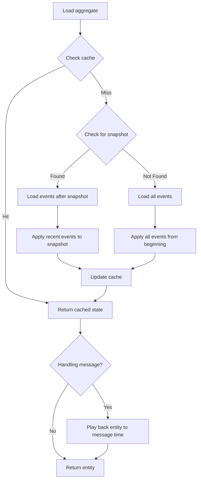
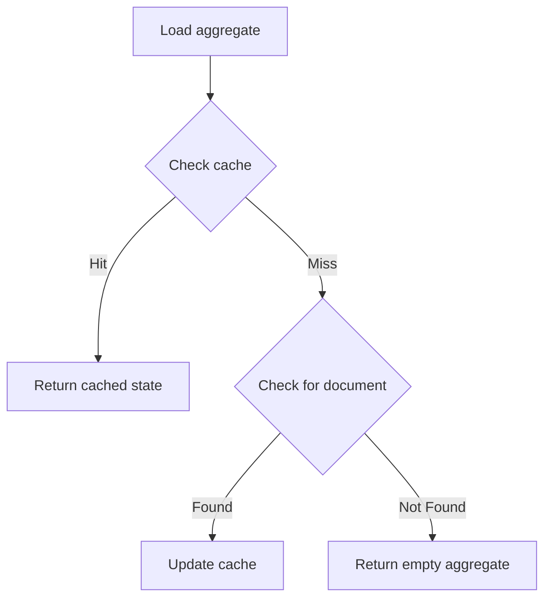

import { Aside, Tabs, TabItem } from '@astrojs/starlight/components';

Fluxzero allows you to model the state of your domain using entities that evolve over time by applying updates. These entities — such as users, orders, etc. — maintain state and enforce invariants through controlled updates, typically driven by commands.

To inspect or update the state of an entity, start by retrieving its aggregate with `Fluxzero.loadAggregate(...)`.

## Event-sourced entities

Event Sourcing is the default persistence strategy in Fluxzero. The current state is reconstructed by replaying a stream of past updates. Rather than persisting only the latest snapshot, Fluxzero stores every change as an event, and the full history can be replayed to rebuild state at any point in time.

By default, event sourced aggregates use the following loading strategy:



Each event that is applied during event-sourcing is deserialized and routed to the corresponding `@Apply` method to reconstruct the aggregate’s entity graph.

- If no such method exists for a given event, the event is silently ignored.
- If the event class itself is missing, deserialization will fail unless `ignoreUnknownEvents = true` is set on the aggregate.

### Loading inside handlers

If you load an event-sourced `Entity` while handling a message (for example inside an `@HandleEvent` method), Fluxzero automatically plays the entity back to the exact version that matches the message’s index. You don’t get the latest state, but the state as it was when the message occurred.

If the application cache is still behind, Fluxzero waits until it has caught up before returning the entity. This prevents stale reads and guarantees consistency.

By keeping caches in sync, Fluxzero makes it easy to safely load event-sourced entities anywhere.
This makes it possible to depend on event-sourced, state-aware entities directly within any of your handlers
— *often eliminating the need for separate projections or read models altogether.*

#### Example: detecting significant balance change

<Tabs>
  <TabItem label="Java">
    ```java
    public class FraudMonitor {

        @HandleEvent
        void handle(Entity<BankAccount> entity) {
            BankAccount current = entity.get();
            BankAccount previous = entity.previous().get();

            if (hasSuspiciousDelta(previous, current)) {
                Fluxzero.publishEvent(new AdminNotification(
                        "Unusual balance change on account %s"
                                .formatted(current.getAccountId())));
            }
        }

        boolean hasSuspiciousDelta(BankAccount previous, BankAccount current) {
            if (previous == null || current == null) {
                return false;
            }
            BigDecimal delta = current.getBalance()
                    .subtract(previous.getBalance()).abs();
            return delta.compareTo(BigDecimal.valueOf(10_000)) > 0;
        }
    }
    ```
  </TabItem>
  <TabItem label="Kotlin">
    ```kotlin
    class FraudMonitor {

        @HandleEvent
        fun handle(entity: Entity<BankAccount>) {
            val current = entity.get()
            val previous = entity.previous().get()

            if (hasSuspiciousDelta(previous, current)) {
                Fluxzero.publishEvent(
                    AdminNotification(
                        "Unusual balance change on account ${current.accountId}"
                    )
                )
            }
        }

        fun hasSuspiciousDelta(previous: BankAccount?, current: BankAccount?): Boolean {
            if (previous == null || current == null) return false
            val delta = current.balance.subtract(previous.balance).abs()
            return delta > BigDecimal.valueOf(10_000)
        }
    }
    ```
  </TabItem>
</Tabs>

In this example:

- The aggregate (`BankAccount`) is automatically synchronized with the current event.
- The handler can access both the current and previous versions.
- It uses these to detect large balance changes.
- No external query or projection is required — this is consistent state straight from the event log.

## Document-based entities

If event-sourcing is disabled but searchable is enabled (`@Aggregate(eventSourcing = false, searchable = true)`),
aggregates are loaded as follows:



<Aside type="caution">
Note: Document-based aggregates cannot be played back to a specific message version. When loaded inside a handler, you always get the latest state.
</Aside>