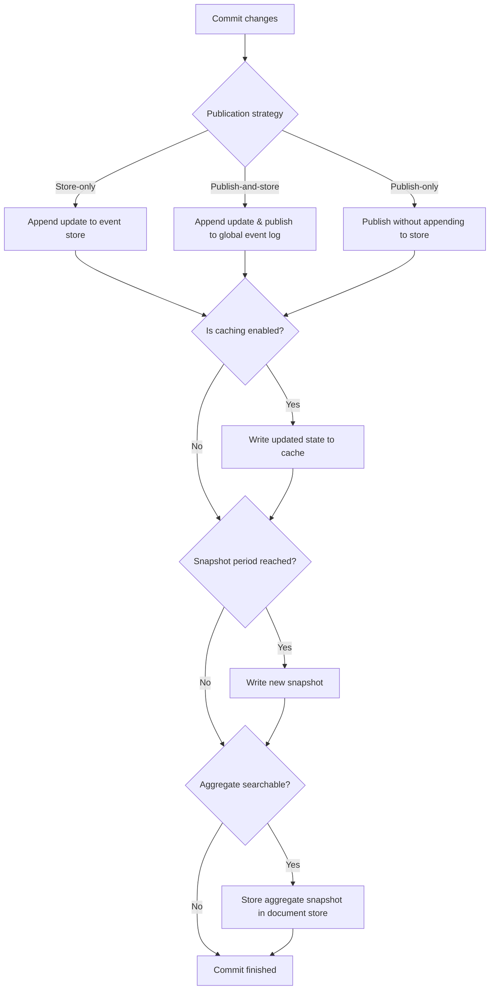

import { Tabs, TabItem } from '@astrojs/starlight/components';
import { Aside } from '@astrojs/starlight/components';

Fluxzero supports multiple strategies for loading and storing aggregates:

- **Event sourcing**: state is derived by replaying a stream of applied updates (events)
- **Document storage**: the full aggregate is stored as a document
- **In-memory only**: ephemeral state, not persisted across messages

By default, aggregates use **event sourcing** (`@Aggregate(eventSourced = true)`), but you can configure each aggregate individually.

## Event-sourcing

By default, Fluxzero stores aggregates as a series of updates (events) that were applied using `@Apply` methods.

When an event-sourced aggregate is loaded it is called event-sourcing. During event-sourcing, each event is re-applied
to the agggregate to rebuild the current state. See [Entity loading]((/docs/guides/modeling-and-persistence/entity-loading/)) for more information.

<Aside type="tip" title="Real-world analogy">
Think of event sourcing like a smart home's activity log. Instead of just knowing "the living room light is on", you have a complete history:

- "8:00 AM - Motion detected, light turned on",
- "8:30 AM - Manual dimming to 50%",
- "6:00 PM - Automatic brightness increase".

You can replay this log to understand exactly how the light got to its current state.
</Aside>

Event-sourcing will be suitable for most of your aggregates, especially your core domain objects and business processes.

As event-sourcing is the default for aggregates it is enough to mark your aggregate class with `@Aggregate`:

<Tabs>
  <TabItem label="Java">
    ```java
    @Aggregate
    public record ShopItem(@EntityId ItemId itemId,
                           ItemDetails details) {
    }
    ```
  </TabItem>
  <TabItem label="Kotlin">
    ```kotlin
    @Aggregate
    data class ShopItem(
        @EntityId val itemId: ItemId,
        val details: ItemDetails
    )
    ```
  </TabItem>
</Tabs>

---

## Document storage

Fluxzero can also store aggregates as documents in a searchable document store. This is useful for:

- Read-heavy aggregates
- Aggregates with large histories
- Reference models that don’t need event streams

To enable document storage, set `searchable = true` in the `@Aggregate` annotation:

<Tabs>
  <TabItem label="Java">
    ```java
    @Aggregate(eventSourced = false, searchable = true, collection = "countries")
    public record Country(@EntityId String countryCode,
                          String name) {
    }
    ```
  </TabItem>
  <TabItem label="Kotlin">
    ```kotlin
    @Aggregate(eventSourced = false, searchable = true, collection = "countries")
    data class Country(
        @EntityId val countryCode: String,
        val name: String
    )
    ```
  </TabItem>
</Tabs>

<Aside type="note">
The `collection` defaults to the simple class name of the aggregate. You can also configure a time-range for the document with `timestampPath` and `endPath` for temporal queries.
</Aside>

A document-based entity can still use:

- `@InterceptApply` to block or modify updates
- `@AssertLegal` to validate updates
- `@Apply` to compute and update state

Each applied update overwrites the document in the store and, by default, is also stored and published as an event. If you want to disable event publication, use `@Aggregate(eventPublication = NEVER)`.

<Aside type="caution">
If you disable event publication, also disable caching — otherwise you risk inconsistent state between application instances.
</Aside>

---

## Dual persistence

You can combine both strategies by enabling `eventSourced = true` and `searchable = true`.

Fluxzero will:

- Store events for replay and auditing
- Index the latest version as a document for fast retrieval and search

<Tabs>
  <TabItem label="Java">
    ```java
    @Aggregate(searchable = true)
    public record Order(@EntityId OrderId orderId,
                        OrderDetails details) {
    }
    ```
  </TabItem>
  <TabItem label="Kotlin">
    ```kotlin
    @Aggregate(searchable = true)
    data class Order(
        @EntityId val orderId: OrderId,
        val details: OrderDetails
    )
    ```
  </TabItem>
</Tabs>

This hybrid approach is ideal when you need both traceability and query speed.

<Aside type="caution">
If you set `eventSourced = false` and do not enable `searchable`, the aggregate will not be persisted. Its state will only live in memory during message processing — not recommended unless for purely transient behavior.
</Aside>

## Persistence behavior

You can further customize the persistence behavior of aggregates using settings in `@Aggregate`:

- `eventPublication`: prevent events when nothing has changed
- `publicationStrategy`: store-only vs publish-and-store
- `snapshotPeriod`: replace aggregate snapshot after every N updates
- `searchable`: store aggregate in document store after each commit

<Tabs>
  <TabItem label="Java">
    ```java
    @Aggregate(snapshotPeriod = 1000)
    public record UserAccount(@EntityId UserId userId,
                              UserProfile profile) {

        @Apply
        UserAccount apply(UpdateProfile update) {
            return toBuilder().profile(update.getProfile()).build();
        }
    }
    ```
  </TabItem>
  <TabItem label="Kotlin">
    ```kotlin
    @Aggregate(snapshotPeriod = 1000)
    data class UserAccount(
        @EntityId val userId: UserId,
        val profile: UserProfile
    ) {
        @Apply
        fun apply(update: UpdateProfile): UserAccount {
            return copy(profile = update.profile)
        }
    }
    ```
  </TabItem>
</Tabs>

---

## Caching and checkpoints

Fluxzero automatically caches aggregates after loading or applying updates unless `@Aggregate(cached = false)`. This enables:

- Fast reuse of recently loaded aggregates
- Automatic rehydration from snapshots or partial checkpoints (when configured)

You can tune cache behavior with:

- `cached`: disable shared cache
- `cachingDepth`: how many versions to retain (enables `.previous()` access)
- `checkpointPeriod`: how often to insert intermediate checkpoints

Aggregates of a given type can also be configured to use their own dedicated cache with `FluxzeroBuilder#withAggregateCache(...)`.
See [Configuring Fluxzero](/docs/guides/configuration-and-support/configuring-fluxzero/) for more details.

---

## Commits and rollbacks

Once an aggregate is updated successfully and no errors occur during message handling, its changes are eventually committed.

However, if a handler fails, all updates performed within that handler are rolled back automatically:

<Tabs>
  <TabItem label="Java">
    ```java
    @HandleCommand
    void handle(DualUpdate command) {
        Fluxzero.loadAggregate(command.firstId())
                .assertAndApply(command.firstUpdate()); // succeeds
        Fluxzero.loadAggregate(command.secondId())
                .assertAndApply(command.secondUpdate()); // fails
    }
    ```
  </TabItem>
  <TabItem label="Kotlin">
    ```kotlin
    @HandleCommand
    fun handle(command: DualUpdate) {
        Fluxzero.loadAggregate(command.firstId())
            .assertAndApply(command.firstUpdate()) // succeeds
        Fluxzero.loadAggregate(command.secondId())
            .assertAndApply(command.secondUpdate()) // fails
    }
    ```
  </TabItem>
</Tabs>

In this example, both updates are rolled back because the second apply fails — ensuring atomic consistency across aggregates.

---

### Commit timing

By default, updates are committed only after the currently tracked message batch completes, *not immediately*. This means:
- Updates are locally cached (per tracker thread) until the batch is processed.
- Unnecessary round-trips to the Fluxzero runtime are avoided during batch processing.

You can change this behavior by setting `@Aggregate(commitInBatch = false)`, which will commit changes at the end of
the current message instead. You can even commit manually at any time using `Entity#commit()`.

<Aside>
If an aggregate is updated outside the context of a message or message batch entirely, commits happen immediately after each update.
</Aside>

---

### Commit process

When an aggregate is committed, Fluxzero processes each updated aggregate individually through the following steps:

