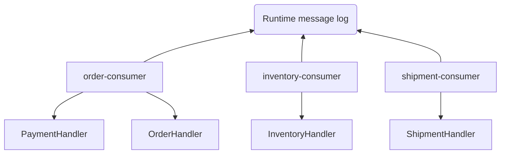
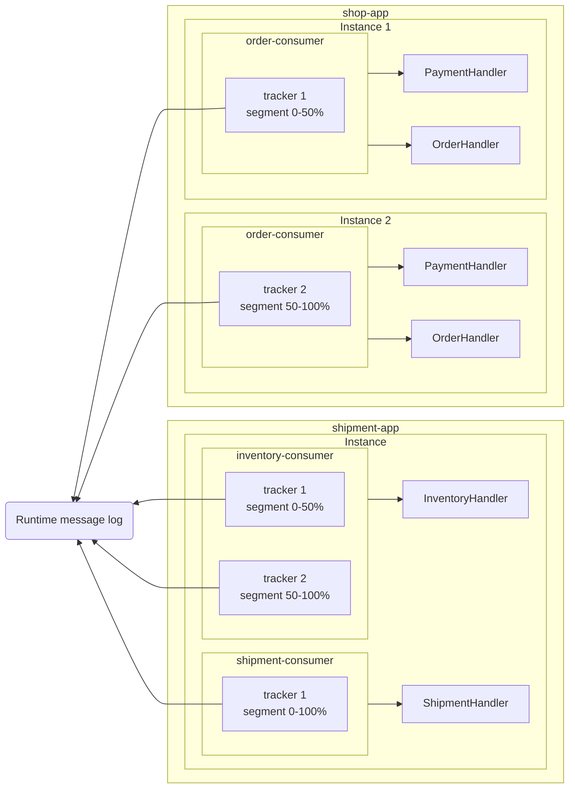

import { Tabs, TabItem, Card, CardGrid, Aside } from '@astrojs/starlight/components';

A **Consumer** is a logical grouping of message handlers that process the same types of messages. Consumers enable load balancing and scaling by allowing multiple application instances to share the work of processing messages.

<Aside type="tip" title="Real-world analogy">
Think of a consumer like a team of workers at a restaurant. Multiple instances of your application are like different workers on the same team - they all handle the same types of orders (messages), but the work is automatically distributed among them so no one gets overwhelmed.
</Aside>

## How Consumers Work

### Functionally



In this functional view, each consumer (order, inventory, shipment) connects to the runtime message log.
  Each consumer groups its own handlers — for example, the order-consumer routes messages to the `PaymentHandler` and `OrderHandler`. This view highlights the *roles* of consumers and handlers in your domain.

### Technically



In the technical view, you see how the same setup runs across multiple application instances.
  Each consumer is backed by one or more **trackers**, which divide the log into segments. Trackers process messages sequentially within their segment, while multiple trackers in parallel enable scaling across cores and instances. Handlers then receive messages via their consumer’s tracker.

The Fluxzero Runtime automatically balances message load across trackers for each consumer.
Scaling up is effortless: just launch another instance of your app (e.g. `shipment-app`), and Fluxzero distributes the work automatically.

<Aside type="tip">
  Use <code>@RoutingKey</code> on a property in your message payload if you need all messages with the same key to be processed sequentially.
  This is especially useful for enforcing order on a per-customer, per-order, or per-entity basis while still benefiting from parallelism across different keys.
</Aside>

### Key Concepts

1. **Consumer**: A logical identifier that groups related handlers
2. **Tracker**: A single-threaded processor of messages for a consumer
3. **Handler**: A class in charge of handling messages (via e.g. `@HandleCommand`)
4. **Instance**: An application instance, defining handlers and consumers

## Defining Consumers

## Default Consumer Behavior

By default, handlers join the **default consumer** for a given message type. For example:

<Tabs>
<TabItem value="Java" label="Java">

```java
class MyHandler {
    @HandleCommand
    void handle(SomeCommand command) {
        // business logic here
    }
}
```

</TabItem>
<TabItem value="Kotlin" label="Kotlin">

```kotlin
class MyHandler {
    @HandleCommand
    fun handle(command: SomeCommand) {
        // business logic here
    }
}
```

</TabItem>
</Tabs>

This handler joins the default **command consumer** automatically.

## Custom Consumers with @Consumer

You can override the default behavior using the `@Consumer` annotation:

<Tabs>
<TabItem value="Java" label="Java">

```java
@Consumer(name = "MyConsumer")
class MyHandler {
    @HandleCommand
    void handle(SomeCommand command) {
        // business logic
    }
}
```

</TabItem>
<TabItem value="Kotlin" label="Kotlin">

```kotlin
@Consumer(name = "MyConsumer")
class MyHandler {
    @HandleCommand
    fun handle(command: SomeCommand) {
        // business logic
    }
}
```

</TabItem>
</Tabs>

To apply this to an entire package (and its subpackages), add a `package-info.java` file:

```java
@Consumer(name = "MyConsumer")
package com.example.handlers;
```

## Customizing Consumer Configuration

You can tune the behavior using additional attributes on the `@Consumer` annotation:

<Tabs>
<TabItem value="Java" label="Java">

```java
@Consumer(name = "MyConsumer", threads = 2, maxFetchSize = 100)
class MyHandler {
    @HandleCommand
    void handle(SomeCommand command) {
        // business logic
    }
}
```

</TabItem>
<TabItem value="Kotlin" label="Kotlin">

```kotlin
@Consumer(name = "MyConsumer", threads = 2, maxFetchSize = 100)
class MyHandler {
    @HandleCommand
    fun handle(command: SomeCommand) {
        // business logic
    }
}
```

</TabItem>
</Tabs>

- `threads = 2`: Two threads per application instance will fetch commands.
- `maxFetchSize = 100`: Up to 100 messages fetched per request, helping apply backpressure.

Each thread runs a **tracker**. If you deploy the app multiple times, Fluxzero automatically load-balances messages across all available trackers.

## Default consumer settings

Fluxzero provides conservative defaults to ensure safe and sequential processing:

| Setting                | Description | Default value             |
|------------------------|-------------|---------------------------|
| `threads`              | Number of tracker threads. Each thread owns a disjoint segment of the log. | `1`                       |
| `maxFetchSize`         | Maximum messages per batch; balances throughput and memory. | `1024`                    |
| `maxWaitDuration`      | How long to wait before polling again if no messages are available. | `60`                      |
| `durationUnit`         | Time unit for `maxWaitDuration`. | `SECONDS`                 |
| `errorHandler`         | Logs processing errors and continues. | `LoggingErrorHandler`     |
| `flowRegulator`        | Default backpressure strategy; no throttling. | `NoOpFlowRegulator`       |
| `filterMessageTarget`  | If true, only messages targeted to this instance are processed. | `false`                   |
| `ignoreSegment`        | If true, bypasses Runtime sharding and processes all segments. | `false`                   |
| `singleTracker`        | If true, a single tracker processes all messages in strict global order. | `false`                   |
| `clientControlledIndex`| If true, the app decides which messages to process. | `false`                   |
| `storePositionManually`| If true, the app must commit tracker position explicitly. | `false`                   |
| `exclusive`            | Handlers are active in only one consumer. | `true`                    |
| `passive`              | If true, handler results are ignored and not published to the result log. | `false`                   |
| `minIndex`             | Negative means start at the end of the log (only new messages). | `-1`                      |
| `maxIndexExclusive`    | Negative means no upper bound. | `-1`                      |
| `typeFilter`           | No server-side filtering; all message types are delivered. | `""` (empty)              |

<Aside type="note">
Defaults are safe but modest. They ensure single-threaded sequential processing with minimal risk of overload.
</Aside>

### Segment distribution

- By default, message logs are split into **128 segments**.
- Trackers divide these segments evenly.
  - `threads = 2` → 64 segments each
  - `threads = 4` → 32 segments each

This segmentation enables parallel consumption and smooth horizontal scaling.

### When to override defaults

- Raise **threads** for concurrency when handlers are I/O-bound.
- Adjust **maxFetchSize** to balance latency and throughput.
- Set **singleTracker = true** for strict global ordering.
- Use **passive = true** for projections or audit-only consumers.
- Enable **storePositionManually** for long-running workflows or custom commit strategies.

<Aside type="caution">
Sticking to defaults may underutilize resources or miss ordering guarantees your use case requires.
</Aside>

## Backpressure, batching, and throughput

- **Batching (`maxFetchSize`)**: Larger batches reduce fetch overhead but create handler bursts.
- **Concurrency (`threads`)**: More trackers increase parallelism but may add contention.
- **Per-message cost**: I/O-heavy handlers benefit from concurrency; CPU-heavy handlers may saturate a core.

<Aside type="note">
Each tracker maintains its own position. A slow tracker does not block faster ones in the same consumer.
</Aside>

## Errors and retries

- **Failures are isolated** to the tracker processing the message.
- **Positions advance on success**; failed messages are retried by policy.
- **Metrics and logs** capture errors with full correlation for root-cause tracing.

<Aside type="caution">
Handlers must be idempotent — retries may invoke the same payload again.
</Aside>

## Tuning checklist

1. Start with defaults; measure latency and handler time.
2. Increase `threads` gradually (1–2 at a time).
3. Tune `maxFetchSize` to match handler burst capacity.
4. Use separate consumers for heavy or specialized workloads.
5. Scale out app instances once a single instance is saturated.

## FAQ

**How many trackers will I have?**
`threads × number_of_app_instances` (per consumer).

**Will a message be processed twice?**
No. The Runtime coordinates trackers to prevent duplicate delivery.

**Can I separate replay from live traffic?**
Yes. Define a separate consumer with its own trackers and configuration.