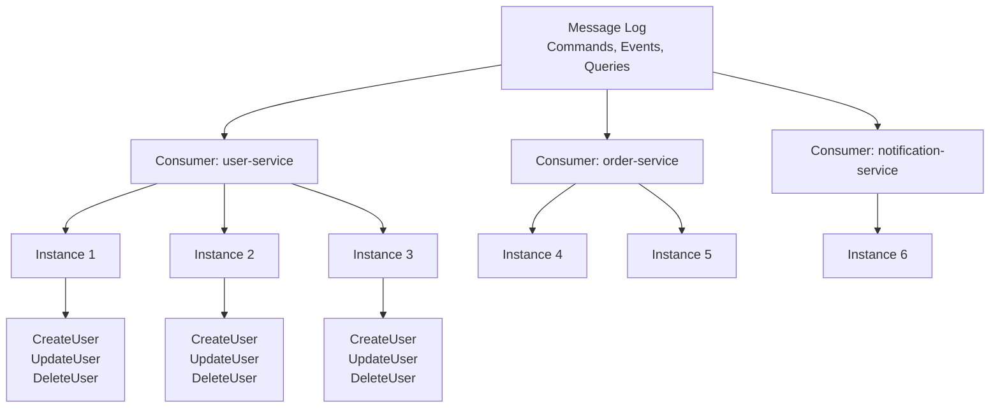
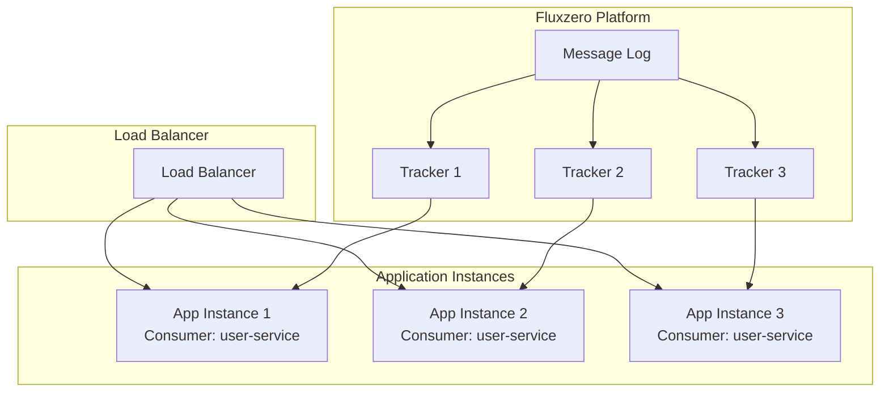
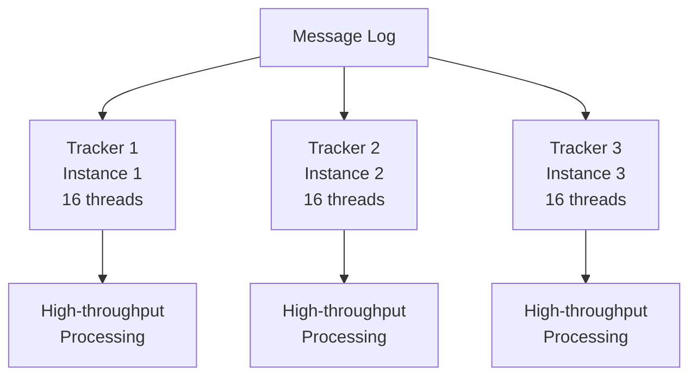
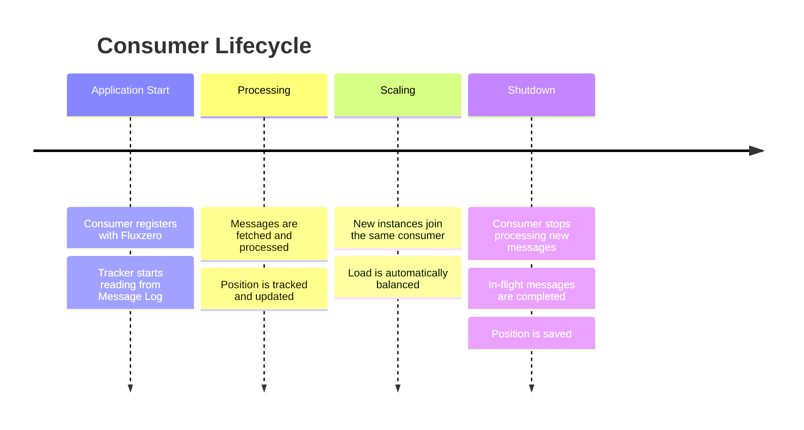

import { Tabs, TabItem, Card, CardGrid, Aside } from '@astrojs/starlight/components';

A **Consumer** is a logical grouping of message handlers that process the same types of messages. Consumers enable load balancing and scaling by allowing multiple application instances to share the work of processing messages.

<Aside type="tip" title="Real-world analogy">
Think of a consumer like a team of workers at a restaurant. Multiple instances of your application are like different workers on the same team - they all handle the same types of orders (messages), but the work is automatically distributed among them so no one gets overwhelmed.
</Aside>

## How Consumers Work



### Key Concepts

1. **Consumer Name**: A logical identifier that groups related handlers
2. **Load Balancing**: Messages are distributed across all instances with the same consumer name
3. **Scaling**: Add more instances to handle increased load
4. **Isolation**: Different consumers process different message types independently

## Defining Consumers

### Default Consumer Behavior

By default, each message handler automatically joins a consumer named after the class:

<Tabs>
<TabItem label="Java">
```java
public class UserService {
    
    @HandleCommand
    public UserId handle(CreateUser command) {
        // Automatically joins consumer "UserService"
        return createUser(command);
    }
    
    @HandleEvent
    public void on(UserCreated event) {
        // Same consumer "UserService"
        updateUserProjection(event);
    }
}
```
</TabItem>
<TabItem label="Kotlin">
```kotlin
class UserService {
    
    @HandleCommand
    fun handle(command: CreateUser): UserId {
        // Automatically joins consumer "UserService"
        return createUser(command)
    }
    
    @HandleEvent
    fun on(event: UserCreated) {
        // Same consumer "UserService"
        updateUserProjection(event)
    }
}
```
</TabItem>
</Tabs>

### Custom Consumer Names

You can specify custom consumer names for better organization:

<Tabs>
<TabItem label="Java">
```java
@Consumer(name = "user-service")
public class UserCommandHandler {
    
    @HandleCommand
    public UserId handle(CreateUser command) {
        return createUser(command);
    }
    
    @HandleCommand
    public void handle(UpdateUser command) {
        updateUser(command);
    }
}

@Consumer(name = "user-service")  // Same consumer!
public class UserEventHandler {
    
    @HandleEvent
    public void on(UserCreated event) {
        updateUserProjection(event);
    }
    
    @HandleEvent
    public void on(UserUpdated event) {
        updateUserProjection(event);
    }
}
```
</TabItem>
<TabItem label="Kotlin">
```kotlin
@Consumer(name = "user-service")
class UserCommandHandler {
    
    @HandleCommand
    fun handle(command: CreateUser): UserId {
        return createUser(command)
    }
    
    @HandleCommand
    fun handle(command: UpdateUser) {
        updateUser(command)
    }
}

@Consumer(name = "user-service")  // Same consumer!
class UserEventHandler {
    
    @HandleEvent
    fun on(event: UserCreated) {
        updateUserProjection(event)
    }
    
    @HandleEvent
    fun on(event: UserUpdated) {
        updateUserProjection(event)
    }
}
```
</TabItem>
</Tabs>

## Consumer Configuration

Consumers can be configured to optimize performance and behavior:

<Tabs>
<TabItem label="Java">
```java
@Consumer(
    name = "user-service",
    trackerConfiguration = @TrackerConfiguration(
        threads = 4,                    // Processing threads
        batchSize = 100,               // Messages per batch
        maxFetchTime = Duration.ofSeconds(1)
    ),
    retryConfiguration = @RetryConfiguration(
        maxRetries = 3,
        retryDelayFactor = 2.0
    )
)
public class UserService {
    
    @HandleCommand
    public UserId handle(CreateUser command) {
        return userRepository.save(new User(command.getName()));
    }
}
```
</TabItem>
<TabItem label="Kotlin">
```kotlin
@Consumer(
    name = "user-service",
    trackerConfiguration = TrackerConfiguration(
        threads = 4,                    // Processing threads
        batchSize = 100,               // Messages per batch
        maxFetchTime = Duration.ofSeconds(1)
    ),
    retryConfiguration = RetryConfiguration(
        maxRetries = 3,
        retryDelayFactor = 2.0
    )
)
class UserService {
    
    @HandleCommand
    fun handle(command: CreateUser): UserId {
        return userRepository.save(User(command.name))
    }
}
```
</TabItem>
</Tabs>

## Scaling Patterns

### Horizontal Scaling

The most common scaling pattern is to run multiple instances of your application:



**Benefits**:
- Automatic load balancing
- Fault tolerance (if one instance fails, others continue)
- Easy to deploy and manage
- Linear scaling with demand

### Vertical Scaling

You can also scale by increasing resources within a single instance:

<Tabs>
<TabItem label="Java">
```java
@Consumer(
    name = "user-service",
    trackerConfiguration = @TrackerConfiguration(
        threads = 16,        // More threads
        batchSize = 1000     // Larger batches
    )
)
public class UserService {
    // Same code, more processing power
}
```
</TabItem>
<TabItem label="Kotlin">
```kotlin
@Consumer(
    name = "user-service",
    trackerConfiguration = TrackerConfiguration(
        threads = 16,        // More threads
        batchSize = 1000     // Larger batches
    )
)
class UserService {
    // Same code, more processing power
}
```
</TabItem>
</Tabs>

### Mixed Scaling

You can combine both approaches:



## Consumer Strategies

### Domain-Based Consumers

Organize consumers around business domains:

<Tabs>
<TabItem label="Java">
```java
@Consumer(name = "user-domain")
public class UserHandlers {
    @HandleCommand
    public UserId handle(CreateUser command) { /* ... */ }
    
    @HandleEvent
    public void on(UserCreated event) { /* ... */ }
}

@Consumer(name = "order-domain")
public class OrderHandlers {
    @HandleCommand
    public OrderId handle(CreateOrder command) { /* ... */ }
    
    @HandleEvent
    public void on(OrderCreated event) { /* ... */ }
}

@Consumer(name = "notification-domain")
public class NotificationHandlers {
    @HandleEvent
    public void on(UserCreated event) { /* Send welcome email */ }
    
    @HandleEvent
    public void on(OrderCreated event) { /* Send confirmation */ }
}
```
</TabItem>
<TabItem label="Kotlin">
```kotlin
@Consumer(name = "user-domain")
class UserHandlers {
    @HandleCommand
    fun handle(command: CreateUser): UserId { /* ... */ }
    
    @HandleEvent
    fun on(event: UserCreated) { /* ... */ }
}

@Consumer(name = "order-domain")
class OrderHandlers {
    @HandleCommand
    fun handle(command: CreateOrder): OrderId { /* ... */ }
    
    @HandleEvent
    fun on(event: OrderCreated) { /* ... */ }
}

@Consumer(name = "notification-domain")
class NotificationHandlers {
    @HandleEvent
    fun on(event: UserCreated) { /* Send welcome email */ }
    
    @HandleEvent
    fun on(event: OrderCreated) { /* Send confirmation */ }
}
```
</TabItem>
</Tabs>

### Function-Based Consumers

Organize consumers around specific functions:

<Tabs>
<TabItem label="Java">
```java
@Consumer(name = "command-processor")
public class CommandProcessor {
    @HandleCommand
    public UserId handle(CreateUser command) { /* ... */ }
    
    @HandleCommand
    public OrderId handle(CreateOrder command) { /* ... */ }
}

@Consumer(name = "projection-builder")
public class ProjectionBuilder {
    @HandleEvent
    public void on(UserCreated event) { /* ... */ }
    
    @HandleEvent
    public void on(OrderCreated event) { /* ... */ }
}

@Consumer(name = "analytics-processor")
public class AnalyticsProcessor {
    @HandleEvent
    public void on(UserCreated event) { /* Track user signup */ }
    
    @HandleEvent
    public void on(OrderCreated event) { /* Track sales */ }
}
```
</TabItem>
<TabItem label="Kotlin">
```kotlin
@Consumer(name = "command-processor")
class CommandProcessor {
    @HandleCommand
    fun handle(command: CreateUser): UserId { /* ... */ }
    
    @HandleCommand
    fun handle(command: CreateOrder): OrderId { /* ... */ }
}

@Consumer(name = "projection-builder")
class ProjectionBuilder {
    @HandleEvent
    fun on(event: UserCreated) { /* ... */ }
    
    @HandleEvent
    fun on(event: OrderCreated) { /* ... */ }
}

@Consumer(name = "analytics-processor")
class AnalyticsProcessor {
    @HandleEvent
    fun on(event: UserCreated) { /* Track user signup */ }
    
    @HandleEvent
    fun on(event: OrderCreated) { /* Track sales */ }
}
```
</TabItem>
</Tabs>

## Performance Considerations

### Choosing the Right Consumer Strategy

<CardGrid>
<Card title="Single Consumer" icon="group">
**Best for**: Simple applications, strong consistency requirements
- All handlers in one consumer
- Easier to manage and deploy
- Sequential processing guarantees
</Card>

<Card title="Domain Consumers" icon="puzzle">
**Best for**: Domain-driven design, team boundaries
- Separate consumers per business domain
- Independent scaling per domain
- Clean separation of concerns
</Card>

<Card title="Function Consumers" icon="setting">
**Best for**: Different performance requirements
- Commands, events, queries in separate consumers
- Optimized configurations per function
- Fine-grained scaling control
</Card>
</CardGrid>

### Tuning Consumer Performance

<Tabs>
<TabItem label="High Throughput">
```java
@Consumer(
    name = "bulk-processor",
    trackerConfiguration = @TrackerConfiguration(
        threads = 16,
        batchSize = 1000,
        maxFetchTime = Duration.ofMillis(100)
    )
)
```
**Use when**: Processing large volumes of messages
**Trade-offs**: Higher resource usage, potential latency
</TabItem>

<TabItem label="Low Latency">
```java
@Consumer(
    name = "real-time-processor",
    trackerConfiguration = @TrackerConfiguration(
        threads = 1,
        batchSize = 1,
        maxFetchTime = Duration.ofMillis(10)
    )
)
```
**Use when**: Real-time processing requirements
**Trade-offs**: Lower throughput, higher resource per message
</TabItem>

<TabItem label="Balanced">
```java
@Consumer(
    name = "general-processor",
    trackerConfiguration = @TrackerConfiguration(
        threads = 4,
        batchSize = 100,
        maxFetchTime = Duration.ofSeconds(1)
    )
)
```
**Use when**: General purpose processing
**Trade-offs**: Good balance of throughput and latency
</TabItem>
</Tabs>

## Consumer Lifecycle

Understanding how consumers start and stop:



### Graceful Shutdown

<Tabs>
<TabItem label="Java">
```java
@Consumer(name = "user-service")
public class UserService {
    
    @HandleCommand
    public UserId handle(CreateUser command) {
        // This will complete before shutdown
        return createUser(command);
    }
    
    @PreDestroy
    public void shutdown() {
        // Cleanup resources
        log.info("UserService shutting down gracefully");
    }
}
```
</TabItem>
<TabItem label="Kotlin">
```kotlin
@Consumer(name = "user-service")
class UserService {
    
    @HandleCommand
    fun handle(command: CreateUser): UserId {
        // This will complete before shutdown
        return createUser(command)
    }
    
    @PreDestroy
    fun shutdown() {
        // Cleanup resources
        log.info("UserService shutting down gracefully")
    }
}
```
</TabItem>
</Tabs>

## Common Patterns

### Multi-Instance Deployment

Deploy the same consumer across multiple instances:

```yaml
# docker-compose.yml
version: '3.8'
services:
  user-service-1:
    image: user-service:latest
    environment:
      - FLUX_CONSUMER_NAME=user-service
      
  user-service-2:
    image: user-service:latest
    environment:
      - FLUX_CONSUMER_NAME=user-service
      
  user-service-3:
    image: user-service:latest
    environment:
      - FLUX_CONSUMER_NAME=user-service
```

### Environment-Specific Consumers

<Tabs>
<TabItem label="Java">
```java
@Consumer(name = "${app.consumer.name:user-service}")
public class UserService {
    // Consumer name from configuration
}
```
</TabItem>
<TabItem label="Kotlin">
```kotlin
@Consumer(name = "\${app.consumer.name:user-service}")
class UserService {
    // Consumer name from configuration
}
```
</TabItem>
</Tabs>

### Consumer Health Checks

<Tabs>
<TabItem label="Java">
```java
@Consumer(name = "user-service")
public class UserService {
    
    private final MeterRegistry meterRegistry;
    private final Counter processedMessages;
    
    public UserService(MeterRegistry meterRegistry) {
        this.meterRegistry = meterRegistry;
        this.processedMessages = Counter.builder("messages.processed")
            .tag("consumer", "user-service")
            .register(meterRegistry);
    }
    
    @HandleCommand
    public UserId handle(CreateUser command) {
        try {
            UserId result = createUser(command);
            processedMessages.increment();
            return result;
        } catch (Exception e) {
            Metrics.counter("messages.failed", "consumer", "user-service").increment();
            throw e;
        }
    }
}
```
</TabItem>
<TabItem label="Kotlin">
```kotlin
@Consumer(name = "user-service")
class UserService(private val meterRegistry: MeterRegistry) {
    
    private val processedMessages = Counter.builder("messages.processed")
        .tag("consumer", "user-service")
        .register(meterRegistry)
    
    @HandleCommand
    fun handle(command: CreateUser): UserId {
        return try {
            val result = createUser(command)
            processedMessages.increment()
            result
        } catch (e: Exception) {
            Metrics.counter("messages.failed", "consumer", "user-service").increment()
            throw e
        }
    }
}
```
</TabItem>
</Tabs>

## Best Practices

### 1. Use Descriptive Consumer Names
```java
// Good
@Consumer(name = "user-service")
@Consumer(name = "order-processing")
@Consumer(name = "notification-sender")

// Bad
@Consumer(name = "service1")
@Consumer(name = "handler")
@Consumer(name = "processor")
```

### 2. Keep Consumer Names Stable
```java
// Good: Stable across deployments
@Consumer(name = "user-service")

// Bad: Environment-specific
@Consumer(name = "user-service-prod")
@Consumer(name = "user-service-${environment}")
```

### 3. Configure for Your Use Case
```java
// For high-throughput batch processing
@Consumer(
    name = "batch-processor",
    trackerConfiguration = @TrackerConfiguration(
        threads = 16,
        batchSize = 1000
    )
)

// For real-time processing
@Consumer(
    name = "real-time-processor",
    trackerConfiguration = @TrackerConfiguration(
        threads = 1,
        batchSize = 1
    )
)
```

### 4. Monitor Consumer Health
```java
@Consumer(name = "user-service")
public class UserService {
    
    @HandleCommand
    public UserId handle(CreateUser command) {
        Timer.Sample timer = Timer.start(meterRegistry);
        try {
            return createUser(command);
        } finally {
            timer.stop(Timer.builder("message.processing.time")
                .tag("consumer", "user-service")
                .tag("message", "CreateUser")
                .register(meterRegistry));
        }
    }
}
```

## Troubleshooting

### Common Issues

<Aside type="caution" title="Messages not being processed">
**Check**:
- Consumer name is correct
- Application instances are running
- No exceptions in message handlers
- Tracker configuration is appropriate
</Aside>

<Aside type="caution" title="Slow processing">
**Solutions**:
- Increase thread count
- Increase batch size
- Add more application instances
- Check handler performance
</Aside>

<Aside type="caution" title="Memory issues">
**Solutions**:
- Reduce batch size
- Reduce thread count
- Check for memory leaks in handlers
- Optimize message processing logic
</Aside>

## Related Concepts

- **[Trackers](/reference/core-components/tracker)** - How consumers read messages
- **[Messages](/reference/core-components/message)** - What consumers process
- **[Handlers](/reference/core-components/handler)** - Where consumer logic lives
- **[Architecture](/about/architecture)** - High-level system overview