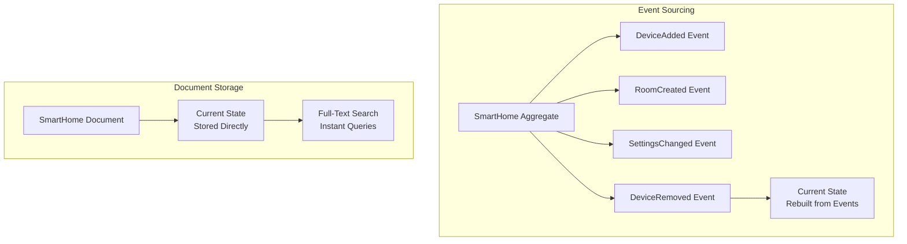

import { Tabs, TabItem, Card, CardGrid, Aside } from '@astrojs/starlight/components';

A **Document** is a data storage approach in Fluxzero that stores aggregates as searchable documents rather than using event sourcing. This is ideal for read-heavy data, reference information, and scenarios where full-text search is more important than complete audit trails.

<Aside type="tip" title="Real-world analogy">
Think of documents like a smart home device catalog. You want to quickly search for "smart thermostats with WiFi" across thousands of products. Documents are perfect for this - they're optimized for searching and reading, not for tracking every change to each product over time.
</Aside>

## Key Concepts

<CardGrid>
<Card title="Current State Storage" icon="document">
Documents store the current state of your data, not the history of changes. This makes them faster to read but you lose the audit trail.
</Card>

<Card title="Full-Text Search" icon="magnifier">
Built-in search engine with advanced features like faceted search, filtering, and lookups across complex data structures.
</Card>

<Card title="Flexible Collections" icon="list-format">
Organize documents into logical collections (like database tables) with custom indexing and search configurations.
</Card>

<Card title="Automatic Indexing" icon="setting">
Documents can be automatically indexed when marked as `@Searchable`, or manually indexed using the Fluxzero API.
</Card>
</CardGrid>

## Document vs Event Sourcing



**Use Event Sourcing when**:
- You need complete audit trails
- Business logic requires knowing what happened when
- Compliance or regulatory requirements
- Complex domain logic with many state transitions

**Use Documents when**:
- Read-heavy workloads (catalogs, references)
- Full-text search is primary use case
- Current state is more important than history
- Performance over auditability

## Creating Document Aggregates

### Basic Document Configuration

<Tabs>
<TabItem label="Java">
```java
@Aggregate(
    eventSourced = false,           // Disable event sourcing
    searchable = true,              // Enable full-text search
    collection = "device-catalog"   // Custom collection name
)
public record DeviceCatalogEntry(
    @EntityId String catalogId,
    String name,
    String brand,
    DeviceType type,
    String description,
    List<String> features,
    Map<String, Object> specifications,
    double price,
    boolean inStock,
    List<String> tags
) {
    public enum DeviceType {
        SMART_LIGHT, SMART_THERMOSTAT, SMART_LOCK, 
        SECURITY_CAMERA, MOTION_SENSOR, DOOR_SENSOR
    }
}
```
</TabItem>
<TabItem label="Kotlin">
```kotlin
@Aggregate(
    eventSourced = false,           // Disable event sourcing
    searchable = true,              // Enable full-text search
    collection = "device-catalog"   // Custom collection name
)
data class DeviceCatalogEntry(
    @EntityId val catalogId: String,
    val name: String,
    val brand: String,
    val type: DeviceType,
    val description: String,
    val features: List<String> = emptyList(),
    val specifications: Map<String, Any> = emptyMap(),
    val price: Double,
    val inStock: Boolean,
    val tags: List<String> = emptyList()
) {
    enum class DeviceType {
        SMART_LIGHT, SMART_THERMOSTAT, SMART_LOCK, 
        SECURITY_CAMERA, MOTION_SENSOR, DOOR_SENSOR
    }
}
```
</TabItem>
</Tabs>

### Home Configuration Document

<Tabs>
<TabItem label="Java">
```java
@Aggregate(eventSourced = false, searchable = true, collection = "home-configs")
public record HomeConfiguration(
    @EntityId String configId,
    HomeId homeId,
    String configurationName,
    Map<String, Object> preferences,
    List<AutomationTemplate> templates,
    SecuritySettings security,
    List<String> installedApps
) {
    
    public record AutomationTemplate(
        String templateId,
        String name,
        String category,
        String description,
        Map<String, Object> defaultSettings
    ) {}
    
    public record SecuritySettings(
        boolean alarmEnabled,
        List<String> trustedDevices,
        Map<String, Integer> accessCodes,
        String emergencyContact
    ) {}
}
```
</TabItem>
<TabItem label="Kotlin">
```kotlin
@Aggregate(eventSourced = false, searchable = true, collection = "home-configs")
data class HomeConfiguration(
    @EntityId val configId: String,
    val homeId: HomeId,
    val configurationName: String,
    val preferences: Map<String, Any> = emptyMap(),
    val templates: List<AutomationTemplate> = emptyList(),
    val security: SecuritySettings,
    val installedApps: List<String> = emptyList()
) {
    
    data class AutomationTemplate(
        val templateId: String,
        val name: String,
        val category: String,
        val description: String,
        val defaultSettings: Map<String, Any> = emptyMap()
    )
    
    data class SecuritySettings(
        val alarmEnabled: Boolean,
        val trustedDevices: List<String> = emptyList(),
        val accessCodes: Map<String, Int> = emptyMap(),
        val emergencyContact: String
    )
}
```
</TabItem>
</Tabs>

## Manual Document Indexing

You can manually index documents using the Fluxzero API:

<Tabs>
<TabItem label="Java">
```java
public class DeviceCatalogService {
    
    // Index a single device
    public void addDeviceTocatalog(DeviceCatalogEntry device) {
        Fluxzero.index(device, device.catalogId(), "device-catalog");
    }
    
    // Index with conditional logic
    public void addDeviceIfNew(DeviceCatalogEntry device) {
        CompletableFuture<Void> future = Fluxzero
            .indexIfAbsent(device, device.catalogId(), "device-catalog");
        
        future.thenRun(() -> 
            log.info("Device {} added to catalog", device.name()));
    }
    
    // Bulk indexing
    public void importDeviceCatalog(List<DeviceCatalogEntry> devices) {
        Fluxzero.index(devices);
    }
    
    // Index with time-based constraints
    public void addTemporaryPromotion(PromotionalDevice promotion) {
        Fluxzero.index(
            promotion, 
            promotion.deviceId(), 
            "promotions",
            promotion.startDate(),
            promotion.endDate()
        );
    }
}
```
</TabItem>
<TabItem label="Kotlin">
```kotlin
class DeviceCatalogService {
    
    // Index a single device
    fun addDeviceToCalog(device: DeviceCatalogEntry) {
        Fluxzero.index(device, device.catalogId, "device-catalog")
    }
    
    // Index with conditional logic
    fun addDeviceIfNew(device: DeviceCatalogEntry) {
        val future = Fluxzero
            .indexIfAbsent(device, device.catalogId, "device-catalog")
        
        future.thenRun { 
            log.info("Device ${device.name} added to catalog")
        }
    }
    
    // Bulk indexing
    fun importDeviceCatalog(devices: List<DeviceCatalogEntry>) {
        Fluxzero.index(devices)
    }
    
    // Index with time-based constraints
    fun addTemporaryPromotion(promotion: PromotionalDevice) {
        Fluxzero.index(
            promotion, 
            promotion.deviceId, 
            "promotions",
            promotion.startDate,
            promotion.endDate
        )
    }
}
```
</TabItem>
</Tabs>

## Automatic Document Indexing

For classes marked with `@Searchable`, indexing happens automatically:

<Tabs>
<TabItem label="Java">
```java
@Searchable(collection = "device-reviews")
public record DeviceReview(
    String reviewId,
    String deviceCatalogId,
    String reviewerName,
    int rating,
    String title,
    String comment,
    List<String> tags,
    Instant reviewDate,
    boolean verified
) {
    // Automatically indexed when instances are created/updated
}

// Usage - automatic indexing
public class ReviewService {
    
    public void addReview(DeviceReview review) {
        // This will automatically trigger indexing
        // No explicit Fluxzero.index() call needed
        reviewRepository.save(review);
    }
}
```
</TabItem>
<TabItem label="Kotlin">
```kotlin
@Searchable(collection = "device-reviews")
data class DeviceReview(
    val reviewId: String,
    val deviceCatalogId: String,
    val reviewerName: String,
    val rating: Int,
    val title: String,
    val comment: String,
    val tags: List<String> = emptyList(),
    val reviewDate: Instant,
    val verified: Boolean
) {
    // Automatically indexed when instances are created/updated
}

// Usage - automatic indexing
class ReviewService {
    
    fun addReview(review: DeviceReview) {
        // This will automatically trigger indexing
        // No explicit Fluxzero.index() call needed
        reviewRepository.save(review)
    }
}
```
</TabItem>
</Tabs>

## Searching Documents

Fluxzero provides a powerful search API for querying documents:

### Basic Search Operations

<Tabs>
<TabItem label="Java">
```java
public class DeviceSearchService {
    
    // Simple text search
    public List<DeviceCatalogEntry> searchByBrand(String brand) {
        return Fluxzero
            .search(DeviceCatalogEntry.class)
            .match(brand, "brand")
            .fetchAll();
    }
    
    // Multi-field search
    public List<DeviceCatalogEntry> searchSmartLights() {
        return Fluxzero
            .search(DeviceCatalogEntry.class)
            .match("SMART_LIGHT", "type")
            .match("true", "inStock")
            .sortBy("price")
            .fetch(20);
    }
    
    // Faceted search with filters
    public List<DeviceCatalogEntry> searchWithFilters(
        String searchTerm, 
        double maxPrice, 
        List<String> requiredFeatures) {
        
        var search = Fluxzero.search(DeviceCatalogEntry.class);
        
        if (searchTerm != null && !searchTerm.isEmpty()) {
            search = search.lookAhead(searchTerm, "name", "description");
        }
        
        if (maxPrice > 0) {
            search = search.filter("price", "<=", maxPrice);
        }
        
        if (requiredFeatures != null && !requiredFeatures.isEmpty()) {
            for (String feature : requiredFeatures) {
                search = search.match(feature, "features");
            }
        }
        
        return search
            .sortBy("price")
            .fetch(50);
    }
    
    // Complex query with time constraints
    public List<DeviceReview> findRecentReviews(String deviceId) {
        Instant oneMonthAgo = Instant.now().minus(30, ChronoUnit.DAYS);
        
        return Fluxzero
            .search("device-reviews")
            .match(deviceId, "deviceCatalogId")
            .since(oneMonthAgo)
            .sortBy("reviewDate", "desc")
            .fetchAll();
    }
}
```
</TabItem>
<TabItem label="Kotlin">
```kotlin
class DeviceSearchService {
    
    // Simple text search
    fun searchByBrand(brand: String): List<DeviceCatalogEntry> {
        return Fluxzero
            .search(DeviceCatalogEntry::class.java)
            .match(brand, "brand")
            .fetchAll()
    }
    
    // Multi-field search
    fun searchSmartLights(): List<DeviceCatalogEntry> {
        return Fluxzero
            .search(DeviceCatalogEntry::class.java)
            .match("SMART_LIGHT", "type")
            .match("true", "inStock")
            .sortBy("price")
            .fetch(20)
    }
    
    // Faceted search with filters
    fun searchWithFilters(
        searchTerm: String?, 
        maxPrice: Double, 
        requiredFeatures: List<String>?): List<DeviceCatalogEntry> {
        
        var search = Fluxzero.search(DeviceCatalogEntry::class.java)
        
        if (!searchTerm.isNullOrEmpty()) {
            search = search.lookAhead(searchTerm, "name", "description")
        }
        
        if (maxPrice > 0) {
            search = search.filter("price", "<=", maxPrice)
        }
        
        requiredFeatures?.forEach { feature ->
            search = search.match(feature, "features")
        }
        
        return search
            .sortBy("price")
            .fetch(50)
    }
    
    // Complex query with time constraints
    fun findRecentReviews(deviceId: String): List<DeviceReview> {
        val oneMonthAgo = Instant.now().minus(30, ChronoUnit.DAYS)
        
        return Fluxzero
            .search("device-reviews")
            .match(deviceId, "deviceCatalogId")
            .since(oneMonthAgo)
            .sortBy("reviewDate", "desc")
            .fetchAll()
    }
}
```
</TabItem>
</Tabs>

### Advanced Search Features

<Tabs>
<TabItem label="Java">
```java
public class AdvancedDeviceSearch {
    
    // Wildcard and pattern matching
    public List<DeviceCatalogEntry> findPhilipsDevices() {
        return Fluxzero
            .search(DeviceCatalogEntry.class)
            .query("philips*", "brand")  // Wildcard search
            .fetchAll();
    }
    
    // Complex boolean queries
    public List<DeviceCatalogEntry> findAffordableSecurityDevices() {
        return Fluxzero
            .search(DeviceCatalogEntry.class)
            .query("(SECURITY_CAMERA or MOTION_SENSOR) and inStock:true", 
                   "type", "inStock")
            .filter("price", "<=", 200.0)
            .sortBy("price")
            .fetchAll();
    }
    
    // Lookahead search (autocomplete)
    public List<String> getDeviceNameSuggestions(String partial) {
        return Fluxzero
            .search(DeviceCatalogEntry.class)
            .lookAhead(partial, "name")
            .fetch(10)
            .stream()
            .map(DeviceCatalogEntry::name)
            .distinct()
            .toList();
    }
    
    // Search with facet aggregation
    public Map<String, Long> getBrandCounts() {
        return Fluxzero
            .search(DeviceCatalogEntry.class)
            .match("true", "inStock")
            .facet("brand")
            .aggregate();
    }
    
    // Geographic/proximity search (if location data available)
    public List<HomeConfiguration> findNearbyHomes(
        double latitude, 
        double longitude, 
        double radiusKm) {
        
        return Fluxzero
            .search(HomeConfiguration.class)
            .near(latitude, longitude, radiusKm)
            .fetchAll();
    }
}
```
</TabItem>
<TabItem label="Kotlin">
```kotlin
class AdvancedDeviceSearch {
    
    // Wildcard and pattern matching
    fun findPhilipsDevices(): List<DeviceCatalogEntry> {
        return Fluxzero
            .search(DeviceCatalogEntry::class.java)
            .query("philips*", "brand")  // Wildcard search
            .fetchAll()
    }
    
    // Complex boolean queries
    fun findAffordableSecurityDevices(): List<DeviceCatalogEntry> {
        return Fluxzero
            .search(DeviceCatalogEntry::class.java)
            .query("(SECURITY_CAMERA or MOTION_SENSOR) and inStock:true", 
                   "type", "inStock")
            .filter("price", "<=", 200.0)
            .sortBy("price")
            .fetchAll()
    }
    
    // Lookahead search (autocomplete)
    fun getDeviceNameSuggestions(partial: String): List<String> {
        return Fluxzero
            .search(DeviceCatalogEntry::class.java)
            .lookAhead(partial, "name")
            .fetch(10)
            .map { it.name }
            .distinct()
    }
    
    // Search with facet aggregation
    fun getBrandCounts(): Map<String, Long> {
        return Fluxzero
            .search(DeviceCatalogEntry::class.java)
            .match("true", "inStock")
            .facet("brand")
            .aggregate()
    }
    
    // Geographic/proximity search (if location data available)
    fun findNearbyHomes(
        latitude: Double, 
        longitude: Double, 
        radiusKm: Double): List<HomeConfiguration> {
        
        return Fluxzero
            .search(HomeConfiguration::class.java)
            .near(latitude, longitude, radiusKm)
            .fetchAll()
    }
}
```
</TabItem>
</Tabs>

## Document Structure and Indexing

### How Search Works

Documents are processed and indexed automatically:


**Example transformation**:

```java
// Original document
DeviceCatalogEntry device = new DeviceCatalogEntry(
    "PHIL-HUE-001",
    "Philips Hue Smart Bulb",
    "Philips",
    SMART_LIGHT,
    "Color-changing WiFi smart bulb",
    List.of("WiFi", "Color", "Dimming", "App Control"),
    Map.of("wattage", 9, "lumens", 800, "voltage", "120V"),
    49.99,
    true,
    List.of("smart", "lighting", "philips", "hue")
);

// Becomes inverted index
{
  "PHIL-HUE-001": ["/catalogId"],
  "Philips Hue Smart Bulb": ["/name"],
  "Philips": ["/brand"],
  "SMART_LIGHT": ["/type"],
  "Color-changing WiFi smart bulb": ["/description"],
  "WiFi": ["/features"],
  "Color": ["/features"],
  // ... more fields
}

// Key concatenation for full-text search
"PHIL-HUE-001 Philips Hue Smart Bulb Philips SMART_LIGHT Color-changing WiFi smart bulb WiFi Color Dimming App Control 9 800 120V 49.99 true smart lighting philips hue"
```

### Search Performance Optimization

<Tabs>
<TabItem label="Java">
```java
// Use specific field searches for better performance
List<DeviceCatalogEntry> devices = Fluxzero
    .search(DeviceCatalogEntry.class)
    .match("Philips", "brand")           // Field-specific search
    .match("SMART_LIGHT", "type")        // Much faster than full-text
    .filter("price", "<=", 100.0)       // Numeric filters
    .sortBy("name")
    .fetch(25);

// Avoid full-text search when possible
// Slower:
List<DeviceCatalogEntry> slow = Fluxzero
    .search(DeviceCatalogEntry.class)
    .query("Philips SMART_LIGHT under 100")  // Full-text search
    .fetchAll();
```
</TabItem>
<TabItem label="Kotlin">
```kotlin
// Use specific field searches for better performance
val devices = Fluxzero
    .search(DeviceCatalogEntry::class.java)
    .match("Philips", "brand")           // Field-specific search
    .match("SMART_LIGHT", "type")        // Much faster than full-text
    .filter("price", "<=", 100.0)       // Numeric filters
    .sortBy("name")
    .fetch(25)

// Avoid full-text search when possible
// Slower:
val slow = Fluxzero
    .search(DeviceCatalogEntry::class.java)
    .query("Philips SMART_LIGHT under 100")  // Full-text search
    .fetchAll()
```
</TabItem>
</Tabs>

## Time-Based Documents

Documents can have time ranges for temporal queries:

<Tabs>
<TabItem label="Java">
```java
@Aggregate(eventSourced = false, searchable = true, collection = "device-usage")
public record DeviceUsageLog(
    @EntityId String logId,
    DeviceId deviceId,
    String deviceName,
    double energyUsed,
    Map<String, Object> readings,
    Instant startTime,
    Instant endTime
) {}

// Index with time range
public void logDeviceUsage(DeviceUsageLog usage) {
    Fluxzero.index(
        usage, 
        usage.logId(), 
        "device-usage",
        usage.startTime(),
        usage.endTime()
    );
}

// Query by time range
public List<DeviceUsageLog> findUsageInPeriod(
    DeviceId deviceId, 
    Instant from, 
    Instant to) {
    
    return Fluxzero
        .search("device-usage")
        .match(deviceId.toString(), "deviceId")
        .between(from, to)
        .sortBy("startTime")
        .fetchAll();
}
```
</TabItem>
<TabItem label="Kotlin">
```kotlin
@Aggregate(eventSourced = false, searchable = true, collection = "device-usage")
data class DeviceUsageLog(
    @EntityId val logId: String,
    val deviceId: DeviceId,
    val deviceName: String,
    val energyUsed: Double,
    val readings: Map<String, Any> = emptyMap(),
    val startTime: Instant,
    val endTime: Instant
)

// Index with time range
fun logDeviceUsage(usage: DeviceUsageLog) {
    Fluxzero.index(
        usage, 
        usage.logId, 
        "device-usage",
        usage.startTime,
        usage.endTime
    )
}

// Query by time range
fun findUsageInPeriod(
    deviceId: DeviceId, 
    from: Instant, 
    to: Instant): List<DeviceUsageLog> {
    
    return Fluxzero
        .search("device-usage")
        .match(deviceId.toString(), "deviceId")
        .between(from, to)
        .sortBy("startTime")
        .fetchAll()
}
```
</TabItem>
</Tabs>

## Best Practices

### 1. Choose the Right Storage Strategy
```java
// Use documents for:
@Aggregate(eventSourced = false, searchable = true)
public record ProductCatalog(/*...*/) {}    // Reference data

@Aggregate(eventSourced = false, searchable = true) 
public record DeviceReview(/*...*/) {}      // Read-heavy content

// Use event sourcing for:
@Aggregate  // eventSourced = true by default
public record SmartHome(/*...*/) {}         // Complex business logic
```

### 2. Design for Search
```java
// Good: Search-friendly field structure
@Aggregate(eventSourced = false, searchable = true)
public record DeviceCatalogEntry(
    String name,                    // Searchable text
    String brand,                   // Facet/filter
    DeviceType type,               // Enum for exact matching
    List<String> features,         // Multi-value search
    double price,                  // Numeric filtering
    List<String> tags             // Free-text tags
) {}
```

### 3. Use Collections Effectively
```java
// Organize related documents in collections
@Aggregate(eventSourced = false, searchable = true, collection = "products")
public record DeviceCatalogEntry(/*...*/) {}

@Aggregate(eventSourced = false, searchable = true, collection = "reviews")
public record DeviceReview(/*...*/) {}

@Aggregate(eventSourced = false, searchable = true, collection = "configurations")
public record HomeConfiguration(/*...*/) {}
```

### 4. Optimize Search Queries
```java
// Efficient: Field-specific searches
search.match("Philips", "brand").match("SMART_LIGHT", "type")

// Less efficient: Full-text search
search.query("Philips smart light")

// Use filters for exact matches
search.filter("inStock", "=", true)

// Use sorting judiciously
search.sortBy("price").fetch(20)  // Good
search.sortBy("relevance").fetchAll()  // Can be expensive
```

## Common Use Cases

### Device Catalog Management
<Tabs>
<TabItem label="Java">
```java
public class DeviceCatalogManager {
    
    public void importCatalog(List<DeviceCatalogEntry> devices) {
        // Bulk import
        Fluxzero.index(devices);
        log.info("Imported {} devices to catalog", devices.size());
    }
    
    public List<DeviceCatalogEntry> searchDevices(String query, int limit) {
        if (query.isEmpty()) {
            return Fluxzero
                .search(DeviceCatalogEntry.class)
                .match("true", "inStock")
                .sortBy("name")
                .fetch(limit);
        }
        
        return Fluxzero
            .search(DeviceCatalogEntry.class)
            .lookAhead(query, "name", "description", "brand")
            .match("true", "inStock")
            .sortBy("relevance")
            .fetch(limit);
    }
    
    public Map<String, Long> getCategoryStats() {
        return Fluxzero
            .search(DeviceCatalogEntry.class)
            .match("true", "inStock")
            .facet("type")
            .aggregate();
    }
}
```
</TabItem>
<TabItem label="Kotlin">
```kotlin
class DeviceCatalogManager {
    
    fun importCatalog(devices: List<DeviceCatalogEntry>) {
        // Bulk import
        Fluxzero.index(devices)
        log.info("Imported ${devices.size} devices to catalog")
    }
    
    fun searchDevices(query: String, limit: Int): List<DeviceCatalogEntry> {
        return if (query.isEmpty()) {
            Fluxzero
                .search(DeviceCatalogEntry::class.java)
                .match("true", "inStock")
                .sortBy("name")
                .fetch(limit)
        } else {
            Fluxzero
                .search(DeviceCatalogEntry::class.java)
                .lookAhead(query, "name", "description", "brand")
                .match("true", "inStock")
                .sortBy("relevance")
                .fetch(limit)
        }
    }
    
    fun getCategoryStats(): Map<String, Long> {
        return Fluxzero
            .search(DeviceCatalogEntry::class.java)
            .match("true", "inStock")
            .facet("type")
            .aggregate()
    }
}
```
</TabItem>
</Tabs>

## Related Concepts

- **[Aggregates](/reference/core-components/aggregate)** - Document aggregates vs event-sourced aggregates  
- **[Event Sourcing](/reference/core-components/event-sourcing)** - Alternative storage strategy
- **[Queries](/reference/core-components/query)** - Retrieving document data
- **[Search Engine](/guides/searching)** - Advanced search techniques
- **[Message Log](/reference/core-components/message-log)** - Where search operations are tracked