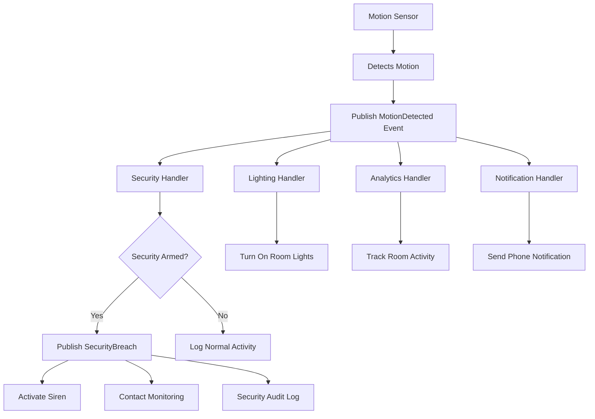

import { Tabs, TabItem, Card, CardGrid, Aside } from '@astrojs/starlight/components';

An **Event** represents something that has happened in your smart home system. Events are immutable facts about state changes - they notify other parts of the system that something important occurred, enabling reactive and decoupled architectures.

<Aside type="tip" title="Real-world analogy">
Think of events like notifications on your phone. When someone turns on a smart light, the system publishes a "LightTurnedOn" event. Just like phone notifications, other parts of your smart home (security system, energy monitoring, automation rules) can "listen" to these events and react accordingly.
</Aside>

## Key Characteristics

<CardGrid>
<Card title="Immutable Facts" icon="document">
Events represent things that have already happened. Once published, they cannot be changed - they're historical facts about your system.
</Card>

<Card title="Broadcast Nature" icon="magnifier">
Unlike commands (which have one handler), events can be processed by multiple handlers. Many parts of your system can react to the same event.
</Card>

<Card title="Decoupled Communication" icon="setting">
Events enable loose coupling between system components. Publishers don't need to know who (if anyone) will handle their events.
</Card>

<Card title="Global Distribution" icon="rocket">
Events are stored in a global event log and available for downstream processing, analytics, and building read models.
</Card>
</CardGrid>

## Event Types in Smart Home Systems

### Device Events

<Tabs>
<TabItem label="Java">
```java
// Device lifecycle events
public record DeviceAdded(HomeId homeId, Device device, Instant timestamp) {}

public record DeviceRemoved(HomeId homeId, DeviceId deviceId, String reason) {}

public record DeviceOnline(DeviceId deviceId, String ipAddress, Instant connectedAt) {}

public record DeviceOffline(DeviceId deviceId, Duration offlineDuration, 
                           String lastKnownStatus) {}

// Device state change events
public record LightTurnedOn(DeviceId lightId, RoomId roomId, int brightness) {}

public record LightTurnedOff(DeviceId lightId, RoomId roomId) {}

public record ThermostatTemperatureChanged(DeviceId thermostatId, 
                                         double oldTemperature, 
                                         double newTemperature,
                                         String changeSource) {} // "manual", "schedule", "automation"

public record DoorLocked(DeviceId lockId, String lockMethod, String userId) {}

public record DoorUnlocked(DeviceId lockId, String unlockMethod, String userId) {}

// Sensor events
public record MotionDetected(DeviceId sensorId, RoomId roomId, 
                           Instant detectedAt, int confidenceLevel) {}

public record MotionCleared(DeviceId sensorId, RoomId roomId, 
                          Duration motionDuration) {}

public record TemperatureReading(DeviceId sensorId, RoomId roomId,
                               double temperature, double humidity) {}

public record SmokeDetected(DeviceId alarmId, RoomId roomId, 
                          String severityLevel) {}
```
</TabItem>
<TabItem label="Kotlin">
```kotlin
// Device lifecycle events
data class DeviceAdded(val homeId: HomeId, val device: Device, val timestamp: Instant)

data class DeviceRemoved(val homeId: HomeId, val deviceId: DeviceId, val reason: String)

data class DeviceOnline(val deviceId: DeviceId, val ipAddress: String, val connectedAt: Instant)

data class DeviceOffline(val deviceId: DeviceId, val offlineDuration: Duration, 
                        val lastKnownStatus: String)

// Device state change events
data class LightTurnedOn(val lightId: DeviceId, val roomId: RoomId, val brightness: Int)

data class LightTurnedOff(val lightId: DeviceId, val roomId: RoomId)

data class ThermostatTemperatureChanged(val thermostatId: DeviceId, 
                                       val oldTemperature: Double, 
                                       val newTemperature: Double,
                                       val changeSource: String) // "manual", "schedule", "automation"

data class DoorLocked(val lockId: DeviceId, val lockMethod: String, val userId: String)

data class DoorUnlocked(val lockId: DeviceId, val unlockMethod: String, val userId: String)

// Sensor events
data class MotionDetected(val sensorId: DeviceId, val roomId: RoomId, 
                         val detectedAt: Instant, val confidenceLevel: Int)

data class MotionCleared(val sensorId: DeviceId, val roomId: RoomId, 
                        val motionDuration: Duration)

data class TemperatureReading(val sensorId: DeviceId, val roomId: RoomId,
                             val temperature: Double, val humidity: Double)

data class SmokeDetected(val alarmId: DeviceId, val roomId: RoomId, 
                        val severityLevel: String)
```
</TabItem>
</Tabs>

### Security Events

<Tabs>
<TabItem label="Java">
```java
public record SecuritySystemArmed(HomeId homeId, String armingMode, 
                                String userId, Instant armedAt) {}

public record SecuritySystemDisarmed(HomeId homeId, String disarmMethod,
                                   String userId, Instant disarmedAt) {}

public record SecurityBreach(HomeId homeId, DeviceId sourceDevice, 
                           String breachType, String severity) {}

public record UnauthorizedAccess(HomeId homeId, DeviceId accessPoint,
                               String attemptDetails, String ipAddress) {}

public record SecurityAlertTriggered(HomeId homeId, String alertType,
                                   List<DeviceId> involvedDevices,
                                   String description) {}

public record SecurityAlertResolved(HomeId homeId, String alertId,
                                  String resolutionMethod, String userId) {}
```
</TabItem>
<TabItem label="Kotlin">
```kotlin
data class SecuritySystemArmed(val homeId: HomeId, val armingMode: String, 
                              val userId: String, val armedAt: Instant)

data class SecuritySystemDisarmed(val homeId: HomeId, val disarmMethod: String,
                                 val userId: String, val disarmedAt: Instant)

data class SecurityBreach(val homeId: HomeId, val sourceDevice: DeviceId, 
                         val breachType: String, val severity: String)

data class UnauthorizedAccess(val homeId: HomeId, val accessPoint: DeviceId,
                             val attemptDetails: String, val ipAddress: String)

data class SecurityAlertTriggered(val homeId: HomeId, val alertType: String,
                                 val involvedDevices: List<DeviceId>,
                                 val description: String)

data class SecurityAlertResolved(val homeId: HomeId, val alertId: String,
                                val resolutionMethod: String, val userId: String)
```
</TabItem>
</Tabs>

### Automation Events

<Tabs>
<TabItem label="Java">
```java
public record AutomationRuleTriggered(HomeId homeId, RuleId ruleId, 
                                    String triggerType, String triggerValue) {}

public record AutomationRuleExecuted(HomeId homeId, RuleId ruleId,
                                   List<String> actionsPerformed,
                                   boolean successful) {}

public record ScheduleActivated(HomeId homeId, ScheduleId scheduleId,
                              DeviceId deviceId, String scheduledAction) {}

public record SceneActivated(HomeId homeId, SceneId sceneId, String userId,
                           Map<DeviceId, String> deviceActions) {}

public record EnergyThresholdExceeded(HomeId homeId, double currentUsage,
                                    double thresholdLimit, Duration period) {}
```
</TabItem>
<TabItem label="Kotlin">
```kotlin
data class AutomationRuleTriggered(val homeId: HomeId, val ruleId: RuleId, 
                                  val triggerType: String, val triggerValue: String)

data class AutomationRuleExecuted(val homeId: HomeId, val ruleId: RuleId,
                                 val actionsPerformed: List<String>,
                                 val successful: Boolean)

data class ScheduleActivated(val homeId: HomeId, val scheduleId: ScheduleId,
                            val deviceId: DeviceId, val scheduledAction: String)

data class SceneActivated(val homeId: HomeId, val sceneId: SceneId, val userId: String,
                         val deviceActions: Map<DeviceId, String>)

data class EnergyThresholdExceeded(val homeId: HomeId, val currentUsage: Double,
                                  val thresholdLimit: Double, val period: Duration)
```
</TabItem>
</Tabs>

## Publishing Events

Events are published using `FluxCapacitor.publishEvent()`:

<Tabs>
<TabItem label="Java">
```java
public class DeviceService {
    
    public void activateDevice(DeviceId deviceId) {
        // Perform the action
        Device device = deviceRepository.updateOnlineStatus(deviceId, true);
        
        // Publish event to notify other parts of the system
        FluxCapacitor.publishEvent(
            new DeviceOnline(deviceId, device.getIpAddress(), Instant.now())
        );
        
        log.info("Device {} is now online", deviceId);
    }
    
    public void detectMotion(DeviceId sensorId, RoomId roomId) {
        // Validate sensor and room
        validateSensor(sensorId);
        
        // Create and publish motion detection event
        MotionDetected motionEvent = new MotionDetected(
            sensorId, 
            roomId, 
            Instant.now(),
            calculateConfidenceLevel(sensorId)
        );
        
        FluxCapacitor.publishEvent(motionEvent);
        
        // The security system, lighting automation, and activity
        // tracking will all receive and process this event
    }
    
    public void triggerSecurityAlert(HomeId homeId, String alertType, 
                                   List<DeviceId> involvedDevices) {
        SecurityAlertTriggered alert = new SecurityAlertTriggered(
            homeId, 
            alertType, 
            involvedDevices,
            "Motion detected in secured area after armed"
        );
        
        FluxCapacitor.publishEvent(alert);
        
        // Multiple handlers will process this:
        // - Notification service (send push notifications)
        // - Security service (activate sirens, lights)
        // - Logging service (record security event)
        // - Emergency service (contact monitoring company)
    }
}
```
</TabItem>
<TabItem label="Kotlin">
```kotlin
class DeviceService {
    
    fun activateDevice(deviceId: DeviceId) {
        // Perform the action
        val device = deviceRepository.updateOnlineStatus(deviceId, true)
        
        // Publish event to notify other parts of the system
        FluxCapacitor.publishEvent(
            DeviceOnline(deviceId, device.ipAddress, Instant.now())
        )
        
        log.info("Device $deviceId is now online")
    }
    
    fun detectMotion(sensorId: DeviceId, roomId: RoomId) {
        // Validate sensor and room
        validateSensor(sensorId)
        
        // Create and publish motion detection event
        val motionEvent = MotionDetected(
            sensorId, 
            roomId, 
            Instant.now(),
            calculateConfidenceLevel(sensorId)
        )
        
        FluxCapacitor.publishEvent(motionEvent)
        
        // The security system, lighting automation, and activity
        // tracking will all receive and process this event
    }
    
    fun triggerSecurityAlert(homeId: HomeId, alertType: String, 
                           involvedDevices: List<DeviceId>) {
        val alert = SecurityAlertTriggered(
            homeId, 
            alertType, 
            involvedDevices,
            "Motion detected in secured area after armed"
        )
        
        FluxCapacitor.publishEvent(alert)
        
        // Multiple handlers will process this:
        // - Notification service (send push notifications)
        // - Security service (activate sirens, lights)  
        // - Logging service (record security event)
        // - Emergency service (contact monitoring company)
    }
}
```
</TabItem>
</Tabs>

## Handling Events

Use `@HandleEvent` to process events. Multiple handlers can process the same event:

<Tabs>
<TabItem label="Java">
```java
// Security system reacts to motion detection
@Component
public class SecurityEventHandler {
    
    @HandleEvent
    public void on(MotionDetected event) {
        // Check if security system is armed
        SmartHome home = getHomeForRoom(event.roomId());
        
        if (home.isSecurityArmed()) {
            // Trigger security alert
            FluxCapacitor.publishEvent(new SecurityBreach(
                home.homeId(), 
                event.sensorId(), 
                "motion_while_armed",
                "HIGH"
            ));
            
            // Activate alarm
            activateSecurityAlarm(home.homeId());
        }
    }
    
    @HandleEvent  
    public void on(DoorUnlocked event) {
        // Log access for security audit
        securityAuditService.logAccess(
            event.lockId(), 
            event.userId(), 
            event.unlockMethod()
        );
        
        // Check if this is during restricted hours
        if (isDuringRestrictedHours()) {
            FluxCapacitor.publishEvent(new UnauthorizedAccess(
                getHomeId(event.lockId()),
                event.lockId(),
                "Access during restricted hours",
                getCurrentIpAddress(event.userId())
            ));
        }
    }
}

// Lighting automation reacts to motion
@Component 
public class LightingAutomationHandler {
    
    @HandleEvent
    public void on(MotionDetected event) {
        // Turn on lights when motion is detected
        List<DeviceId> lightsInRoom = getLightsInRoom(event.roomId());
        
        for (DeviceId lightId : lightsInRoom) {
            if (!isLightOn(lightId)) {
                // Send command to turn on light
                FluxCapacitor.sendCommand(new TurnOnLight(
                    lightId, 
                    getOptimalBrightness(event.roomId(), Instant.now())
                ));
            }
        }
    }
    
    @HandleEvent
    public void on(MotionCleared event) {
        // Auto-turn off lights after motion clears
        if (event.motionDuration().toMinutes() > 10) {
            List<DeviceId> lightsInRoom = getLightsInRoom(event.roomId());
            
            // Schedule light turn-off after delay
            scheduleDelayedAction(() -> {
                lightsInRoom.forEach(lightId -> 
                    FluxCapacitor.sendCommand(new TurnOffLight(lightId))
                );
            }, Duration.ofMinutes(2));
        }
    }
}

// Analytics service tracks all events
@Component
public class HomeAnalyticsHandler {
    
    @HandleEvent
    public void on(MotionDetected event) {
        // Record activity analytics
        analyticsService.recordActivity(
            event.roomId(), 
            "motion_detected", 
            event.detectedAt()
        );
    }
    
    @HandleEvent
    public void on(DeviceOnline event) {
        // Track device uptime
        deviceMetricsService.recordOnlineEvent(event.deviceId(), event.connectedAt());
    }
    
    @HandleEvent
    public void on(DeviceOffline event) {
        // Track device reliability
        deviceMetricsService.recordOfflineEvent(
            event.deviceId(), 
            event.offlineDuration()
        );
    }
    
    @HandleEvent
    public void on(EnergyThresholdExceeded event) {
        // Alert homeowner about high energy usage
        notificationService.sendEnergyAlert(
            event.homeId(),
            "Energy usage exceeded " + event.thresholdLimit() + " kWh"
        );
    }
}
```
</TabItem>
<TabItem label="Kotlin">
```kotlin
// Security system reacts to motion detection
@Component
class SecurityEventHandler {
    
    @HandleEvent
    fun on(event: MotionDetected) {
        // Check if security system is armed
        val home = getHomeForRoom(event.roomId)
        
        if (home.isSecurityArmed) {
            // Trigger security alert
            FluxCapacitor.publishEvent(SecurityBreach(
                home.homeId, 
                event.sensorId, 
                "motion_while_armed",
                "HIGH"
            ))
            
            // Activate alarm
            activateSecurityAlarm(home.homeId)
        }
    }
    
    @HandleEvent  
    fun on(event: DoorUnlocked) {
        // Log access for security audit
        securityAuditService.logAccess(
            event.lockId, 
            event.userId, 
            event.unlockMethod
        )
        
        // Check if this is during restricted hours
        if (isDuringRestrictedHours()) {
            FluxCapacitor.publishEvent(UnauthorizedAccess(
                getHomeId(event.lockId),
                event.lockId,
                "Access during restricted hours",
                getCurrentIpAddress(event.userId)
            ))
        }
    }
}

// Lighting automation reacts to motion
@Component 
class LightingAutomationHandler {
    
    @HandleEvent
    fun on(event: MotionDetected) {
        // Turn on lights when motion is detected
        val lightsInRoom = getLightsInRoom(event.roomId)
        
        lightsInRoom.forEach { lightId ->
            if (!isLightOn(lightId)) {
                // Send command to turn on light
                FluxCapacitor.sendCommand(TurnOnLight(
                    lightId, 
                    getOptimalBrightness(event.roomId, Instant.now())
                ))
            }
        }
    }
    
    @HandleEvent
    fun on(event: MotionCleared) {
        // Auto-turn off lights after motion clears
        if (event.motionDuration.toMinutes() > 10) {
            val lightsInRoom = getLightsInRoom(event.roomId)
            
            // Schedule light turn-off after delay
            scheduleDelayedAction({
                lightsInRoom.forEach { lightId ->
                    FluxCapacitor.sendCommand(TurnOffLight(lightId))
                }
            }, Duration.ofMinutes(2))
        }
    }
}

// Analytics service tracks all events
@Component
class HomeAnalyticsHandler {
    
    @HandleEvent
    fun on(event: MotionDetected) {
        // Record activity analytics
        analyticsService.recordActivity(
            event.roomId, 
            "motion_detected", 
            event.detectedAt
        )
    }
    
    @HandleEvent
    fun on(event: DeviceOnline) {
        // Track device uptime
        deviceMetricsService.recordOnlineEvent(event.deviceId, event.connectedAt)
    }
    
    @HandleEvent
    fun on(event: DeviceOffline) {
        // Track device reliability
        deviceMetricsService.recordOfflineEvent(
            event.deviceId, 
            event.offlineDuration
        )
    }
    
    @HandleEvent
    fun on(event: EnergyThresholdExceeded) {
        // Alert homeowner about high energy usage
        notificationService.sendEnergyAlert(
            event.homeId,
            "Energy usage exceeded ${event.thresholdLimit} kWh"
        )
    }
}
```
</TabItem>
</Tabs>

## Event Flow Patterns



### Event Cascading

Events can trigger commands that generate more events:

<Tabs>
<TabItem label="Java">
```java
// Event cascade example: Security breach triggers multiple responses
@Component
public class EmergencyResponseHandler {
    
    @HandleEvent
    public void on(SecurityBreach event) {
        HomeId homeId = getHomeId(event.sourceDevice());
        
        // Cascade 1: Activate all security devices
        FluxCapacitor.sendCommand(new ActivateSecurityProtocol(
            homeId, 
            event.severity()
        ));
        
        // Cascade 2: Send emergency notifications
        FluxCapacitor.sendCommand(new SendEmergencyNotification(
            homeId,
            "Security breach detected: " + event.breachType(),
            List.of("SMS", "PUSH", "EMAIL")
        ));
        
        // Cascade 3: Start recording on all cameras
        FluxCapacitor.sendCommand(new StartEmergencyRecording(homeId));
    }
}

// Each command generates its own events:
public record ActivateSecurityProtocol(HomeId homeId, String severity) {
    @Apply
    SmartHome apply(SmartHome home) {
        // This publishes SecurityProtocolActivated event
        FluxCapacitor.publishEvent(new SecurityProtocolActivated(
            homeId, severity, Instant.now()
        ));
        
        return home.toBuilder()
            .securityStatus(SecurityStatus.EMERGENCY)
            .build();
    }
}
```
</TabItem>
<TabItem label="Kotlin">
```kotlin
// Event cascade example: Security breach triggers multiple responses
@Component
class EmergencyResponseHandler {
    
    @HandleEvent
    fun on(event: SecurityBreach) {
        val homeId = getHomeId(event.sourceDevice)
        
        // Cascade 1: Activate all security devices
        FluxCapacitor.sendCommand(ActivateSecurityProtocol(
            homeId, 
            event.severity
        ))
        
        // Cascade 2: Send emergency notifications
        FluxCapacitor.sendCommand(SendEmergencyNotification(
            homeId,
            "Security breach detected: ${event.breachType}",
            listOf("SMS", "PUSH", "EMAIL")
        ))
        
        // Cascade 3: Start recording on all cameras
        FluxCapacitor.sendCommand(StartEmergencyRecording(homeId))
    }
}

// Each command generates its own events:
data class ActivateSecurityProtocol(val homeId: HomeId, val severity: String) {
    @Apply
    fun apply(home: SmartHome): SmartHome {
        // This publishes SecurityProtocolActivated event
        FluxCapacitor.publishEvent(SecurityProtocolActivated(
            homeId, severity, Instant.now()
        ))
        
        return home.copy(securityStatus = SecurityStatus.EMERGENCY)
    }
}
```
</TabItem>
</Tabs>

## Event Metadata and Correlation

Events can include metadata for tracing and correlation:

<Tabs>
<TabItem label="Java">
```java
public class SecurityService {
    
    public void startSecurityCheck(HomeId homeId) {
        String correlationId = UUID.randomUUID().toString();
        
        // Start coordinated security check
        FluxCapacitor.publishEvent(
            new SecurityCheckStarted(homeId, correlationId),
            Metadata.of("correlationId", correlationId)
        );
        
        // Check each device (all linked by correlation ID)
        List<DeviceId> securityDevices = getSecurityDevices(homeId);
        
        for (DeviceId deviceId : securityDevices) {
            FluxCapacitor.sendCommand(
                new CheckDeviceSecurity(deviceId),
                Metadata.of("correlationId", correlationId)
            );
        }
    }
    
    @HandleEvent
    public void on(DeviceSecurityCheckCompleted event, Metadata metadata) {
        String correlationId = metadata.get("correlationId");
        
        // Track completion of individual device checks
        securityCheckTracker.recordDeviceCheck(
            correlationId, 
            event.deviceId(), 
            event.isSecure()
        );
        
        // Check if all devices completed
        if (securityCheckTracker.allDevicesChecked(correlationId)) {
            boolean allSecure = securityCheckTracker.areAllDevicesSecure(correlationId);
            
            FluxCapacitor.publishEvent(
                new SecurityCheckCompleted(event.homeId(), allSecure),
                Metadata.of("correlationId", correlationId)
            );
        }
    }
}
```
</TabItem>
<TabItem label="Kotlin">
```kotlin
class SecurityService {
    
    fun startSecurityCheck(homeId: HomeId) {
        val correlationId = UUID.randomUUID().toString()
        
        // Start coordinated security check
        FluxCapacitor.publishEvent(
            SecurityCheckStarted(homeId, correlationId),
            Metadata.of("correlationId", correlationId)
        )
        
        // Check each device (all linked by correlation ID)
        val securityDevices = getSecurityDevices(homeId)
        
        securityDevices.forEach { deviceId ->
            FluxCapacitor.sendCommand(
                CheckDeviceSecurity(deviceId),
                Metadata.of("correlationId", correlationId)
            )
        }
    }
    
    @HandleEvent
    fun on(event: DeviceSecurityCheckCompleted, metadata: Metadata) {
        val correlationId = metadata["correlationId"]
        
        // Track completion of individual device checks
        securityCheckTracker.recordDeviceCheck(
            correlationId, 
            event.deviceId, 
            event.isSecure
        )
        
        // Check if all devices completed
        if (securityCheckTracker.allDevicesChecked(correlationId)) {
            val allSecure = securityCheckTracker.areAllDevicesSecure(correlationId)
            
            FluxCapacitor.publishEvent(
                SecurityCheckCompleted(event.homeId, allSecure),
                Metadata.of("correlationId", correlationId)
            )
        }
    }
}
```
</TabItem>
</Tabs>

## Event Persistence and Replay

Events are stored in the global event log and can be replayed:

<Tabs>
<TabItem label="Java">
```java
public class HomeAnalyticsService {
    
    // Replay events to rebuild analytics from scratch
    public void rebuildAnalytics(HomeId homeId) {
        log.info("Rebuilding analytics for home {}", homeId);
        
        // Clear existing analytics
        analyticsRepository.clearHome(homeId);
        
        // Replay all events for this home from the beginning
        FluxCapacitor.replayEvents()
            .from(Instant.EPOCH)
            .to(Instant.now())
            .filter(event -> isHomeRelatedEvent(event, homeId))
            .forEach(this::processEventForAnalytics);
    }
    
    // Generate daily activity reports by querying historical events
    public DailyActivityReport generateDailyReport(HomeId homeId, LocalDate date) {
        Instant dayStart = date.atStartOfDay(ZoneOffset.UTC).toInstant();
        Instant dayEnd = dayStart.plus(Duration.ofDays(1));
        
        List<Object> dayEvents = FluxCapacitor.getEvents()
            .from(dayStart)
            .to(dayEnd)
            .filter(event -> isHomeRelatedEvent(event, homeId))
            .collect(toList());
            
        return DailyActivityReport.builder()
            .homeId(homeId)
            .date(date)
            .totalDeviceActivations(countEvents(dayEvents, DeviceOnline.class))
            .motionDetections(countEvents(dayEvents, MotionDetected.class))
            .securityEvents(countEvents(dayEvents, SecurityBreach.class))
            .energyEvents(countEvents(dayEvents, EnergyThresholdExceeded.class))
            .build();
    }
    
    // Time-travel: see what the home state was at any point
    public SmartHome getHomeStateAt(HomeId homeId, Instant timestamp) {
        return FluxCapacitor.replayAggregateAt(homeId, SmartHome.class, timestamp);
    }
}
```
</TabItem>
<TabItem label="Kotlin">
```kotlin
class HomeAnalyticsService {
    
    // Replay events to rebuild analytics from scratch
    fun rebuildAnalytics(homeId: HomeId) {
        log.info("Rebuilding analytics for home $homeId")
        
        // Clear existing analytics
        analyticsRepository.clearHome(homeId)
        
        // Replay all events for this home from the beginning
        FluxCapacitor.replayEvents()
            .from(Instant.EPOCH)
            .to(Instant.now())
            .filter { event -> isHomeRelatedEvent(event, homeId) }
            .forEach { processEventForAnalytics(it) }
    }
    
    // Generate daily activity reports by querying historical events
    fun generateDailyReport(homeId: HomeId, date: LocalDate): DailyActivityReport {
        val dayStart = date.atStartOfDay(ZoneOffset.UTC).toInstant()
        val dayEnd = dayStart.plus(Duration.ofDays(1))
        
        val dayEvents = FluxCapacitor.getEvents()
            .from(dayStart)
            .to(dayEnd)
            .filter { event -> isHomeRelatedEvent(event, homeId) }
            .toList()
            
        return DailyActivityReport(
            homeId = homeId,
            date = date,
            totalDeviceActivations = countEvents(dayEvents, DeviceOnline::class),
            motionDetections = countEvents(dayEvents, MotionDetected::class),
            securityEvents = countEvents(dayEvents, SecurityBreach::class),
            energyEvents = countEvents(dayEvents, EnergyThresholdExceeded::class)
        )
    }
    
    // Time-travel: see what the home state was at any point
    fun getHomeStateAt(homeId: HomeId, timestamp: Instant): SmartHome {
        return FluxCapacitor.replayAggregateAt(homeId, SmartHome::class.java, timestamp)
    }
}
```
</TabItem>
</Tabs>

## Event Best Practices

### 1. Design Events as Immutable Facts
```java
// Good: Describes what happened
public record TemperatureChanged(DeviceId thermostatId, double oldTemp, 
                               double newTemp, Instant changedAt) {}

// Bad: Contains commands or behavior  
public record TemperatureUpdate(DeviceId thermostatId, Runnable updateAction) {}
```

### 2. Use Rich, Descriptive Event Data
```java
// Good: Rich context about what happened
public record DoorLocked(DeviceId lockId, RoomId roomId, String lockMethod, 
                       String userId, boolean isRemoteLock, Instant lockedAt) {}

// Bad: Minimal information
public record DoorEvent(DeviceId deviceId, String action) {}
```

### 3. Consider Event Granularity
```java
// Fine-grained: Individual setting changes
public record ThermostatTargetTempChanged(DeviceId id, double oldTemp, double newTemp) {}
public record ThermostatModeChanged(DeviceId id, String oldMode, String newMode) {}

// Or coarse-grained: Combined settings update
public record ThermostatSettingsChanged(DeviceId id, 
                                      Map<String, Object> oldSettings,
                                      Map<String, Object> newSettings) {}
```

### 4. Handle Event Evolution
```java
// Version 1
public record DeviceAddedV1(DeviceId deviceId, String deviceName) {}

// Version 2: Add more context
public record DeviceAddedV2(DeviceId deviceId, String deviceName, 
                          RoomId roomId, DeviceType type) {}

// Handle both versions in event handlers
@HandleEvent
public void on(DeviceAddedV1 event) {
    // Convert to V2 with defaults
    handleDeviceAdded(event.deviceId(), event.deviceName(), 
                     null, DeviceType.UNKNOWN);
}

@HandleEvent  
public void on(DeviceAddedV2 event) {
    handleDeviceAdded(event.deviceId(), event.deviceName(),
                     event.roomId(), event.type());
}
```

### 5. Use Correlation for Complex Workflows
```java
public record SecurityArmingStarted(HomeId homeId, @CorrelationId String processId) {}
public record DeviceSecurityChecked(DeviceId deviceId, boolean secure, 
                                  @CorrelationId String processId) {}
public record SecurityArmingCompleted(HomeId homeId, boolean successful,
                                    @CorrelationId String processId) {}
```

## Event Testing

<Tabs>
<TabItem label="Java">
```java
@Test
void shouldTriggerLightAutomationOnMotionDetection() {
    // Given
    TestFluxCapacitor flux = TestFluxCapacitor.create();
    DeviceId motionSensor = DeviceId.generate();
    RoomId livingRoom = RoomId.generate();
    DeviceId roomLight = DeviceId.generate();
    
    setupRoom(livingRoom, List.of(motionSensor, roomLight));
    
    // When
    flux.publishEvent(new MotionDetected(
        motionSensor, 
        livingRoom, 
        Instant.now(),
        95 // High confidence
    ));
    
    // Then
    // Verify light control command was sent
    List<Object> commands = flux.getCommands();
    assertThat(commands)
        .hasSize(1)
        .first()
        .isInstanceOf(TurnOnLight.class)
        .extracting("lightId")
        .isEqualTo(roomLight);
    
    // Verify analytics event was recorded
    List<Object> publishedEvents = flux.getPublishedEvents();
    assertThat(publishedEvents)
        .anyMatch(event -> event instanceof ActivityRecorded &&
                          ((ActivityRecorded) event).roomId().equals(livingRoom));
}

@Test
void shouldCascadeSecurityEvents() {
    // Given
    TestFluxCapacitor flux = TestFluxCapacitor.create();
    HomeId homeId = HomeId.generate();
    DeviceId breachDevice = DeviceId.generate();
    
    armSecuritySystem(homeId);
    
    // When
    flux.publishEvent(new SecurityBreach(
        homeId, 
        breachDevice, 
        "unauthorized_motion",
        "HIGH"
    ));
    
    // Then
    // Should trigger multiple response commands
    List<Object> commands = flux.getCommands();
    assertThat(commands)
        .hasSize(3)
        .extracting(Object::getClass)
        .containsExactly(
            ActivateSecurityProtocol.class,
            SendEmergencyNotification.class,
            StartEmergencyRecording.class
        );
}
```
</TabItem>
<TabItem label="Kotlin">
```kotlin
@Test
fun shouldTriggerLightAutomationOnMotionDetection() {
    // Given
    val flux = TestFluxCapacitor.create()
    val motionSensor = DeviceId.generate()
    val livingRoom = RoomId.generate()
    val roomLight = DeviceId.generate()
    
    setupRoom(livingRoom, listOf(motionSensor, roomLight))
    
    // When
    flux.publishEvent(MotionDetected(
        motionSensor, 
        livingRoom, 
        Instant.now(),
        95 // High confidence
    ))
    
    // Then
    // Verify light control command was sent
    val commands = flux.getCommands()
    assertThat(commands)
        .hasSize(1)
        .first()
        .isInstanceOf(TurnOnLight::class.java)
        .extracting("lightId")
        .isEqualTo(roomLight)
    
    // Verify analytics event was recorded
    val publishedEvents = flux.getPublishedEvents()
    assertThat(publishedEvents)
        .anyMatch { event -> 
            event is ActivityRecorded && event.roomId == livingRoom 
        }
}

@Test
fun shouldCascadeSecurityEvents() {
    // Given
    val flux = TestFluxCapacitor.create()
    val homeId = HomeId.generate()
    val breachDevice = DeviceId.generate()
    
    armSecuritySystem(homeId)
    
    // When
    flux.publishEvent(SecurityBreach(
        homeId, 
        breachDevice, 
        "unauthorized_motion",
        "HIGH"
    ))
    
    // Then
    // Should trigger multiple response commands
    val commands = flux.getCommands()
    assertThat(commands)
        .hasSize(3)
        .extracting { it::class.java }
        .containsExactly(
            ActivateSecurityProtocol::class.java,
            SendEmergencyNotification::class.java,
            StartEmergencyRecording::class.java
        )
}
```
</TabItem>
</Tabs>

## Common Event Patterns

### Publisher-Subscriber Pattern
Multiple handlers subscribe to the same event type:

```java
// One event, multiple subscribers
FluxCapacitor.publishEvent(new MotionDetected(sensorId, roomId, Instant.now(), 95));

// Subscriber 1: Security system
@HandleEvent void on(MotionDetected event) { checkSecurity(event); }

// Subscriber 2: Lighting system  
@HandleEvent void on(MotionDetected event) { autoLighting(event); }

// Subscriber 3: Analytics system
@HandleEvent void on(MotionDetected event) { trackActivity(event); }
```

### Event Sourcing Pattern
Events rebuild aggregate state:

```java
@Aggregate
public record SmartHome(/*...*/) {
    @Apply
    SmartHome apply(DeviceAdded event) {
        return addDevice(event.device());
    }
    
    @Apply  
    SmartHome apply(DeviceRemoved event) {
        return removeDevice(event.deviceId());
    }
}
```

### Saga Pattern
Long-running processes coordinated by events:

```java
// Saga: Complete home setup process
public class HomeSetupSaga {
    @HandleEvent void on(HomeCreated event) { /* Step 1 */ }
    @HandleEvent void on(DevicesConfigured event) { /* Step 2 */ }
    @HandleEvent void on(SecuritySetup event) { /* Step 3 */ }
    @HandleEvent void on(HomeSetupCompleted event) { /* Final step */ }
}
```

## Related Concepts

- **[Commands](/reference/core-components/command)** - Events are often published as a result of command processing
- **[Handlers](/reference/core-components/handler)** - Process events with `@HandleEvent` methods
- **[Event Sourcing](/reference/core-components/event-sourcing)** - Events are the building blocks of event-sourced systems
- **[Message Log](/reference/core-components/message-log)** - Where events are permanently stored
- **[Aggregates](/reference/core-components/aggregate)** - Events modify aggregate state through `@Apply` methods
- **[Queries](/reference/core-components/query)** - Often used to read projections built from events