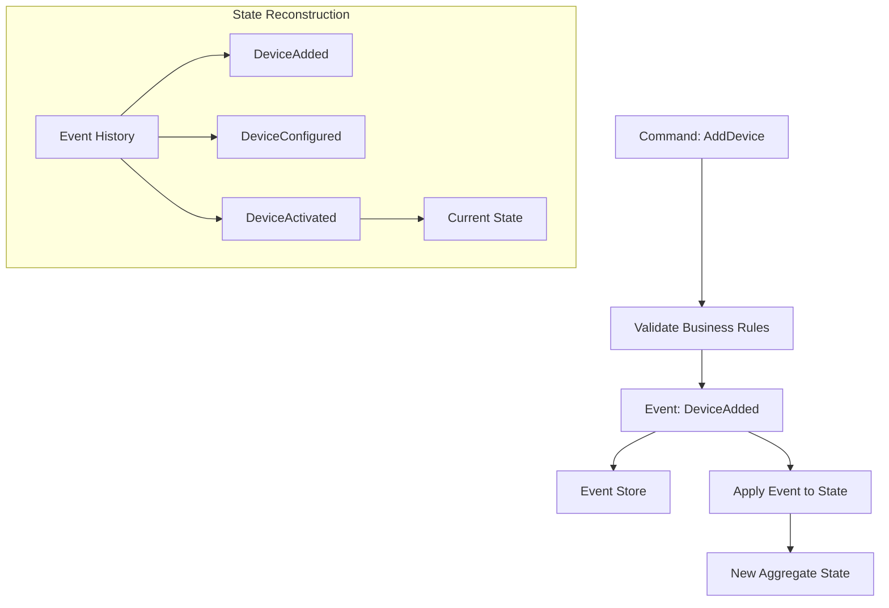
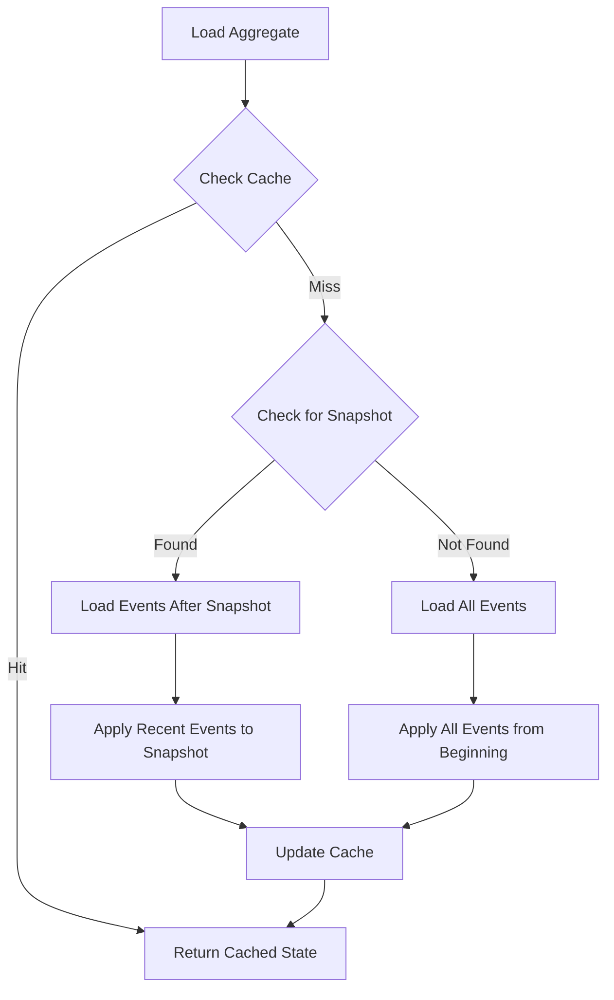

import { Tabs, TabItem, Card, CardGrid, Aside } from '@astrojs/starlight/components';

**Event Sourcing** is the default persistence strategy in Fluxzero where state is derived by replaying a stream of applied updates (events). Instead of storing current state, the system stores every change as an event that can be replayed to rebuild the current state.

<Aside type="tip" title="Real-world analogy">
Think of event sourcing like a smart home's activity log. Instead of just knowing "the living room light is on", you have a complete history: "8:00 AM - Motion detected, light turned on", "8:30 AM - Manual dimming to 50%", "6:00 PM - Automatic brightness increase". You can replay this log to understand exactly how the light got to its current state.
</Aside>

## Key Concepts

<CardGrid>
<Card title="Event Stream" icon="list-format">
Every change to an aggregate is captured as an event in an ordered sequence. Events are immutable facts about what happened.
</Card>

<Card title="State Reconstruction" icon="rocket">
Current state is rebuilt by replaying all events from the beginning. No direct state mutations - only through event application.
</Card>

<Card title="Complete Audit Trail" icon="document">
Every change is permanently recorded with full context, providing complete auditability and compliance capabilities.
</Card>

<Card title="Time Travel" icon="setting">
You can reconstruct the state of any aggregate at any point in time by replaying events up to that moment.
</Card>
</CardGrid>

## How Event Sourcing Works



## Event Lifecycle in Smart Home

Let's trace through how a smart home device lifecycle is captured as events:

<Tabs>
<TabItem label="Java">
```java
// Initial home creation
public record CreateSmartHome(String address, String ownerName) {
    @Apply
    SmartHome apply() {
        return new SmartHome(HomeId.generate(), address, ownerName, 
                           false, List.of(), List.of());
    }
}

// Event sequence for adding and configuring a device
public record AddDevice(HomeId homeId, Device device) {
    @Apply
    SmartHome apply(SmartHome home) {
        List<Device> updatedDevices = new ArrayList<>(home.devices());
        updatedDevices.add(device);
        return home.toBuilder().devices(updatedDevices).build();
    }
}

public record ConfigureDevice(HomeId homeId, DeviceId deviceId, 
                             Map<String, Object> settings) {
    @Apply
    SmartHome apply(SmartHome home) {
        List<Device> updatedDevices = home.devices().stream()
            .map(device -> {
                if (device.deviceId().equals(deviceId)) {
                    return device.toBuilder().settings(settings).build();
                }
                return device;
            })
            .toList();
        
        return home.toBuilder().devices(updatedDevices).build();
    }
}

public record ActivateDevice(HomeId homeId, DeviceId deviceId) {
    @Apply
    SmartHome apply(SmartHome home) {
        List<Device> updatedDevices = home.devices().stream()
            .map(device -> {
                if (device.deviceId().equals(deviceId)) {
                    return device.toBuilder().isOnline(true).build();
                }
                return device;
            })
            .toList();
        
        return home.toBuilder().devices(updatedDevices).build();
    }
}
```
</TabItem>
<TabItem label="Kotlin">
```kotlin
// Initial home creation
data class CreateSmartHome(val address: String, val ownerName: String) {
    @Apply
    fun apply(): SmartHome {
        return SmartHome(HomeId.generate(), address, ownerName, false)
    }
}

// Event sequence for adding and configuring a device
data class AddDevice(val homeId: HomeId, val device: Device) {
    @Apply
    fun apply(home: SmartHome): SmartHome {
        return home.copy(devices = home.devices + device)
    }
}

data class ConfigureDevice(val homeId: HomeId, val deviceId: DeviceId, 
                          val settings: Map<String, Any>) {
    @Apply
    fun apply(home: SmartHome): SmartHome {
        val updatedDevices = home.devices.map { device ->
            if (device.deviceId == deviceId) {
                device.copy(settings = settings)
            } else {
                device
            }
        }
        return home.copy(devices = updatedDevices)
    }
}

data class ActivateDevice(val homeId: HomeId, val deviceId: DeviceId) {
    @Apply
    fun apply(home: SmartHome): SmartHome {
        val updatedDevices = home.devices.map { device ->
            if (device.deviceId == deviceId) {
                device.copy(isOnline = true)
            } else {
                device
            }
        }
        return home.copy(devices = updatedDevices)
    }
}
```
</TabItem>
</Tabs>

## Event Application Lifecycle

### Validation Before Events

Use `@AssertLegal` to validate business rules before events are created:

<Tabs>
<TabItem label="Java">
```java
public record SetDeviceSchedule(HomeId homeId, DeviceId deviceId, 
                               Schedule schedule) {
    
    @AssertLegal
    void validateSchedule(SmartHome home) {
        if (home == null) {
            throw new IllegalCommandException("Smart home not found");
        }
        
        // Find the device
        Device device = home.devices().stream()
            .filter(d -> d.deviceId().equals(deviceId))
            .findFirst()
            .orElseThrow(() -> new IllegalCommandException("Device not found"));
        
        // Validate device supports scheduling
        if (!device.type().equals(DeviceType.THERMOSTAT) && 
            !device.type().equals(DeviceType.LIGHT)) {
            throw new IllegalCommandException(
                "Device type " + device.type() + " does not support scheduling");
        }
        
        // Validate schedule times
        if (schedule.startTime().isAfter(schedule.endTime())) {
            throw new IllegalCommandException("Start time must be before end time");
        }
        
        // Check for overlapping schedules
        boolean hasOverlap = home.schedules().stream()
            .filter(s -> s.deviceId().equals(deviceId))
            .anyMatch(existingSchedule -> 
                schedule.overlaps(existingSchedule));
        
        if (hasOverlap) {
            throw new IllegalCommandException("Schedule overlaps with existing schedule");
        }
    }
    
    @Apply
    SmartHome apply(SmartHome home) {
        List<Schedule> updatedSchedules = new ArrayList<>(home.schedules());
        updatedSchedules.add(schedule);
        
        return home.toBuilder().schedules(updatedSchedules).build();
    }
}
```
</TabItem>
<TabItem label="Kotlin">
```kotlin
data class SetDeviceSchedule(val homeId: HomeId, val deviceId: DeviceId, 
                            val schedule: Schedule) {
    
    @AssertLegal
    fun validateSchedule(home: SmartHome?) {
        requireNotNull(home) { "Smart home not found" }
        
        // Find the device
        val device = home.devices.find { it.deviceId == deviceId }
            ?: throw IllegalCommandException("Device not found")
        
        // Validate device supports scheduling
        require(device.type in listOf(DeviceType.THERMOSTAT, DeviceType.LIGHT)) {
            "Device type ${device.type} does not support scheduling"
        }
        
        // Validate schedule times
        require(schedule.startTime.isBefore(schedule.endTime)) {
            "Start time must be before end time"
        }
        
        // Check for overlapping schedules
        val hasOverlap = home.schedules.any { existingSchedule ->
            existingSchedule.deviceId == deviceId && schedule.overlaps(existingSchedule)
        }
        
        require(!hasOverlap) { "Schedule overlaps with existing schedule" }
    }
    
    @Apply
    fun apply(home: SmartHome): SmartHome {
        return home.copy(schedules = home.schedules + schedule)
    }
}
```
</TabItem>
</Tabs>

### Intercepting Events

Use `@InterceptApply` to modify, filter, or expand events before they're applied:

<Tabs>
<TabItem label="Java">
```java
public record UpdateDeviceSettings(DeviceId deviceId, 
                                  Map<String, Object> newSettings) {
    
    @InterceptApply
    List<Object> expandUpdate(Device device) {
        List<Object> events = new ArrayList<>();
        
        // Create individual events for each setting change
        for (Map.Entry<String, Object> entry : newSettings.entrySet()) {
            String key = entry.getKey();
            Object newValue = entry.getValue();
            Object oldValue = device.settings().get(key);
            
            if (!Objects.equals(oldValue, newValue)) {
                events.add(new DeviceSettingChanged(
                    deviceId, key, oldValue, newValue, Instant.now()));
            }
        }
        
        // Add a summary event
        if (!events.isEmpty()) {
            events.add(new DeviceSettingsUpdated(deviceId, newSettings));
        }
        
        return events;
    }
}

public record DeviceSettingChanged(DeviceId deviceId, String settingKey,
                                  Object oldValue, Object newValue, 
                                  Instant timestamp) {
    @Apply
    SmartHome apply(SmartHome home, Device device) {
        // Update specific setting
        Map<String, Object> updatedSettings = new HashMap<>(device.settings());
        updatedSettings.put(settingKey, newValue);
        
        Device updatedDevice = device.toBuilder()
            .settings(updatedSettings)
            .build();
        
        List<Device> updatedDevices = home.devices().stream()
            .map(d -> d.deviceId().equals(deviceId) ? updatedDevice : d)
            .toList();
        
        return home.toBuilder().devices(updatedDevices).build();
    }
}
```
</TabItem>
<TabItem label="Kotlin">
```kotlin
data class UpdateDeviceSettings(val deviceId: DeviceId, 
                               val newSettings: Map<String, Any>) {
    
    @InterceptApply
    fun expandUpdate(device: Device): List<Any> {
        val events = mutableListOf<Any>()
        
        // Create individual events for each setting change
        newSettings.forEach { (key, newValue) ->
            val oldValue = device.settings[key]
            
            if (oldValue != newValue) {
                events.add(DeviceSettingChanged(
                    deviceId, key, oldValue, newValue, Instant.now()))
            }
        }
        
        // Add a summary event
        if (events.isNotEmpty()) {
            events.add(DeviceSettingsUpdated(deviceId, newSettings))
        }
        
        return events
    }
}

data class DeviceSettingChanged(val deviceId: DeviceId, val settingKey: String,
                               val oldValue: Any?, val newValue: Any?, 
                               val timestamp: Instant) {
    @Apply
    fun apply(home: SmartHome, device: Device): SmartHome {
        // Update specific setting
        val updatedSettings = device.settings + (settingKey to newValue)
        
        val updatedDevice = device.copy(settings = updatedSettings)
        
        val updatedDevices = home.devices.map { d ->
            if (d.deviceId == deviceId) updatedDevice else d
        }
        
        return home.copy(devices = updatedDevices)
    }
}
```
</TabItem>
</Tabs>

## Event Store Optimization

### Snapshots

For aggregates with many events, use snapshots to improve loading performance:

<Tabs>
<TabItem label="Java">
```java
@Aggregate(snapshotPeriod = 1000)  // Create snapshot every 1000 events
public record SmartHome(@EntityId HomeId homeId,
                        String address,
                        String ownerName,
                        boolean securityEnabled,
                        @Member List<Room> rooms,
                        @Member List<Device> devices,
                        @Member List<Schedule> schedules) {
    
    // Business methods that don't change with snapshots
    public List<Device> getOnlineDevices() {
        return devices.stream()
            .filter(Device::isOnline)
            .toList();
    }
    
    public int getTotalDeviceCount() {
        return devices.size();
    }
}
```
</TabItem>
<TabItem label="Kotlin">
```kotlin
@Aggregate(snapshotPeriod = 1000)  // Create snapshot every 1000 events
data class SmartHome(@EntityId val homeId: HomeId,
                     val address: String,
                     val ownerName: String,
                     val securityEnabled: Boolean,
                     @Member val rooms: List<Room> = emptyList(),
                     @Member val devices: List<Device> = emptyList(),
                     @Member val schedules: List<Schedule> = emptyList()) {
    
    // Business methods that don't change with snapshots
    fun getOnlineDevices(): List<Device> {
        return devices.filter { it.isOnline }
    }
    
    fun getTotalDeviceCount(): Int = devices.size
}
```
</TabItem>
</Tabs>

### Event Retention

Configure how long events are retained:

<Tabs>
<TabItem label="Java">
```java
// Events retained indefinitely (default)
@Aggregate
public record SmartHome(/*...*/) {}

// Events retained for specific period (if configured globally)
@Aggregate(retentionPeriod = "P365D")  // 1 year
public record TemporaryDeviceLog(/*...*/) {}
```
</TabItem>
<TabItem label="Kotlin">
```kotlin
// Events retained indefinitely (default)
@Aggregate
data class SmartHome(/*...*/)

// Events retained for specific period (if configured globally)
@Aggregate(retentionPeriod = "P365D")  // 1 year
data class TemporaryDeviceLog(/*...*/)
```
</TabItem>
</Tabs>

## Loading Strategies

Event sourced aggregates use a sophisticated loading strategy:



### Performance Characteristics

<Tabs>
<TabItem label="Loading Performance">
```java
// Without snapshot: O(n) where n = total events
SmartHome home1 = Fluxzero.loadAggregate(homeId, SmartHome.class);
// Must replay all 10,000 events

// With snapshot: O(k) where k = events since last snapshot  
@Aggregate(snapshotPeriod = 1000)
SmartHome home2 = Fluxzero.loadAggregate(homeId, SmartHome.class);
// Loads snapshot + replays only 500 recent events
```
</TabItem>
<TabItem label="Memory Usage">
```java
// Event sourcing: Memory scales with aggregate complexity
SmartHome home = Fluxzero.loadAggregate(homeId, SmartHome.class);
// Memory: Current state only (devices, rooms, schedules)

// Document storage: Memory scales with document size
DeviceCatalog catalog = Fluxzero.loadAggregate(catalogId, DeviceCatalog.class);
// Memory: Full document content
```
</TabItem>
</Tabs>

## Event Sourcing vs Other Patterns

### Comparison Matrix

| Feature | Event Sourcing | Document Storage | Traditional DB |
|---------|----------------|------------------|----------------|
| **Audit Trail** | Complete | None | Limited |
| **Time Travel** | Full support | None | None |
| **Query Performance** | Moderate | Excellent | Good |
| **Write Performance** | Good | Excellent | Good |
| **Storage Requirements** | High | Low | Medium |
| **Complexity** | High | Low | Medium |
| **Compliance** | Excellent | Poor | Good |

### When to Use Each

<Tabs>
<TabItem label="Event Sourcing">
```java
// Use event sourcing for:
@Aggregate  // Default: eventSourced = true
public record SmartHome(/*...*/) {
    // Complex business logic
    // Need audit trail
    // Regulatory compliance
    // Time-based analysis
}

@Aggregate
public record SecuritySystem(/*...*/) {
    // Security events must be auditable
    // Need to track who did what when
}
```
</TabItem>
<TabItem label="Document Storage">
```java
// Use documents for:
@Aggregate(eventSourced = false, searchable = true)
public record DeviceCatalog(/*...*/) {
    // Read-heavy reference data
    // Search is primary use case
    // Current state is sufficient
}

@Aggregate(eventSourced = false)
public record UserPreferences(/*...*/) {
    // Simple state with no audit needs
}
```
</TabItem>
</Tabs>

## Advanced Event Sourcing Patterns

### Event Upcasting

Handle schema evolution by transforming old events:

<Tabs>
<TabItem label="Java">
```java
// Version 1: Simple device
public record DeviceAddedV1(HomeId homeId, String deviceName, String deviceType) {}

// Version 2: Rich device model
public record DeviceAddedV2(HomeId homeId, Device device) {}

// Upcaster to transform V1 to V2
@Component
public class DeviceEventUpcaster {
    
    @EventUpcast
    DeviceAddedV2 upcast(DeviceAddedV1 oldEvent) {
        Device device = Device.builder()
            .deviceId(DeviceId.generate())
            .name(oldEvent.deviceName())
            .type(DeviceType.valueOf(oldEvent.deviceType()))
            .isOnline(false)
            .settings(Map.of())
            .build();
            
        return new DeviceAddedV2(oldEvent.homeId(), device);
    }
}
```
</TabItem>
<TabItem label="Kotlin">
```kotlin
// Version 1: Simple device
data class DeviceAddedV1(val homeId: HomeId, val deviceName: String, val deviceType: String)

// Version 2: Rich device model
data class DeviceAddedV2(val homeId: HomeId, val device: Device)

// Upcaster to transform V1 to V2
@Component
class DeviceEventUpcaster {
    
    @EventUpcast
    fun upcast(oldEvent: DeviceAddedV1): DeviceAddedV2 {
        val device = Device(
            deviceId = DeviceId.generate(),
            name = oldEvent.deviceName,
            type = DeviceType.valueOf(oldEvent.deviceType),
            isOnline = false,
            settings = emptyMap()
        )
            
        return DeviceAddedV2(oldEvent.homeId, device)
    }
}
```
</TabItem>
</Tabs>

### Event Correlation

Link related events for complex workflows:

<Tabs>
<TabItem label="Java">
```java
public record StartSecurityArming(HomeId homeId, 
                                 @CorrelationId String armingProcessId) {
    @Apply
    SmartHome apply(SmartHome home) {
        return home.toBuilder()
            .securityStatus(SecurityStatus.ARMING)
            .build();
    }
}

public record DeviceSecurityCheckCompleted(HomeId homeId, DeviceId deviceId,
                                          boolean secure,
                                          @CorrelationId String armingProcessId) {
    @Apply  
    SmartHome apply(SmartHome home) {
        // Update security check status for this device
        // If all devices checked, complete arming process
        return updateSecurityStatus(home);
    }
}

public record SecurityArmingCompleted(HomeId homeId,
                                     @CorrelationId String armingProcessId,
                                     boolean successful) {
    @Apply
    SmartHome apply(SmartHome home) {
        return home.toBuilder()
            .securityStatus(successful ? 
                SecurityStatus.ARMED : SecurityStatus.DISARMED)
            .build();
    }
}
```
</TabItem>
<TabItem label="Kotlin">
```kotlin
data class StartSecurityArming(val homeId: HomeId, 
                              @CorrelationId val armingProcessId: String) {
    @Apply
    fun apply(home: SmartHome): SmartHome {
        return home.copy(securityStatus = SecurityStatus.ARMING)
    }
}

data class DeviceSecurityCheckCompleted(val homeId: HomeId, val deviceId: DeviceId,
                                       val secure: Boolean,
                                       @CorrelationId val armingProcessId: String) {
    @Apply  
    fun apply(home: SmartHome): SmartHome {
        // Update security check status for this device
        // If all devices checked, complete arming process
        return updateSecurityStatus(home)
    }
}

data class SecurityArmingCompleted(val homeId: HomeId,
                                  @CorrelationId val armingProcessId: String,
                                  val successful: Boolean) {
    @Apply
    fun apply(home: SmartHome): SmartHome {
        return home.copy(
            securityStatus = if (successful) 
                SecurityStatus.ARMED else SecurityStatus.DISARMED
        )
    }
}
```
</TabItem>
</Tabs>

## Event Sourcing Best Practices

### 1. Design Events as Facts
```java
// Good: Events describe what happened
public record TemperatureChanged(DeviceId thermostatId, double oldTemp, 
                               double newTemp, Instant timestamp) {}

// Bad: Events describe what to do
public record ChangeTemperature(DeviceId thermostatId, double temperature) {}
```

### 2. Keep Events Immutable and Serializable
```java
// Good: Simple, immutable data
public record DeviceActivated(DeviceId deviceId, Instant activatedAt) {}

// Bad: Contains behavior or mutable state
public record DeviceActivated(Device device, AtomicBoolean isProcessing) {}
```

### 3. Use Semantic Event Names
```java
// Good: Clear business meaning
public record SecuritySystemArmed(HomeId homeId, String armingCode) {}
public record MotionDetected(DeviceId sensorId, RoomId roomId) {}
public record DeviceOfflineDetected(DeviceId deviceId, Duration offlineDuration) {}

// Bad: Technical or vague names
public record SystemUpdated(String id, Map<String, Object> data) {}
public record EntityChanged(Object entity) {}
```

### 4. Handle Event Evolution
```java
// Version events and provide upcasters
public record DeviceAddedV1(String name, String type) {}
public record DeviceAddedV2(String name, DeviceType type, Map<String, Object> settings) {}

// Include version information
public record DeviceAdded(String name, DeviceType type, 
                         Map<String, Object> settings,
                         @Version int version) {}
```

### 5. Optimize for Replay Performance
```java
// Use snapshots for large aggregates
@Aggregate(snapshotPeriod = 500)
public record SmartHome(/*...*/) {}

// Keep event application logic simple and fast
@Apply
SmartHome apply(DeviceAdded event) {
    // Simple, efficient state update
    return toBuilder()
        .devices(addDevice(event.device()))
        .build();
}
```

## Troubleshooting Event Sourcing

### Common Issues

<Aside type="caution" title="Slow aggregate loading">
**Symptoms**: Long response times when loading aggregates

**Solutions**:
- Enable snapshots with `@Aggregate(snapshotPeriod = N)`
- Optimize `@Apply` methods for performance
- Consider splitting large aggregates
- Use caching for frequently accessed aggregates
</Aside>

<Aside type="caution" title="Event schema evolution errors">
**Symptoms**: Exceptions during event replay after code changes

**Solutions**:
- Implement event upcasters for schema changes
- Version your events explicitly
- Test event replay with production data
- Use backward-compatible changes when possible
</Aside>

<Aside type="caution" title="Memory issues with large aggregates">
**Symptoms**: OutOfMemoryError when loading aggregates

**Solutions**:
- Implement snapshots to reduce event replay
- Split aggregates into smaller consistency boundaries
- Review aggregate design for proper boundaries
- Monitor aggregate size and complexity
</Aside>

## Testing Event Sourced Aggregates

<Tabs>
<TabItem label="Java">
```java
@Test
void shouldTrackCompleteDeviceLifecycle() {
    // Given
    TestFluxCapacitor flux = TestFluxCapacitor.create();
    HomeId homeId = HomeId.generate();
    
    // Create home
    flux.sendCommand(new CreateSmartHome("123 Main St", "John Doe"));
    
    // When - Device lifecycle events
    Device thermostat = new Device(DeviceId.generate(), "Living Room Thermostat",
                                  DeviceType.THERMOSTAT, false, Map.of());
    
    flux.sendCommand(new AddDevice(homeId, thermostat));
    flux.sendCommand(new ConfigureDevice(homeId, thermostat.deviceId(), 
                                       Map.of("targetTemp", 22.0)));
    flux.sendCommand(new ActivateDevice(homeId, thermostat.deviceId()));
    
    // Then - Verify complete event history
    SmartHome home = flux.loadAggregate(homeId, SmartHome.class);
    
    assertThat(home.devices()).hasSize(1);
    assertThat(home.devices().get(0).isOnline()).isTrue();
    assertThat(home.devices().get(0).settings().get("targetTemp")).isEqualTo(22.0);
    
    // Verify events were recorded
    List<Object> events = flux.getEvents(homeId);
    assertThat(events)
        .hasSize(4)
        .extracting(Object::getClass)
        .containsExactly(
            CreateSmartHome.class,
            AddDevice.class, 
            ConfigureDevice.class,
            ActivateDevice.class
        );
}
```
</TabItem>
<TabItem label="Kotlin">
```kotlin
@Test
fun shouldTrackCompleteDeviceLifecycle() {
    // Given
    val flux = TestFluxCapacitor.create()
    val homeId = HomeId.generate()
    
    // Create home
    flux.sendCommand(CreateSmartHome("123 Main St", "John Doe"))
    
    // When - Device lifecycle events
    val thermostat = Device(DeviceId.generate(), "Living Room Thermostat",
                           DeviceType.THERMOSTAT, false, emptyMap())
    
    flux.sendCommand(AddDevice(homeId, thermostat))
    flux.sendCommand(ConfigureDevice(homeId, thermostat.deviceId, 
                                   mapOf("targetTemp" to 22.0)))
    flux.sendCommand(ActivateDevice(homeId, thermostat.deviceId))
    
    // Then - Verify complete event history
    val home = flux.loadAggregate(homeId, SmartHome::class.java)
    
    assertThat(home.devices).hasSize(1)
    assertThat(home.devices[0].isOnline).isTrue()
    assertThat(home.devices[0].settings["targetTemp"]).isEqualTo(22.0)
    
    // Verify events were recorded
    val events = flux.getEvents(homeId)
    assertThat(events)
        .hasSize(4)
        .extracting { it::class.java }
        .containsExactly(
            CreateSmartHome::class.java,
            AddDevice::class.java, 
            ConfigureDevice::class.java,
            ActivateDevice::class.java
        )
}
```
</TabItem>
</Tabs>

## Related Concepts

- **[Aggregates](/reference/core-components/aggregate)** - Entities that use event sourcing by default
- **[Events](/reference/core-components/event)** - The building blocks of event sourcing
- **[Commands](/reference/core-components/command)** - Trigger events through aggregate methods
- **[Handlers](/reference/core-components/handler)** - Process events to maintain projections
- **[Message Log](/reference/core-components/message-log)** - Where events are stored persistently
- **[Document Storage](/reference/core-components/document)** - Alternative to event sourcing for simpler use cases