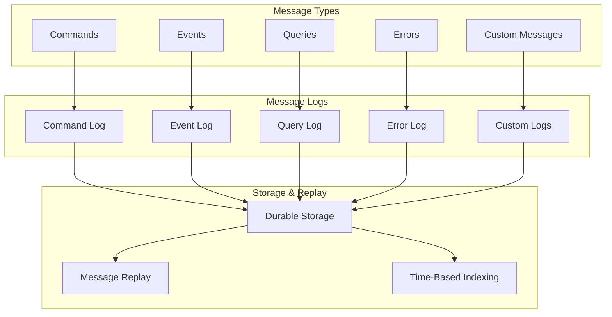

import { Tabs, TabItem, Card, CardGrid, Aside } from '@astrojs/starlight/components';

The **Message Log** is Fluxzero's durable storage system that persistently stores all types of messages including commands, events, queries, errors, and custom messages. It provides the foundation for event sourcing, audit trails, system recovery, and replay capabilities.

<Aside type="tip" title="Real-world analogy">
Think of the message log like a smart home's activity journal. Every action—"motion detected," "lights turned on," "security armed"—is permanently recorded with timestamps. You can replay the entire history to understand what happened, troubleshoot issues, or restore the system to any previous state.
</Aside>

## Key Concepts

<CardGrid>
<Card title="Durable Storage" icon="document">
All messages are persistently stored with configurable retention policies. Events are retained indefinitely by default for complete audit trails.
</Card>

<Card title="Message Separation" icon="list-format">
Different message types (commands, events, queries, errors) have separate logs, allowing independent configuration and management.
</Card>

<Card title="Time-Based Indexing" icon="setting">
Messages are indexed by time-based values, enabling precise replay from specific points in time using timestamps or index positions.
</Card>

<Card title="Replay Capabilities" icon="rocket">
Past messages can be replayed by tracking from earlier positions in the log, supporting system recovery and analysis workflows.
</Card>
</CardGrid>

## Message Log Architecture



## Publishing Messages to Logs

### Built-in Message Gateways

Fluxzero provides dedicated gateways for each message type:

<Tabs>
<TabItem label="Java">
```java
@Component
public class SmartHomeService {
    
    @Autowired private CommandGateway commandGateway;
    @Autowired private EventGateway eventGateway;
    @Autowired private QueryGateway queryGateway;
    @Autowired private MetricsGateway metricsGateway;
    @Autowired private ErrorGateway errorGateway;
    
    public void controlDevice(DeviceId deviceId, boolean turnOn) {
        // Publish command to command log
        if (turnOn) {
            commandGateway.sendAndWait(new TurnOnLight(deviceId));
        } else {
            commandGateway.sendAndWait(new TurnOffLight(deviceId));
        }
    }
    
    public void publishDeviceEvent(DeviceId deviceId, String eventType) {
        // Publish event to event log
        switch (eventType) {
            case "motion" -> eventGateway.publish(
                new MotionDetected(deviceId, Instant.now()));
            case "offline" -> eventGateway.publish(
                new DeviceOffline(deviceId, Duration.ofMinutes(5)));
        }
    }
    
    public List<Device> queryHomeDevices(HomeId homeId) {
        // Send query to query log and get result
        return queryGateway.sendAndWait(new GetHomeDevices(homeId));
    }
    
    public void recordMetrics(String metricName, double value) {
        // Log metrics for monitoring
        metricsGateway.publish(new DeviceMetric(metricName, value, Instant.now()));
    }
    
    public void logError(Exception error, String context) {
        // Log errors for debugging and recovery
        errorGateway.publish(new SystemError(error.getMessage(), context, Instant.now()));
    }
}
```
</TabItem>
<TabItem label="Kotlin">
```kotlin
@Component
class SmartHomeService {
    
    @Autowired private lateinit var commandGateway: CommandGateway
    @Autowired private lateinit var eventGateway: EventGateway
    @Autowired private lateinit var queryGateway: QueryGateway
    @Autowired private lateinit var metricsGateway: MetricsGateway
    @Autowired private lateinit var errorGateway: ErrorGateway
    
    fun controlDevice(deviceId: DeviceId, turnOn: Boolean) {
        // Publish command to command log
        if (turnOn) {
            commandGateway.sendAndWait(TurnOnLight(deviceId))
        } else {
            commandGateway.sendAndWait(TurnOffLight(deviceId))
        }
    }
    
    fun publishDeviceEvent(deviceId: DeviceId, eventType: String) {
        // Publish event to event log
        when (eventType) {
            "motion" -> eventGateway.publish(
                MotionDetected(deviceId, Instant.now()))
            "offline" -> eventGateway.publish(
                DeviceOffline(deviceId, Duration.ofMinutes(5)))
        }
    }
    
    fun queryHomeDevices(homeId: HomeId): List<Device> {
        // Send query to query log and get result
        return queryGateway.sendAndWait(GetHomeDevices(homeId))
    }
    
    fun recordMetrics(metricName: String, value: Double) {
        // Log metrics for monitoring
        metricsGateway.publish(DeviceMetric(metricName, value, Instant.now()))
    }
    
    fun logError(error: Exception, context: String) {
        // Log errors for debugging and recovery
        errorGateway.publish(SystemError(error.message ?: "", context, Instant.now()))
    }
}
```
</TabItem>
</Tabs>

### Custom Message Logs

Create specialized logs for specific use cases:

<Tabs>
<TabItem label="Java">
```java
public class SmartHomeIntegrationService {
    
    // Publish to custom home automation log
    public void logThirdPartyEvent(String deviceId, String eventType, Map<String, Object> data) {
        FluxCapacitor.get()
            .customGateway("home-automation-events")
            .sendAndForget(new ThirdPartyDeviceEvent(deviceId, eventType, data, Instant.now()));
    }
    
    // Publish security audit events
    public void logSecurityAudit(String userId, String action, String details) {
        FluxCapacitor.get()
            .customGateway("security-audit")
            .sendAndForget(new SecurityAuditEvent(userId, action, details, Instant.now()));
    }
    
    // Log energy consumption data
    public void logEnergyUsage(DeviceId deviceId, double kwh, Instant timestamp) {
        FluxCapacitor.get()
            .customGateway("energy-monitoring")
            .sendAndForget(new EnergyUsageLog(deviceId, kwh, timestamp));
    }
    
    // Set retention policy for custom log
    public void configureRetention() {
        // Energy data retained for 2 years
        FluxCapacitor.get()
            .customGateway("energy-monitoring")
            .setRetentionTime(Duration.ofDays(730));
            
        // Security audit retained indefinitely (no retention set)
        // home-automation-events use default retention
    }
}

public record ThirdPartyDeviceEvent(String deviceId, String eventType, 
                                   Map<String, Object> data, Instant timestamp) {}

public record SecurityAuditEvent(String userId, String action, 
                                String details, Instant timestamp) {}

public record EnergyUsageLog(DeviceId deviceId, double kwhUsed, Instant timestamp) {}
```
</TabItem>
<TabItem label="Kotlin">
```kotlin
class SmartHomeIntegrationService {
    
    // Publish to custom home automation log
    fun logThirdPartyEvent(deviceId: String, eventType: String, data: Map<String, Any>) {
        FluxCapacitor.get()
            .customGateway("home-automation-events")
            .sendAndForget(ThirdPartyDeviceEvent(deviceId, eventType, data, Instant.now()))
    }
    
    // Publish security audit events
    fun logSecurityAudit(userId: String, action: String, details: String) {
        FluxCapacitor.get()
            .customGateway("security-audit")
            .sendAndForget(SecurityAuditEvent(userId, action, details, Instant.now()))
    }
    
    // Log energy consumption data
    fun logEnergyUsage(deviceId: DeviceId, kwh: Double, timestamp: Instant) {
        FluxCapacitor.get()
            .customGateway("energy-monitoring")
            .sendAndForget(EnergyUsageLog(deviceId, kwh, timestamp))
    }
    
    // Set retention policy for custom log
    fun configureRetention() {
        // Energy data retained for 2 years
        FluxCapacitor.get()
            .customGateway("energy-monitoring")
            .setRetentionTime(Duration.ofDays(730))
            
        // Security audit retained indefinitely (no retention set)
        // home-automation-events use default retention
    }
}

data class ThirdPartyDeviceEvent(val deviceId: String, val eventType: String, 
                                val data: Map<String, Any>, val timestamp: Instant)

data class SecurityAuditEvent(val userId: String, val action: String, 
                             val details: String, val timestamp: Instant)

data class EnergyUsageLog(val deviceId: DeviceId, val kwhUsed: Double, val timestamp: Instant)
```
</TabItem>
</Tabs>

## Message Replay and Recovery

### Time-Based Message Replay

Replay messages from specific points in time using timestamps or index positions:

<Tabs>
<TabItem label="Java">
```java
// Consumer that replays events from a specific date
@Consumer(
    name = "security-audit-replay",
    minIndex = 111677748019200000L,  // Generated from timestamp
    exclusive = false  // Run alongside live consumers
)
public class SecurityAuditReplayHandler {
    
    @HandleEvent
    void auditDeviceActivation(DeviceActivated event) {
        // Re-audit past device activations
        log.info("AUDIT: Device {} activated at {}", 
                event.deviceId(), event.timestamp());
        
        // Check for security policy violations
        validateSecurityCompliance(event);
    }
    
    @HandleEvent  
    void auditSecurityEvents(SecuritySystemArmed event) {
        // Review past security events
        log.info("AUDIT: Security armed by {} at {}", 
                event.userId(), event.timestamp());
    }
}

// Helper class to generate replay indices
public class ReplayHelper {
    
    public static long getIndexForDate(String dateString) {
        Instant timestamp = Instant.parse(dateString);
        return IndexUtils.indexFromTimestamp(timestamp);
    }
    
    public static void startReplay(String consumerName, String fromDate, String toDate) {
        long minIndex = getIndexForDate(fromDate);
        long maxIndex = getIndexForDate(toDate);
        
        // Configure replay consumer programmatically
        ConsumerConfiguration config = ConsumerConfiguration.builder()
            .name(consumerName)
            .minIndex(minIndex)
            .maxIndexExclusive(maxIndex)
            .exclusive(false)
            .threads(2)
            .build();
            
        FluxCapacitor.client().getTrackingClient(MessageType.EVENT)
            .startTracking(config);
    }
}
```
</TabItem>
<TabItem label="Kotlin">
```kotlin
// Consumer that replays events from a specific date
@Consumer(
    name = "security-audit-replay",
    minIndex = 111677748019200000L,  // Generated from timestamp
    exclusive = false  // Run alongside live consumers
)
class SecurityAuditReplayHandler {
    
    @HandleEvent
    fun auditDeviceActivation(event: DeviceActivated) {
        // Re-audit past device activations
        log.info("AUDIT: Device ${event.deviceId} activated at ${event.timestamp}")
        
        // Check for security policy violations
        validateSecurityCompliance(event)
    }
    
    @HandleEvent  
    fun auditSecurityEvents(event: SecuritySystemArmed) {
        // Review past security events
        log.info("AUDIT: Security armed by ${event.userId} at ${event.timestamp}")
    }
}

// Helper class to generate replay indices
class ReplayHelper {
    
    companion object {
        fun getIndexForDate(dateString: String): Long {
            val timestamp = Instant.parse(dateString)
            return IndexUtils.indexFromTimestamp(timestamp)
        }
        
        fun startReplay(consumerName: String, fromDate: String, toDate: String) {
            val minIndex = getIndexForDate(fromDate)
            val maxIndex = getIndexForDate(toDate)
            
            // Configure replay consumer programmatically
            val config = ConsumerConfiguration.builder()
                .name(consumerName)
                .minIndex(minIndex)
                .maxIndexExclusive(maxIndex)
                .exclusive(false)
                .threads(2)
                .build()
                
            FluxCapacitor.client().getTrackingClient(MessageType.EVENT)
                .startTracking(config)
        }
    }
}
```
</TabItem>
</Tabs>

### Error Recovery and Dead Letter Queue

Use the error log as a dynamic dead letter queue for failed message recovery:

<Tabs>
<TabItem label="Java">
```java
// Replay failed commands from a specific time period
@Consumer(
    name = "command-recovery",
    minIndex = 111677748019200000L,  // Start of failure period
    maxIndexExclusive = 111853279641600000L  // End of failure period
)
public class CommandRecoveryHandler {
    
    @HandleError
    @Trigger(messageType = MessageType.COMMAND)
    void retryFailedDeviceCommands(TurnOnLight failedCommand) {
        try {
            // Retry the failed command with backoff
            Thread.sleep(1000);  // Simple backoff
            
            // Re-execute the command
            FluxCapacitor.get(CommandGateway.class)
                .sendAndWait(failedCommand);
                
            log.info("Successfully retried command: {}", failedCommand);
            
        } catch (Exception e) {
            log.error("Command retry failed again: {}", failedCommand, e);
            // Could send to another error handler or escalate
        }
    }
    
    @HandleError
    @Trigger(messageType = MessageType.COMMAND)
    void retryFailedThermostatCommands(SetTemperature failedCommand) {
        // Different retry logic for thermostat commands
        DeviceId deviceId = failedCommand.deviceId();
        
        // Check if device is online before retrying
        Device device = FluxCapacitor.loadEntity(deviceId);
        if (!device.isOnline()) {
            log.warn("Device {} still offline, skipping retry", deviceId);
            return;
        }
        
        try {
            FluxCapacitor.get(CommandGateway.class)
                .sendAndWait(failedCommand);
        } catch (Exception e) {
            // Escalate to manual intervention
            notifyAdministrator(failedCommand, e);
        }
    }
}

// System recovery service
@Service
public class SystemRecoveryService {
    
    public void recoverFromOutage(Instant outageStart, Instant outageEnd) {
        long startIndex = IndexUtils.indexFromTimestamp(outageStart);
        long endIndex = IndexUtils.indexFromTimestamp(outageEnd);
        
        log.info("Starting recovery for period {} to {}", outageStart, outageEnd);
        
        // Reset error consumer to replay failed messages
        FluxCapacitor.client()
            .getTrackingClient(MessageType.ERROR)
            .resetPosition("command-recovery", startIndex, Guarantee.STORED);
    }
    
    public void resetConsumerPosition(String consumerName, Instant replayFrom) {
        long replayIndex = IndexUtils.indexFromTimestamp(replayFrom);
        
        FluxCapacitor.client()
            .getTrackingClient(MessageType.EVENT)
            .resetPosition(consumerName, replayIndex, Guarantee.STORED);
            
        log.info("Reset consumer {} to index {}", consumerName, replayIndex);
    }
}
```
</TabItem>
<TabItem label="Kotlin">
```kotlin
// Replay failed commands from a specific time period
@Consumer(
    name = "command-recovery",
    minIndex = 111677748019200000L,  // Start of failure period
    maxIndexExclusive = 111853279641600000L  // End of failure period
)
class CommandRecoveryHandler {
    
    @HandleError
    @Trigger(messageType = MessageType.COMMAND)
    fun retryFailedDeviceCommands(failedCommand: TurnOnLight) {
        try {
            // Retry the failed command with backoff
            Thread.sleep(1000)  // Simple backoff
            
            // Re-execute the command
            FluxCapacitor.get(CommandGateway::class.java)
                .sendAndWait(failedCommand)
                
            log.info("Successfully retried command: $failedCommand")
            
        } catch (e: Exception) {
            log.error("Command retry failed again: $failedCommand", e)
            // Could send to another error handler or escalate
        }
    }
    
    @HandleError
    @Trigger(messageType = MessageType.COMMAND)
    fun retryFailedThermostatCommands(failedCommand: SetTemperature) {
        // Different retry logic for thermostat commands
        val deviceId = failedCommand.deviceId
        
        // Check if device is online before retrying
        val device = FluxCapacitor.loadEntity<Device>(deviceId)
        if (!device.isOnline) {
            log.warn("Device $deviceId still offline, skipping retry")
            return
        }
        
        try {
            FluxCapacitor.get(CommandGateway::class.java)
                .sendAndWait(failedCommand)
        } catch (e: Exception) {
            // Escalate to manual intervention
            notifyAdministrator(failedCommand, e)
        }
    }
}

// System recovery service
@Service
class SystemRecoveryService {
    
    fun recoverFromOutage(outageStart: Instant, outageEnd: Instant) {
        val startIndex = IndexUtils.indexFromTimestamp(outageStart)
        val endIndex = IndexUtils.indexFromTimestamp(outageEnd)
        
        log.info("Starting recovery for period $outageStart to $outageEnd")
        
        // Reset error consumer to replay failed messages
        FluxCapacitor.client()
            .getTrackingClient(MessageType.ERROR)
            .resetPosition("command-recovery", startIndex, Guarantee.STORED)
    }
    
    fun resetConsumerPosition(consumerName: String, replayFrom: Instant) {
        val replayIndex = IndexUtils.indexFromTimestamp(replayFrom)
        
        FluxCapacitor.client()
            .getTrackingClient(MessageType.EVENT)
            .resetPosition(consumerName, replayIndex, Guarantee.STORED)
            
        log.info("Reset consumer $consumerName to index $replayIndex")
    }
}
```
</TabItem>
</Tabs>

## Performance Configuration

### Consumer Performance Tuning

Configure consumers for optimal message log processing:

<Tabs>
<TabItem label="Java">
```java
// High-throughput event processing consumer
@Consumer(
    name = "device-analytics",
    threads = 8,           // Parallel processing threads
    maxFetchSize = 4096    // Large batch size for efficiency
)
@Stateful(commitInBatch = true)  // Defer updates for better performance
public class DeviceAnalyticsHandler {
    
    private final Map<DeviceId, DeviceStats> statsCache = new ConcurrentHashMap<>();
    
    @HandleEvent
    void updateDeviceStats(DeviceStatusChanged event) {
        // Update stats in local cache (not persisted until batch commit)
        DeviceId deviceId = event.deviceId();
        
        statsCache.compute(deviceId, (id, existingStats) -> {
            if (existingStats == null) {
                return new DeviceStats(id, 1, event.timestamp());
            }
            return existingStats.withUpdatedCount().withLastSeen(event.timestamp());
        });
    }
    
    @HandleEvent
    void updateEnergyUsage(EnergyConsumptionEvent event) {
        // High-frequency energy events processed in batches
        DeviceId deviceId = event.deviceId();
        
        statsCache.compute(deviceId, (id, stats) -> {
            if (stats == null) {
                return new DeviceStats(id, event.energyUsed(), event.timestamp());
            }
            return stats.withAddedEnergyUsage(event.energyUsed());
        });
    }
    
    // Batch commit happens automatically at end of message batch
    // statsCache updates are persisted together for better performance
}

// Configuration for tracking client performance
@Configuration
public class MessageLogConfiguration {
    
    @Bean
    public ClientConfig fluxCapacitorConfig() {
        return ClientConfig.builder()
            .trackingConfig(TrackingConfig.builder()
                .cacheSize(2000)      // Buffer messages in-memory per topic
                .maxFetchSize(2048)   // Default batch size
                .build())
            .build();
    }
}
```
</TabItem>
<TabItem label="Kotlin">
```kotlin
// High-throughput event processing consumer
@Consumer(
    name = "device-analytics",
    threads = 8,           // Parallel processing threads
    maxFetchSize = 4096    // Large batch size for efficiency
)
@Stateful(commitInBatch = true)  // Defer updates for better performance
class DeviceAnalyticsHandler {
    
    private val statsCache = ConcurrentHashMap<DeviceId, DeviceStats>()
    
    @HandleEvent
    fun updateDeviceStats(event: DeviceStatusChanged) {
        // Update stats in local cache (not persisted until batch commit)
        val deviceId = event.deviceId
        
        statsCache.compute(deviceId) { id, existingStats ->
            existingStats?.withUpdatedCount()?.withLastSeen(event.timestamp)
                ?: DeviceStats(id, 1, event.timestamp)
        }
    }
    
    @HandleEvent
    fun updateEnergyUsage(event: EnergyConsumptionEvent) {
        // High-frequency energy events processed in batches
        val deviceId = event.deviceId
        
        statsCache.compute(deviceId) { id, stats ->
            stats?.withAddedEnergyUsage(event.energyUsed)
                ?: DeviceStats(id, event.energyUsed, event.timestamp)
        }
    }
    
    // Batch commit happens automatically at end of message batch
    // statsCache updates are persisted together for better performance
}

// Configuration for tracking client performance
@Configuration
class MessageLogConfiguration {
    
    @Bean
    fun fluxCapacitorConfig(): ClientConfig {
        return ClientConfig.builder()
            .trackingConfig(TrackingConfig.builder()
                .cacheSize(2000)      // Buffer messages in-memory per topic
                .maxFetchSize(2048)   // Default batch size
                .build())
            .build()
    }
}
```
</TabItem>
</Tabs>

### Message Log Retention Policies

Configure retention policies for different types of logs:

<Tabs>
<TabItem label="Java">
```java
@Service
public class MessageLogRetentionService {
    
    @PostConstruct
    public void configureRetentionPolicies() {
        // Events: Retain indefinitely (default) for audit trail
        // Commands: Default retention (usually shorter)
        // Queries: Default retention (usually shorter)
        
        // Custom logs with specific retention needs
        
        // Energy monitoring: 2 years for compliance
        FluxCapacitor.get()
            .customGateway("energy-monitoring")
            .setRetentionTime(Duration.ofDays(730));
            
        // Device diagnostics: 90 days for troubleshooting
        FluxCapacitor.get()
            .customGateway("device-diagnostics")
            .setRetentionTime(Duration.ofDays(90));
            
        // Third-party integration logs: 30 days
        FluxCapacitor.get()
            .customGateway("third-party-events")
            .setRetentionTime(Duration.ofDays(30));
            
        // Security audit: Infinite retention (no setRetentionTime call)
        
        log.info("Message log retention policies configured");
    }
    
    public void adjustRetentionForCompliance(String customLogName, Duration newRetention) {
        FluxCapacitor.get()
            .customGateway(customLogName)
            .setRetentionTime(newRetention);
            
        log.info("Updated retention for {} to {}", customLogName, newRetention);
    }
}
```
</TabItem>
<TabItem label="Kotlin">
```kotlin
@Service
class MessageLogRetentionService {
    
    @PostConstruct
    fun configureRetentionPolicies() {
        // Events: Retain indefinitely (default) for audit trail
        // Commands: Default retention (usually shorter)
        // Queries: Default retention (usually shorter)
        
        // Custom logs with specific retention needs
        
        // Energy monitoring: 2 years for compliance
        FluxCapacitor.get()
            .customGateway("energy-monitoring")
            .setRetentionTime(Duration.ofDays(730))
            
        // Device diagnostics: 90 days for troubleshooting
        FluxCapacitor.get()
            .customGateway("device-diagnostics")
            .setRetentionTime(Duration.ofDays(90))
            
        // Third-party integration logs: 30 days
        FluxCapacitor.get()
            .customGateway("third-party-events")
            .setRetentionTime(Duration.ofDays(30))
            
        // Security audit: Infinite retention (no setRetentionTime call)
        
        log.info("Message log retention policies configured")
    }
    
    fun adjustRetentionForCompliance(customLogName: String, newRetention: Duration) {
        FluxCapacitor.get()
            .customGateway(customLogName)
            .setRetentionTime(newRetention)
            
        log.info("Updated retention for $customLogName to $newRetention")
    }
}
```
</TabItem>
</Tabs>

## Custom Message Handlers

Handle messages from custom logs with specialized consumers:

<Tabs>
<TabItem label="Java">
```java
// Handle third-party device events
@Consumer(name = "third-party-integration")
public class ThirdPartyEventHandler {
    
    @HandleCustomMessage("home-automation-events")
    void processThirdPartyDeviceEvent(ThirdPartyDeviceEvent event) {
        log.info("Processing third-party event: {} for device {}", 
                event.eventType(), event.deviceId());
        
        // Translate to internal events
        switch (event.eventType()) {
            case "device_connected" -> publishInternalEvent(
                new DeviceOnline(DeviceId.from(event.deviceId())));
            case "device_disconnected" -> publishInternalEvent(
                new DeviceOffline(DeviceId.from(event.deviceId()), Duration.ofMinutes(1)));
            case "sensor_reading" -> processSensorData(event);
        }
    }
    
    @HandleCustomMessage("security-audit")
    void processSecurityAudit(SecurityAuditEvent event) {
        // Forward security events to compliance monitoring
        complianceMonitor.recordAuditEvent(event);
        
        // Check for suspicious patterns
        if (isHighRiskActivity(event)) {
            alertSecurityTeam(event);
        }
    }
    
    @HandleCustomMessage("energy-monitoring")
    void processEnergyUsage(EnergyUsageLog event) {
        // Update energy consumption analytics
        energyAnalytics.recordUsage(event.deviceId(), event.kwhUsed(), event.timestamp());
        
        // Check for unusual consumption patterns
        if (isAnomalousUsage(event)) {
            triggerEfficiencyAlert(event);
        }
    }
}

// Replay historical energy data for analysis
@Consumer(
    name = "energy-analysis-replay",
    minIndex = 111677748019200000L  // Last month
)
public class EnergyAnalysisReplayHandler {
    
    @HandleCustomMessage("energy-monitoring")
    void analyzeHistoricalEnergyUsage(EnergyUsageLog event) {
        // Process historical energy data for trend analysis
        energyTrendAnalyzer.addDataPoint(
            event.deviceId(), 
            event.kwhUsed(), 
            event.timestamp()
        );
        
        // Generate efficiency recommendations
        if (hasEnoughDataForAnalysis(event.deviceId())) {
            generateEfficiencyReport(event.deviceId());
        }
    }
}
```
</TabItem>
<TabItem label="Kotlin">
```kotlin
// Handle third-party device events
@Consumer(name = "third-party-integration")
class ThirdPartyEventHandler {
    
    @HandleCustomMessage("home-automation-events")
    fun processThirdPartyDeviceEvent(event: ThirdPartyDeviceEvent) {
        log.info("Processing third-party event: ${event.eventType} for device ${event.deviceId}")
        
        // Translate to internal events
        when (event.eventType) {
            "device_connected" -> publishInternalEvent(
                DeviceOnline(DeviceId.from(event.deviceId)))
            "device_disconnected" -> publishInternalEvent(
                DeviceOffline(DeviceId.from(event.deviceId), Duration.ofMinutes(1)))
            "sensor_reading" -> processSensorData(event)
        }
    }
    
    @HandleCustomMessage("security-audit")
    fun processSecurityAudit(event: SecurityAuditEvent) {
        // Forward security events to compliance monitoring
        complianceMonitor.recordAuditEvent(event)
        
        // Check for suspicious patterns
        if (isHighRiskActivity(event)) {
            alertSecurityTeam(event)
        }
    }
    
    @HandleCustomMessage("energy-monitoring")
    fun processEnergyUsage(event: EnergyUsageLog) {
        // Update energy consumption analytics
        energyAnalytics.recordUsage(event.deviceId, event.kwhUsed, event.timestamp)
        
        // Check for unusual consumption patterns
        if (isAnomalousUsage(event)) {
            triggerEfficiencyAlert(event)
        }
    }
}

// Replay historical energy data for analysis
@Consumer(
    name = "energy-analysis-replay",
    minIndex = 111677748019200000L  // Last month
)
class EnergyAnalysisReplayHandler {
    
    @HandleCustomMessage("energy-monitoring")
    fun analyzeHistoricalEnergyUsage(event: EnergyUsageLog) {
        // Process historical energy data for trend analysis
        energyTrendAnalyzer.addDataPoint(
            event.deviceId, 
            event.kwhUsed, 
            event.timestamp
        )
        
        // Generate efficiency recommendations
        if (hasEnoughDataForAnalysis(event.deviceId)) {
            generateEfficiencyReport(event.deviceId)
        }
    }
}
```
</TabItem>
</Tabs>

## Best Practices

### 1. Choose Appropriate Retention Policies
```java
// Events: Keep indefinitely for audit trails
// Default behavior - no explicit retention needed

// Custom logs: Set retention based on business needs
FluxCapacitor.get().customGateway("analytics")
    .setRetentionTime(Duration.ofDays(90));

// Compliance data: Long retention periods
FluxCapacitor.get().customGateway("compliance-audit")
    .setRetentionTime(Duration.ofDays(2555));  // 7 years
```

### 2. Use Custom Logs for Specific Purposes
```java
// Separate concerns with different custom logs
- "device-diagnostics" - Technical troubleshooting data
- "security-audit" - Compliance and security events  
- "energy-monitoring" - Consumption analytics
- "third-party-events" - External system integration
```

### 3. Optimize Consumer Performance
```java
// High-throughput consumers
@Consumer(threads = 4, maxFetchSize = 2048)
@Stateful(commitInBatch = true)  // For write-heavy operations

// Low-latency consumers  
@Consumer(threads = 1, maxFetchSize = 64)
// No batching for real-time responses
```

### 4. Implement Proper Error Recovery
```java
// Use error log as dynamic DLQ with time-bounded replay
@Consumer(
    name = "error-recovery",
    minIndex = failureStartIndex,
    maxIndexExclusive = failureEndIndex
)
// Replay only failed messages from specific period
```

### 5. Monitor Message Log Health
```java
// Track consumer lag and processing rates
- Monitor consumer position vs current log position
- Alert on growing lag or processing failures
- Use metrics gateway to track message log performance
```

## Common Use Cases

### System Recovery After Outage
<Tabs>
<TabItem label="Java">
```java
@Service
public class DisasterRecoveryService {
    
    public void recoverFromSystemOutage(Instant outageStart, Instant outageEnd) {
        log.info("Starting system recovery for outage period: {} to {}", 
                outageStart, outageEnd);
        
        // 1. Replay critical events to restore system state
        replayEventsForPeriod("critical-system-recovery", outageStart, outageEnd);
        
        // 2. Retry failed commands from error log
        retryFailedCommands("command-recovery", outageStart, outageEnd);
        
        // 3. Regenerate missed analytics and reports  
        regenerateAnalytics("analytics-recovery", outageStart, outageEnd);
        
        log.info("System recovery process initiated");
    }
    
    private void replayEventsForPeriod(String consumerName, Instant start, Instant end) {
        long startIndex = IndexUtils.indexFromTimestamp(start);
        long endIndex = IndexUtils.indexFromTimestamp(end);
        
        FluxCapacitor.client()
            .getTrackingClient(MessageType.EVENT)
            .resetPosition(consumerName, startIndex, Guarantee.STORED);
    }
}
```
</TabItem>
<TabItem label="Kotlin">
```kotlin
@Service
class DisasterRecoveryService {
    
    fun recoverFromSystemOutage(outageStart: Instant, outageEnd: Instant) {
        log.info("Starting system recovery for outage period: $outageStart to $outageEnd")
        
        // 1. Replay critical events to restore system state
        replayEventsForPeriod("critical-system-recovery", outageStart, outageEnd)
        
        // 2. Retry failed commands from error log
        retryFailedCommands("command-recovery", outageStart, outageEnd)
        
        // 3. Regenerate missed analytics and reports  
        regenerateAnalytics("analytics-recovery", outageStart, outageEnd)
        
        log.info("System recovery process initiated")
    }
    
    private fun replayEventsForPeriod(consumerName: String, start: Instant, end: Instant) {
        val startIndex = IndexUtils.indexFromTimestamp(start)
        val endIndex = IndexUtils.indexFromTimestamp(end)
        
        FluxCapacitor.client()
            .getTrackingClient(MessageType.EVENT)
            .resetPosition(consumerName, startIndex, Guarantee.STORED)
    }
}
```
</TabItem>
</Tabs>

## Troubleshooting Message Logs

### Common Issues

<Aside type="caution" title="Consumer lag increasing">
**Symptoms**: Messages building up in log, consumers falling behind

**Solutions**:
- Increase consumer threads and maxFetchSize
- Enable batch processing with `commitInBatch = true`
- Check for slow handlers and optimize
- Consider horizontal scaling with multiple consumer instances
</Aside>

<Aside type="caution" title="Replay performance issues">
**Symptoms**: Slow replay of historical messages

**Solutions**:
- Use time-bounded replay with maxIndexExclusive
- Replay in smaller time windows
- Run replay consumers with `exclusive = false`
- Optimize replay handlers for read-only operations
</Aside>

<Aside type="caution" title="Storage growth concerns">
**Symptoms**: Message log storage usage growing rapidly

**Solutions**:
- Review and adjust retention policies
- Use custom logs with shorter retention for high-volume data
- Monitor and analyze message volume patterns
- Consider archiving strategies for compliance data
</Aside>

## Related Concepts

- **[Event Sourcing](/reference/core-components/event-sourcing)** - How aggregates use the message log for persistence
- **[Handlers](/reference/core-components/handler)** - Processing messages from logs with consumers
- **[Commands](/reference/core-components/command)** - Messages stored in the command log
- **[Events](/reference/core-components/event)** - Messages stored in the event log
- **[Queries](/reference/core-components/query)** - Messages stored in the query log
- **[Routing Keys](/reference/core-components/routing-key)** - How messages are routed to appropriate logs