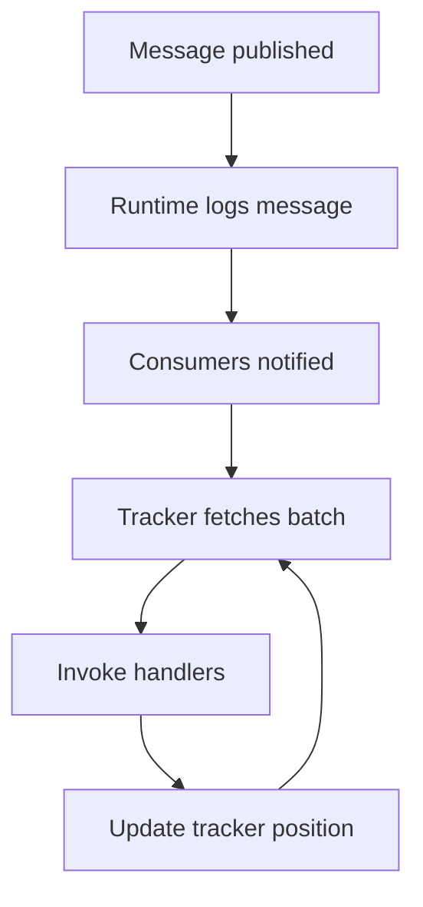
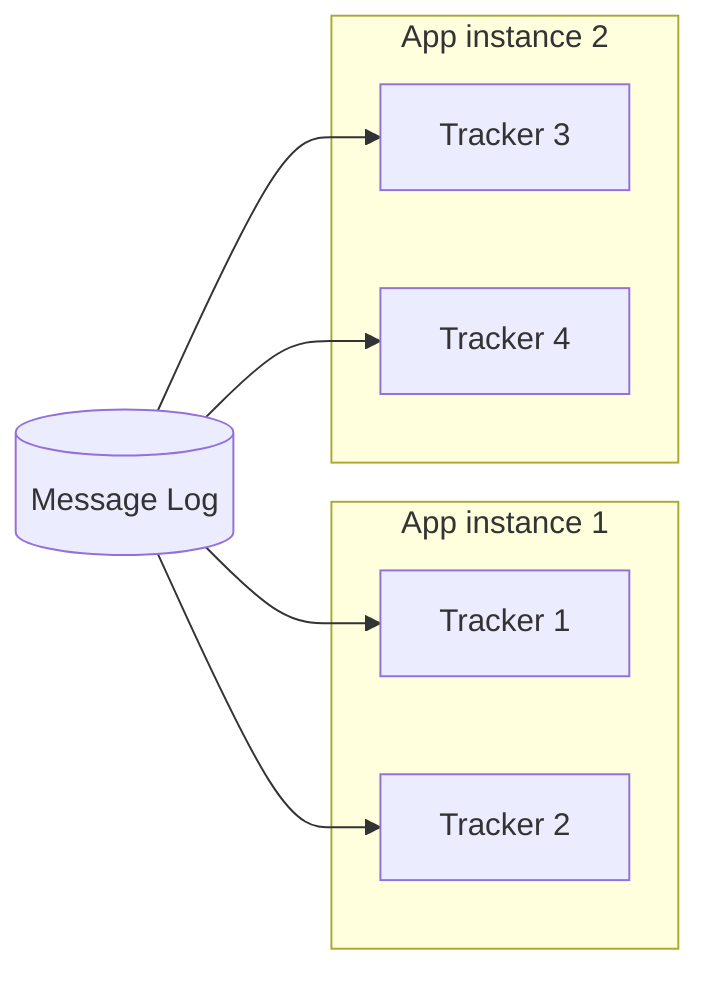

import { Aside, Tabs, TabItem } from '@astrojs/starlight/components';

## What is a tracker?

A **tracker** is a lightweight worker thread that continuously fetches messages from the Fluxzero Runtime and dispatches them to your handlers for a specific [consumer](/docs/reference/consumer).

Trackers form the backbone of message processing in Fluxzero. They:

- **Dispatch asynchronously** — decoupling message publication from handling.
- **Balance load** — distributing work across threads and application instances.
- **Regulate pressure** — controlling inflight work through batch size and concurrency.
- **Isolate faults** — ensuring failures in one tracker don’t block others.

<Aside type="note">
The number of trackers per application instance equals the consumer’s <code>threads</code> setting.
</Aside>

## Tracker lifecycle

Each tracker follows the same loop: fetch, deliver, and advance position.



1. A message is published and logged in the Runtime.
2. Consumers subscribed to that message type are notified.
3. Each tracker fetches a batch of messages (up to `maxFetchSize`).
4. The handler methods (`@HandleCommand`, `@HandleEvent`, etc.) are invoked.
5. Once processed, the tracker updates its position and continues polling.

This cycle allows continuous streaming of messages with at-least-once guarantees.

## Configuring trackers

Trackers are configured through the `@Consumer` annotation. Each **thread** defined on a consumer creates one **tracker**.

<Tabs>
  <TabItem value="Java" label="Java">

```java
@Consumer(name = "FastConsumer", threads = 3, maxFetchSize = 50)
class MyHandler {
    @HandleEvent
    void handle(SomeEvent event) {
        // process event
    }
}
```

  </TabItem>
  <TabItem value="Kotlin" label="Kotlin">

```kotlin
@Consumer(name = "FastConsumer", threads = 3, maxFetchSize = 50)
class MyHandler {
    @HandleEvent
    fun handle(event: SomeEvent) {
        // process event
    }
}
```

  </TabItem>
</Tabs>

- **threads = 3** → Three trackers run in parallel for this consumer per app instance.
- **maxFetchSize = 50** → Each tracker fetches up to 50 messages per poll.

Together, these settings define concurrency and throughput for your handlers.

## Tracker distribution across instances

When you scale horizontally, each application instance spawns its own trackers. The Runtime coordinates delivery so that a message is never processed twice in steady state.



<Aside type="tip">
Isolate heavy or latency-sensitive workloads in a dedicated consumer with its own trackers.
</Aside>