import { Tabs, TabItem, Card, CardGrid, Aside } from '@astrojs/starlight/components';

**Routing Keys** in Fluxzero determine how messages are distributed across segments using consistent hashing. They ensure that messages about the same entity are always processed by the same consumer in the correct order, providing per-entity consistency while enabling parallel processing.

<Aside type="tip" title="Real-world analogy">
Think of routing keys like mail delivery routes in a smart home neighborhood. All packages for "123 Main Street" always go to the same mail carrier, ensuring they're delivered in the right order. Similarly, all messages for "Device-ABC" go to the same message handler, maintaining consistency for that specific device while other devices are processed in parallel.
</Aside>

## Key Concepts

<CardGrid>
<Card title="Consistent Hashing" icon="setting">
Messages are distributed using consistent hashing based on routing keys, ensuring the same entity always routes to the same segment for ordering guarantees.
</Card>

<Card title="Data Locality" icon="document">
Related messages are processed by the same consumer, enabling efficient caching and maintaining entity state in memory for better performance.
</Card>

<Card title="Order Preservation" icon="list-format">
Messages with the same routing key are processed sequentially, maintaining strict ordering for entity-specific operations while allowing parallel processing.
</Card>

<Card title="Load Distribution" icon="rocket">
Different routing keys are distributed across segments, providing horizontal scaling and parallel processing capabilities across the system.
</Card>
</CardGrid>

## How Routing Keys Work

```mermaid
graph TB
    subgraph "Message Sources"
        CMD1[TurnOnLight<br/>deviceId: DEV-001]
        CMD2[SetTemperature<br/>deviceId: DEV-002] 
        CMD3[TurnOffLight<br/>deviceId: DEV-001]
        EVT1[MotionDetected<br/>sensorId: SEN-001]
    end
    
    subgraph "Consistent Hashing"
        HASH[Hash Function]
        CMD1 --> HASH
        CMD2 --> HASH  
        CMD3 --> HASH
        EVT1 --> HASH
    end
    
    subgraph "Segments"
        SEG1[Segment 1<br/>Handles DEV-001]
        SEG2[Segment 2<br/>Handles DEV-002]
        SEG3[Segment 3<br/>Handles SEN-001]
    end
    
    HASH --> SEG1
    HASH --> SEG2
    HASH --> SEG3
    
    subgraph "Processing Order"
        ORD1[DEV-001: TurnOn → TurnOff]
        ORD2[DEV-002: SetTemperature]
        ORD3[SEN-001: MotionDetected]
    end
    
    SEG1 --> ORD1
    SEG2 --> ORD2  
    SEG3 --> ORD3
```



## Defining Routing Keys

### Field-Level @RoutingKey

Use `@RoutingKey` on fields or methods to specify the routing key:

<Tabs>
<TabItem label="Java">
```java
// Route by device ID to ensure all device operations are ordered
public record TurnOnLight(@RoutingKey DeviceId deviceId) {
    @Apply
    SmartHome apply(SmartHome home) {
        return updateDeviceStatus(home, deviceId, true);
    }
}

public record SetThermostatTemperature(@RoutingKey DeviceId thermostatId, 
                                      double targetTemperature) {
    @Apply
    SmartHome apply(SmartHome home) {
        return updateThermostatSetting(home, thermostatId, "targetTemp", targetTemperature);
    }
}

// Route by room ID to ensure room operations are consistent
public record AddDeviceToRoom(@RoutingKey RoomId roomId, Device device) {
    @Apply
    SmartHome apply(SmartHome home) {
        return addDeviceToSpecificRoom(home, roomId, device);
    }
}

// Route by home ID to ensure home-level operations are ordered
public record ArmSecuritySystem(@RoutingKey HomeId homeId, String armingCode) {
    @Apply
    SmartHome apply(SmartHome home) {
        if (home.validateArmingCode(armingCode)) {
            return home.toBuilder().securityArmed(true).build();
        }
        throw new IllegalCommandException("Invalid arming code");
    }
}
```
</TabItem>
<TabItem label="Kotlin">
```kotlin
// Route by device ID to ensure all device operations are ordered
data class TurnOnLight(@RoutingKey val deviceId: DeviceId) {
    @Apply
    fun apply(home: SmartHome): SmartHome {
        return updateDeviceStatus(home, deviceId, true)
    }
}

data class SetThermostatTemperature(@RoutingKey val thermostatId: DeviceId, 
                                   val targetTemperature: Double) {
    @Apply
    fun apply(home: SmartHome): SmartHome {
        return updateThermostatSetting(home, thermostatId, "targetTemp", targetTemperature)
    }
}

// Route by room ID to ensure room operations are consistent
data class AddDeviceToRoom(@RoutingKey val roomId: RoomId, val device: Device) {
    @Apply
    fun apply(home: SmartHome): SmartHome {
        return addDeviceToSpecificRoom(home, roomId, device)
    }
}

// Route by home ID to ensure home-level operations are ordered
data class ArmSecuritySystem(@RoutingKey val homeId: HomeId, val armingCode: String) {
    @Apply
    fun apply(home: SmartHome): SmartHome {
        return if (home.validateArmingCode(armingCode)) {
            home.copy(securityArmed = true)
        } else {
            throw IllegalCommandException("Invalid arming code")
        }
    }
}
```
</TabItem>
</Tabs>

### Property Path Routing

Extract routing keys from nested objects using property paths:

<Tabs>
<TabItem label="Java">
```java
// Route by the device's home ID from nested structure
@RoutingKey("device/homeId")
public record DeviceStatusChanged(Device device, DeviceStatus newStatus, 
                                 Instant timestamp) {}

// Route by the customer ID from user information  
@RoutingKey("homeowner/customerId")
public record HomeOwnershipTransferred(HomeOwner homeowner, HomeId homeId,
                                      Instant transferDate) {}

// Route by sensor location's zone ID
@RoutingKey("sensorLocation/zoneId") 
public record SecuritySensorTriggered(SensorLocation sensorLocation,
                                     SecurityEventType eventType,
                                     Instant detectionTime) {
    
    public record SensorLocation(ZoneId zoneId, RoomId roomId, 
                                String description) {}
}
```
</TabItem>
<TabItem label="Kotlin">
```kotlin
// Route by the device's home ID from nested structure
@RoutingKey("device/homeId")
data class DeviceStatusChanged(val device: Device, val newStatus: DeviceStatus, 
                              val timestamp: Instant)

// Route by the customer ID from user information  
@RoutingKey("homeowner/customerId")
data class HomeOwnershipTransferred(val homeowner: HomeOwner, val homeId: HomeId,
                                   val transferDate: Instant)

// Route by sensor location's zone ID
@RoutingKey("sensorLocation/zoneId") 
data class SecuritySensorTriggered(val sensorLocation: SensorLocation,
                                  val eventType: SecurityEventType,
                                  val detectionTime: Instant) {
    
    data class SensorLocation(val zoneId: ZoneId, val roomId: RoomId, 
                             val description: String)
}
```
</TabItem>
</Tabs>

### Class-Level Routing

Apply routing keys at the class level for messages that don't have a specific field:

<Tabs>
<TabItem label="Java">
```java
// Route by homeId from metadata or payload
@RoutingKey("homeId")
public class SecuritySystemStatusChanged {
    private HomeId homeId;
    private SecurityStatus oldStatus;
    private SecurityStatus newStatus;
    private String triggeredBy;
    private Instant timestamp;
    
    // Constructor and methods
}

// Route by organizationId from metadata
@RoutingKey("organizationId") 
public class HomeSubscriptionUpdated {
    private HomeId homeId;
    private SubscriptionTier newTier;
    private Instant effectiveDate;
    
    // Constructor and methods
}
```
</TabItem>
<TabItem label="Kotlin">
```kotlin
// Route by homeId from metadata or payload
@RoutingKey("homeId")
data class SecuritySystemStatusChanged(
    val homeId: HomeId,
    val oldStatus: SecurityStatus,
    val newStatus: SecurityStatus,
    val triggeredBy: String,
    val timestamp: Instant
)

// Route by organizationId from metadata
@RoutingKey("organizationId") 
data class HomeSubscriptionUpdated(
    val homeId: HomeId,
    val newTier: SubscriptionTier,
    val effectiveDate: Instant
)
```
</TabItem>
</Tabs>

## Handler-Level Routing Override

Override routing keys at the handler level for specialized processing:

<Tabs>
<TabItem label="Java">
```java
@Consumer(ignoreSegment = true)  // Required when overriding routing
public class SpecializedDeviceHandler {
    
    @HandleCommand
    @RoutingKey("deviceType")  // Route by device type instead of device ID
    void handleDeviceCalibration(CalibrateDevice command) {
        // All thermostat calibrations go to thermostat specialist
        // All light calibrations go to lighting specialist
        DeviceType type = command.deviceType();
        
        switch (type) {
            case THERMOSTAT -> calibrateThermostat(command);
            case LIGHT -> calibrateLight(command);
            case CAMERA -> calibrateCamera(command);
        }
    }
    
    @HandleEvent
    @RoutingKey("#metadata.tenantId")  // Route by tenant ID from metadata
    void handleMultiTenantEvent(DeviceEvent event, Message<?> message) {
        String tenantId = message.getMetaData().get("tenantId", String.class);
        tenantSpecificProcessor.processForTenant(tenantId, event);
    }
    
    @HandleQuery
    @RoutingKey("regionId")  // Route by region for geographic distribution
    List<Device> getRegionalDeviceStats(GetRegionalDeviceStats query) {
        return deviceAnalytics.getStatsForRegion(query.regionId());
    }
}
```
</TabItem>
<TabItem label="Kotlin">
```kotlin
@Consumer(ignoreSegment = true)  // Required when overriding routing
class SpecializedDeviceHandler {
    
    @HandleCommand
    @RoutingKey("deviceType")  // Route by device type instead of device ID
    fun handleDeviceCalibration(command: CalibrateDevice) {
        // All thermostat calibrations go to thermostat specialist
        // All light calibrations go to lighting specialist
        val type = command.deviceType
        
        when (type) {
            DeviceType.THERMOSTAT -> calibrateThermostat(command)
            DeviceType.LIGHT -> calibrateLight(command)
            DeviceType.CAMERA -> calibrateCamera(command)
        }
    }
    
    @HandleEvent
    @RoutingKey("#metadata.tenantId")  // Route by tenant ID from metadata
    fun handleMultiTenantEvent(event: DeviceEvent, message: Message<*>) {
        val tenantId = message.metaData["tenantId"] as String
        tenantSpecificProcessor.processForTenant(tenantId, event)
    }
    
    @HandleQuery
    @RoutingKey("regionId")  // Route by region for geographic distribution
    fun getRegionalDeviceStats(query: GetRegionalDeviceStats): List<Device> {
        return deviceAnalytics.getStatsForRegion(query.regionId)
    }
}
```
</TabItem>
</Tabs>

## Data Locality and Performance

### Entity-Centric Processing

Routing keys enable efficient entity-centric processing by ensuring related operations are handled together:

<Tabs>
<TabItem label="Java">
```java
@Consumer(name = "device-lifecycle-handler")
public class DeviceLifecycleHandler {
    
    // All operations for the same device will be processed by the same consumer instance
    // This enables efficient caching and state management
    
    private final Map<DeviceId, DeviceState> deviceCache = new ConcurrentHashMap<>();
    
    @HandleCommand
    void addDevice(@RoutingKey DeviceId deviceId, AddDevice command) {
        // First operation - device gets added to cache
        DeviceState state = new DeviceState(deviceId, DeviceStatus.OFFLINE);
        deviceCache.put(deviceId, state);
        
        log.info("Device {} added to cache", deviceId);
    }
    
    @HandleCommand  
    void activateDevice(@RoutingKey DeviceId deviceId, ActivateDevice command) {
        // Subsequent operation - can efficiently access cached state
        DeviceState state = deviceCache.get(deviceId);
        if (state != null) {
            state.setStatus(DeviceStatus.ONLINE);
            log.info("Device {} activated using cached state", deviceId);
        }
    }
    
    @HandleCommand
    void configureDevice(@RoutingKey DeviceId deviceId, ConfigureDevice command) {
        // Another operation - benefits from cached state  
        DeviceState state = deviceCache.get(deviceId);
        if (state != null) {
            state.updateConfiguration(command.settings());
            log.info("Device {} configured using cached state", deviceId);
        }
    }
    
    @HandleEvent
    void onDeviceRemoved(@RoutingKey DeviceId deviceId, DeviceRemoved event) {
        // Cleanup cached state when device is removed
        deviceCache.remove(deviceId);
        log.info("Device {} removed from cache", deviceId);
    }
}
```
</TabItem>
<TabItem label="Kotlin">
```kotlin
@Consumer(name = "device-lifecycle-handler")
class DeviceLifecycleHandler {
    
    // All operations for the same device will be processed by the same consumer instance
    // This enables efficient caching and state management
    
    private val deviceCache = ConcurrentHashMap<DeviceId, DeviceState>()
    
    @HandleCommand
    fun addDevice(@RoutingKey deviceId: DeviceId, command: AddDevice) {
        // First operation - device gets added to cache
        val state = DeviceState(deviceId, DeviceStatus.OFFLINE)
        deviceCache[deviceId] = state
        
        log.info("Device $deviceId added to cache")
    }
    
    @HandleCommand  
    fun activateDevice(@RoutingKey deviceId: DeviceId, command: ActivateDevice) {
        // Subsequent operation - can efficiently access cached state
        val state = deviceCache[deviceId]
        if (state != null) {
            state.status = DeviceStatus.ONLINE
            log.info("Device $deviceId activated using cached state")
        }
    }
    
    @HandleCommand
    fun configureDevice(@RoutingKey deviceId: DeviceId, command: ConfigureDevice) {
        // Another operation - benefits from cached state  
        val state = deviceCache[deviceId]
        if (state != null) {
            state.updateConfiguration(command.settings)
            log.info("Device $deviceId configured using cached state")
        }
    }
    
    @HandleEvent
    fun onDeviceRemoved(@RoutingKey deviceId: DeviceId, event: DeviceRemoved) {
        // Cleanup cached state when device is removed
        deviceCache.remove(deviceId)
        log.info("Device $deviceId removed from cache")
    }
}
```
</TabItem>
</Tabs>

### Load Distribution Patterns

Different routing strategies provide different load distribution characteristics:

<Tabs>
<TabItem label="Java">
```java
// 1. Device-level routing - High parallelism, many segments
public record TurnOnLight(@RoutingKey DeviceId deviceId) {}
// Each device can be processed independently

// 2. Room-level routing - Medium parallelism, moderate segments  
public record AdjustRoomLighting(@RoutingKey RoomId roomId, int brightness) {}
// All devices in a room processed together for coordination

// 3. Home-level routing - Lower parallelism, fewer segments
public record SetHomeMode(@RoutingKey HomeId homeId, HomeMode mode) {}
// All home operations coordinated together

// 4. Zone-level routing - Balanced parallelism for geographic distribution
public record ProcessRegionalAnalytics(@RoutingKey("region") String regionId, 
                                      AnalyticsData data) {}
// Load distributed by geographic region

public class RoutingStrategyExample {
    
    public void demonstrateLoadDistribution() {
        // High concurrency - different devices processed in parallel
        sendCommand(new TurnOnLight(DeviceId.of("living-room-light-1")));
        sendCommand(new TurnOnLight(DeviceId.of("bedroom-light-1")));  
        sendCommand(new TurnOnLight(DeviceId.of("kitchen-light-1")));
        // Each command goes to different segment
        
        // Coordinated processing - all room operations serialized
        sendCommand(new AdjustRoomLighting(RoomId.of("living-room"), 75));
        sendCommand(new AdjustRoomLighting(RoomId.of("living-room"), 50));
        // Both commands go to same segment for ordering
    }
}
```
</TabItem>
<TabItem label="Kotlin">
```kotlin
// 1. Device-level routing - High parallelism, many segments
data class TurnOnLight(@RoutingKey val deviceId: DeviceId)
// Each device can be processed independently

// 2. Room-level routing - Medium parallelism, moderate segments  
data class AdjustRoomLighting(@RoutingKey val roomId: RoomId, val brightness: Int)
// All devices in a room processed together for coordination

// 3. Home-level routing - Lower parallelism, fewer segments
data class SetHomeMode(@RoutingKey val homeId: HomeId, val mode: HomeMode)
// All home operations coordinated together

// 4. Zone-level routing - Balanced parallelism for geographic distribution
data class ProcessRegionalAnalytics(@RoutingKey("region") val regionId: String, 
                                   val data: AnalyticsData)
// Load distributed by geographic region

class RoutingStrategyExample {
    
    fun demonstrateLoadDistribution() {
        // High concurrency - different devices processed in parallel
        sendCommand(TurnOnLight(DeviceId.of("living-room-light-1")))
        sendCommand(TurnOnLight(DeviceId.of("bedroom-light-1")))  
        sendCommand(TurnOnLight(DeviceId.of("kitchen-light-1")))
        // Each command goes to different segment
        
        // Coordinated processing - all room operations serialized
        sendCommand(AdjustRoomLighting(RoomId.of("living-room"), 75))
        sendCommand(AdjustRoomLighting(RoomId.of("living-room"), 50))
        // Both commands go to same segment for ordering
    }
}
```
</TabItem>
</Tabs>

## Routing with Aggregates

When working with aggregates, the `@EntityId` automatically serves as the routing key:

<Tabs>
<TabItem label="Java">
```java
@Aggregate
public record SmartHome(@EntityId HomeId homeId,
                        String address,
                        boolean securityEnabled,
                        @Member List<Device> devices) {
    
    // All operations on this aggregate are automatically routed by homeId
    // No need to specify @RoutingKey on commands that target this aggregate
}

// Commands targeting the SmartHome aggregate
public record AddDevice(HomeId homeId, Device device) {
    // homeId automatically used as routing key due to aggregate @EntityId
    @Apply
    SmartHome apply(SmartHome home) {
        List<Device> updatedDevices = new ArrayList<>(home.devices());
        updatedDevices.add(device);
        return home.toBuilder().devices(updatedDevices).build();
    }
}

public record RemoveDevice(HomeId homeId, DeviceId deviceId) {
    // Also routed by homeId automatically
    @Apply  
    SmartHome apply(SmartHome home) {
        List<Device> updatedDevices = home.devices().stream()
            .filter(d -> !d.deviceId().equals(deviceId))
            .toList();
        return home.toBuilder().devices(updatedDevices).build();
    }
}

// For operations that need different routing, use explicit @RoutingKey
public record SynchronizeDeviceAcrossHomes(@RoutingKey DeviceId deviceId,
                                          List<HomeId> targetHomes) {
    // Routes by deviceId instead of homeId for cross-home operations
}
```
</TabItem>
<TabItem label="Kotlin">
```kotlin
@Aggregate
data class SmartHome(@EntityId val homeId: HomeId,
                     val address: String,
                     val securityEnabled: Boolean,
                     @Member val devices: List<Device> = emptyList()) {
    
    // All operations on this aggregate are automatically routed by homeId
    // No need to specify @RoutingKey on commands that target this aggregate
}

// Commands targeting the SmartHome aggregate
data class AddDevice(val homeId: HomeId, val device: Device) {
    // homeId automatically used as routing key due to aggregate @EntityId
    @Apply
    fun apply(home: SmartHome): SmartHome {
        return home.copy(devices = home.devices + device)
    }
}

data class RemoveDevice(val homeId: HomeId, val deviceId: DeviceId) {
    // Also routed by homeId automatically
    @Apply  
    fun apply(home: SmartHome): SmartHome {
        return home.copy(devices = home.devices.filter { it.deviceId != deviceId })
    }
}

// For operations that need different routing, use explicit @RoutingKey
data class SynchronizeDeviceAcrossHomes(@RoutingKey val deviceId: DeviceId,
                                       val targetHomes: List<HomeId>) {
    // Routes by deviceId instead of homeId for cross-home operations
}
```
</TabItem>
</Tabs>

## Routing Key Placement Summary

| Placement | Usage | Example |
|-----------|--------|---------|
| **Field/Getter** | Direct field value as routing key | `@RoutingKey DeviceId deviceId` |
| **Property Path** | Extract from nested objects | `@RoutingKey("device/homeId")` |  
| **Class-Level** | Use named property from metadata/payload | `@RoutingKey("homeId")` |
| **Handler Method** | Override routing per handler | `@RoutingKey("organizationId")` |
| **Aggregate EntityId** | Automatic routing for aggregate operations | `@EntityId HomeId homeId` |

## Best Practices

### 1. Choose Appropriate Granularity
```java
// High concurrency: Route by individual entities
public record UpdateDeviceStatus(@RoutingKey DeviceId deviceId, DeviceStatus status) {}

// Coordinated operations: Route by grouping entity  
public record UpdateRoomEnvironment(@RoutingKey RoomId roomId, EnvironmentSettings settings) {}

// System-wide coordination: Route by system identifier
public record InitiateSystemMaintenance(@RoutingKey HomeId homeId, MaintenanceType type) {}
```

### 2. Ensure Good Key Distribution
```java
// Good: Well-distributed keys
public record ProcessDeviceReading(@RoutingKey DeviceId deviceId, SensorReading reading) {}

// Avoid: Poorly distributed keys that create hot spots
public record ProcessReading(@RoutingKey("always-the-same-value") String fixedKey, SensorReading reading) {}
```

### 3. Maintain Consistency Within Entity Boundaries
```java
// Good: Consistent routing for related operations
public record StartDeviceCalibration(@RoutingKey DeviceId deviceId) {}
public record CompleteDeviceCalibration(@RoutingKey DeviceId deviceId, CalibrationResult result) {}

// Ensure both operations go to same segment for proper ordering
```

### 4. Use Handler-Level Overrides Sparingly
```java
// Use only when you need specialized routing different from default
@Consumer(ignoreSegment = true)  // Remember this is required
public class SpecializedHandler {
    @HandleCommand
    @RoutingKey("specialField")  // Only when business logic requires it
    void handleSpecialCase(SpecialCommand command) {
        // Implementation
    }
}
```

### 5. Consider Caching Implications
```java
// Route related operations together to benefit from caching
@HandleEvent
void onDeviceEvent(@RoutingKey DeviceId deviceId, DeviceEvent event) {
    // Can maintain device state cache since all device events come here
    DeviceState state = deviceStateCache.computeIfAbsent(deviceId, 
        k -> loadDeviceState(k));
    state.update(event);
}
```

## Common Routing Patterns

### Smart Home Routing Strategies

<Tabs>
<TabItem label="Java">
```java
public class SmartHomeRoutingExamples {
    
    // 1. Device-centric routing for high concurrency
    public record TurnOnDevice(@RoutingKey DeviceId deviceId) {}
    public record UpdateDeviceSettings(@RoutingKey DeviceId deviceId, Map<String, Object> settings) {}
    
    // 2. Room-centric routing for coordinated control
    public record SetRoomAmbiance(@RoutingKey RoomId roomId, AmbianceSettings settings) {}
    public record OptimizeRoomEnergy(@RoutingKey RoomId roomId) {}
    
    // 3. Home-centric routing for system-wide operations
    public record SetHomeMode(@RoutingKey HomeId homeId, HomeMode mode) {}
    public record ArmSecuritySystem(@RoutingKey HomeId homeId, String code) {}
    
    // 4. User-centric routing for personalized experiences
    public record UpdateUserPreferences(@RoutingKey UserId userId, UserPreferences preferences) {}
    public record RecordUserActivity(@RoutingKey UserId userId, ActivityData activity) {}
    
    // 5. Zone-centric routing for geographic distribution  
    public record ProcessRegionalWeatherUpdate(@RoutingKey("region") String region, WeatherData weather) {}
    public record AnalyzeZoneEnergyUsage(@RoutingKey("zone") String zoneId, UsageData usage) {}
}
```
</TabItem>
<TabItem label="Kotlin">
```kotlin
class SmartHomeRoutingExamples {
    
    // 1. Device-centric routing for high concurrency
    data class TurnOnDevice(@RoutingKey val deviceId: DeviceId)
    data class UpdateDeviceSettings(@RoutingKey val deviceId: DeviceId, val settings: Map<String, Any>)
    
    // 2. Room-centric routing for coordinated control
    data class SetRoomAmbiance(@RoutingKey val roomId: RoomId, val settings: AmbianceSettings)
    data class OptimizeRoomEnergy(@RoutingKey val roomId: RoomId)
    
    // 3. Home-centric routing for system-wide operations
    data class SetHomeMode(@RoutingKey val homeId: HomeId, val mode: HomeMode)
    data class ArmSecuritySystem(@RoutingKey val homeId: HomeId, val code: String)
    
    // 4. User-centric routing for personalized experiences
    data class UpdateUserPreferences(@RoutingKey val userId: UserId, val preferences: UserPreferences)
    data class RecordUserActivity(@RoutingKey val userId: UserId, val activity: ActivityData)
    
    // 5. Zone-centric routing for geographic distribution  
    data class ProcessRegionalWeatherUpdate(@RoutingKey("region") val region: String, val weather: WeatherData)
    data class AnalyzeZoneEnergyUsage(@RoutingKey("zone") val zoneId: String, val usage: UsageData)
}
```
</TabItem>
</Tabs>

## Troubleshooting Routing

### Common Issues

<Aside type="caution" title="Hot key problems">
**Symptoms**: One segment getting overloaded while others are idle

**Solutions**:
- Review routing key distribution
- Consider using more granular routing keys
- Check for imbalanced data patterns
- Monitor segment load metrics
</Aside>

<Aside type="caution" title="Order preservation issues">
**Symptoms**: Events processed out of order for the same entity

**Solutions**:
- Ensure consistent routing key usage across related operations
- Verify @RoutingKey annotations are correctly applied
- Check handler-level routing overrides
- Confirm ignoreSegment = true when using handler-level routing
</Aside>

<Aside type="caution" title="Poor performance with handler overrides">
**Symptoms**: Reduced parallelism when using handler-level routing

**Solutions**:
- Use handler-level routing sparingly
- Ensure ignoreSegment = true is set correctly
- Consider if field-level routing would be more appropriate
- Monitor segment utilization
</Aside>

## Testing Routing Behavior

<Tabs>
<TabItem label="Java">
```java
public class RoutingKeyTest {
    
    @Test
    void shouldRouteDeviceCommandsConsistently() {
        DeviceId deviceId = DeviceId.generate();
        
        testFixture
            // All commands for same device should be processed in order
            .whenCommand(new AddDevice(deviceId, "Smart Light"))
            .expectEvents(new DeviceAdded(deviceId, "Smart Light"))
            .andThen()
            .whenCommand(new TurnOnLight(deviceId))
            .expectEvents(new LightTurnedOn(deviceId))
            .andThen()
            .whenCommand(new TurnOffLight(deviceId))
            .expectEvents(new LightTurnedOff(deviceId));
    }
    
    @Test
    void shouldDistributeLoadAcrossDevices() {
        DeviceId device1 = DeviceId.generate();
        DeviceId device2 = DeviceId.generate();
        
        // Commands for different devices can be processed in parallel
        testFixture
            .whenCommands(
                new TurnOnLight(device1),
                new TurnOnLight(device2)
            )
            .expectEvents(
                new LightTurnedOn(device1),
                new LightTurnedOn(device2)
            );
    }
}
```
</TabItem>
<TabItem label="Kotlin">
```kotlin
class RoutingKeyTest {
    
    @Test
    fun shouldRouteDeviceCommandsConsistently() {
        val deviceId = DeviceId.generate()
        
        testFixture
            // All commands for same device should be processed in order
            .whenCommand(AddDevice(deviceId, "Smart Light"))
            .expectEvents(DeviceAdded(deviceId, "Smart Light"))
            .andThen()
            .whenCommand(TurnOnLight(deviceId))
            .expectEvents(LightTurnedOn(deviceId))
            .andThen()
            .whenCommand(TurnOffLight(deviceId))
            .expectEvents(LightTurnedOff(deviceId))
    }
    
    @Test
    fun shouldDistributeLoadAcrossDevices() {
        val device1 = DeviceId.generate()
        val device2 = DeviceId.generate()
        
        // Commands for different devices can be processed in parallel
        testFixture
            .whenCommands(
                TurnOnLight(device1),
                TurnOnLight(device2)
            )
            .expectEvents(
                LightTurnedOn(device1),
                LightTurnedOn(device2)
            )
    }
}
```
</TabItem>
</Tabs>

## Related Concepts

- **[Aggregates](/reference/core-components/aggregate)** - How @EntityId automatically provides routing keys
- **[Handlers](/reference/core-components/handler)** - Processing messages routed to specific segments
- **[Segments](/reference/core-components/segment)** - The processing units that messages are routed to
- **[Commands](/reference/core-components/command)** - How routing ensures command ordering per entity
- **[Events](/reference/core-components/event)** - How routing maintains event ordering consistency
- **[Message Log](/reference/core-components/message-log)** - Where routed messages are stored and tracked
