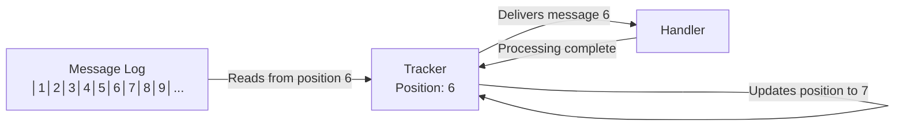
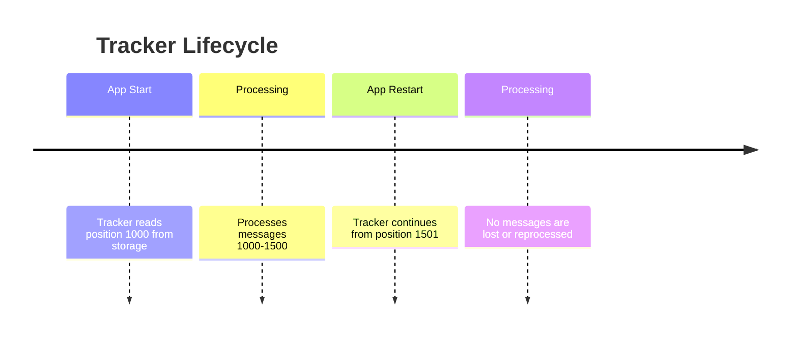
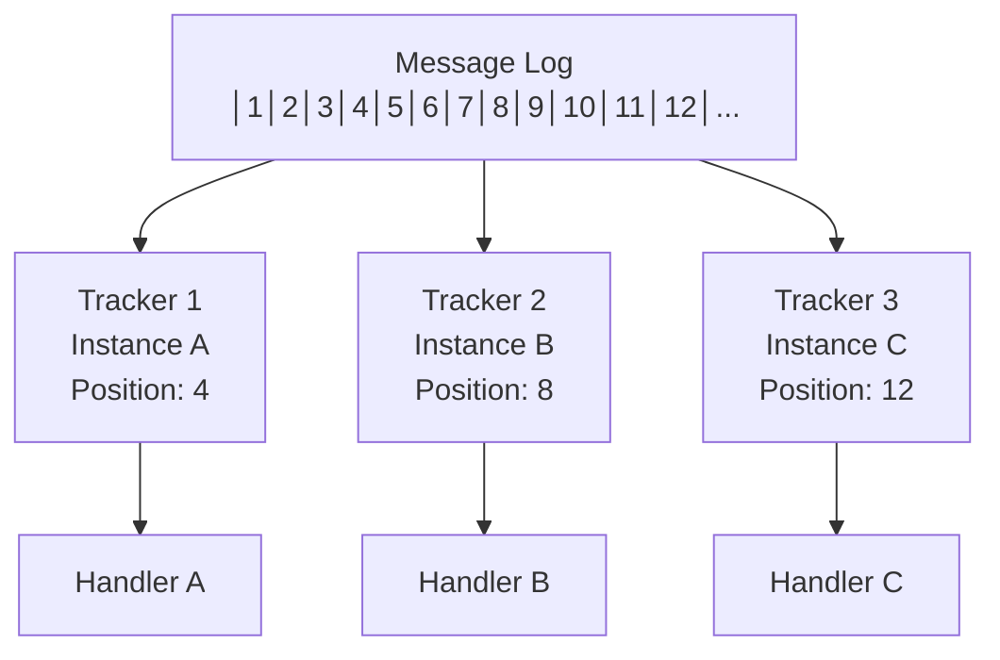

import { Tabs, TabItem, Card, CardGrid, Aside } from '@astrojs/starlight/components';

A **Tracker** is Fluxzero's mechanism for reading messages from the Message Log and delivering them to your handlers. Think of it as a "bookmark" that keeps track of where you are in the stream of messages and ensures reliable processing.

<Aside type="tip" title="Real-world analogy">
Imagine reading a book - a tracker is like your bookmark. It remembers exactly where you left off, so you can pick up reading from the same place even if you close the book and come back later.
</Aside>

## How Trackers Work



### The Tracking Process

1. **Position Tracking**: Each tracker maintains its current position in the Message Log
2. **Message Fetching**: The tracker reads messages from its current position
3. **Handler Delivery**: Messages are delivered to your handlers for processing
4. **Position Update**: After successful processing, the tracker advances its position
5. **Repeat**: The process continues for the next message

## Key Features

### Persistent Position
Your tracker's position is stored persistently, so it survives application restarts:



### Exactly-Once Processing
Trackers ensure that each message is processed exactly once:
- **Duplicate Detection**: Messages are never processed twice
- **Failure Recovery**: If processing fails, the tracker position doesn't advance
- **Retry Logic**: Failed messages are automatically retried with exponential backoff

### Replay Capability
You can start a tracker from any position in the Message Log:

<Tabs>
<TabItem label="Java">
```java
// Start from the beginning
@Consumer(name = "rebuild-projection", 
          trackerConfiguration = @TrackerConfiguration(
              startPosition = START_FROM_BEGINNING
          ))
public class ProjectionRebuilder {
    
    @HandleEvent
    public void on(UserCreated event) {
        // Rebuild projection from all historical events
        userProjection.rebuild(event);
    }
}
```
</TabItem>
<TabItem label="Kotlin">
```kotlin
// Start from the beginning
@Consumer(name = "rebuild-projection", 
          trackerConfiguration = TrackerConfiguration(
              startPosition = START_FROM_BEGINNING
          ))
class ProjectionRebuilder {
    
    @HandleEvent
    fun on(event: UserCreated) {
        // Rebuild projection from all historical events
        userProjection.rebuild(event)
    }
}
```
</TabItem>
</Tabs>

## Tracker Configuration

You can configure trackers to optimize for your specific use case:

### Basic Configuration

<Tabs>
<TabItem label="Java">
```java
@Consumer(name = "user-service",
          trackerConfiguration = @TrackerConfiguration(
              threads = 4,                    // Number of processing threads
              batchSize = 100,               // Messages per batch
              maxFetchTime = Duration.ofSeconds(1),  // Max time to wait for messages
              retryConfiguration = @RetryConfiguration(
                  maxRetries = 3,
                  retryDelayFactor = 2.0
              )
          ))
public class UserService {
    
    @HandleCommand
    public UserId handle(CreateUser command) {
        // Your business logic
        return userRepository.save(new User(command.getName()));
    }
}
```
</TabItem>
<TabItem label="Kotlin">
```kotlin
@Consumer(name = "user-service",
          trackerConfiguration = TrackerConfiguration(
              threads = 4,                    // Number of processing threads
              batchSize = 100,               // Messages per batch
              maxFetchTime = Duration.ofSeconds(1),  // Max time to wait for messages
              retryConfiguration = RetryConfiguration(
                  maxRetries = 3,
                  retryDelayFactor = 2.0
              )
          ))
class UserService {
    
    @HandleCommand
    fun handle(command: CreateUser): UserId {
        // Your business logic
        return userRepository.save(User(command.name))
    }
}
```
</TabItem>
</Tabs>

### Configuration Options

<CardGrid>
<Card title="threads" icon="setting">
**Number of processing threads**
- Default: 1
- Higher values = more parallel processing
- Be careful with ordering requirements
</Card>

<Card title="batchSize" icon="list-format">
**Messages fetched per batch**
- Default: 1000
- Higher values = better throughput
- Lower values = better latency
</Card>

<Card title="maxFetchTime" icon="clock">
**Max time to wait for messages**
- Default: 1 second
- Balances latency vs resource usage
- Shorter = more responsive to new messages
</Card>

<Card title="startPosition" icon="rocket">
**Where to start processing**
- `START_FROM_CURRENT` (default)
- `START_FROM_BEGINNING`
- `START_FROM_END`
- Custom position
</Card>
</CardGrid>

## Common Patterns

### High-Throughput Processing

For maximum throughput, use multiple threads and larger batches:

```java
@TrackerConfiguration(
    threads = 8,
    batchSize = 500,
    maxFetchTime = Duration.ofMillis(100)
)
```

### Low-Latency Processing

For minimal latency, use single-threaded processing with small batches:

```java
@TrackerConfiguration(
    threads = 1,
    batchSize = 1,
    maxFetchTime = Duration.ofMillis(10)
)
```

### Catch-Up Processing

For rebuilding projections or catching up after downtime:

```java
@TrackerConfiguration(
    threads = 16,
    batchSize = 1000,
    startPosition = START_FROM_BEGINNING
)
```

## Tracking Multiple Message Types

A single tracker can handle multiple message types:

<Tabs>
<TabItem label="Java">
```java
@Consumer(name = "user-service")
public class UserService {
    
    @HandleCommand
    public UserId handle(CreateUser command) {
        // Handle user creation
        return createUser(command);
    }
    
    @HandleCommand
    public void handle(UpdateUser command) {
        // Handle user updates
        updateUser(command);
    }
    
    @HandleEvent
    public void on(UserCreated event) {
        // Update read model
        userProjection.update(event);
    }
}
```
</TabItem>
<TabItem label="Kotlin">
```kotlin
@Consumer(name = "user-service")
class UserService {
    
    @HandleCommand
    fun handle(command: CreateUser): UserId {
        // Handle user creation
        return createUser(command)
    }
    
    @HandleCommand
    fun handle(command: UpdateUser) {
        // Handle user updates
        updateUser(command)
    }
    
    @HandleEvent
    fun on(event: UserCreated) {
        // Update read model
        userProjection.update(event)
    }
}
```
</TabItem>
</Tabs>

## Scaling with Multiple Trackers

When you run multiple instances of your application, each gets its own tracker:



### Load Balancing

Messages are automatically distributed across all trackers:
- **Round-robin distribution**: Messages are evenly spread
- **Consistent hashing**: Messages with the same routing key go to the same tracker
- **Automatic failover**: If one tracker fails, others continue processing

### Ordering Guarantees

Fluxzero provides different ordering guarantees:

<Tabs>
<TabItem label="Global Ordering">
```java
@TrackerConfiguration(
    threads = 1,  // Single thread for global ordering
    batchSize = 1
)
```
**Use when**: You need strict global message ordering
**Trade-off**: Lower throughput
</TabItem>

<TabItem label="Per-Aggregate Ordering">
```java
@HandleCommand
public void handle(UpdateUser command, 
                  @RoutingKey String userId) {
    // Messages for the same user always go to the same tracker
    updateUser(userId, command);
}
```
**Use when**: You need ordering per entity/aggregate
**Trade-off**: Balanced throughput and consistency
</TabItem>

<TabItem label="No Ordering">
```java
@TrackerConfiguration(
    threads = 16,  // High parallelism
    batchSize = 1000
)
```
**Use when**: Maximum throughput is needed
**Trade-off**: No ordering guarantees
</TabItem>
</Tabs>

## Monitoring and Debugging

### Tracker Metrics

Fluxzero provides metrics for tracking performance:

- **Messages processed per second**
- **Current tracker position**
- **Lag behind message log**
- **Processing time percentiles**
- **Error rates**

### Common Issues

<Aside type="caution" title="Slow processing">
If your tracker is falling behind:
- Check handler performance
- Increase batch size
- Add more threads (if ordering allows)
- Scale horizontally with more instances
</Aside>

<Aside type="caution" title="Memory issues">
If you're running out of memory:
- Reduce batch size
- Reduce number of threads
- Check for message handler memory leaks
</Aside>

## Best Practices

### 1. Choose the Right Configuration
```java
// For real-time processing
@TrackerConfiguration(threads = 1, batchSize = 1)

// For batch processing
@TrackerConfiguration(threads = 8, batchSize = 1000)

// For catch-up processing
@TrackerConfiguration(threads = 16, batchSize = 2000)
```

### 2. Handle Failures Gracefully
```java
@HandleCommand
public void handle(CreateUser command) {
    try {
        userService.createUser(command);
    } catch (ValidationException e) {
        // Log and skip invalid messages
        log.warn("Invalid user data: {}", e.getMessage());
    } catch (Exception e) {
        // Let Fluxzero retry transient failures
        throw e;
    }
}
```

### 3. Use Appropriate Consumer Names
```java
// Good: Descriptive and stable
@Consumer(name = "user-service")

// Bad: Environment-specific
@Consumer(name = "user-service-prod")
```

### 4. Monitor Your Trackers
```java
@HandleCommand
public void handle(CreateUser command) {
    Timer.Sample timer = Timer.start(meterRegistry);
    try {
        userService.createUser(command);
    } finally {
        timer.stop(Timer.builder("user.creation").register(meterRegistry));
    }
}
```

## Related Concepts

- **[Consumers](/reference/core-components/consumer)** - Logical grouping of trackers
- **[Messages](/reference/core-components/message)** - What trackers process
- **[Handlers](/reference/core-components/handler)** - Where messages are delivered
- **[Message Log](/reference/core-components/message-log)** - What trackers read from