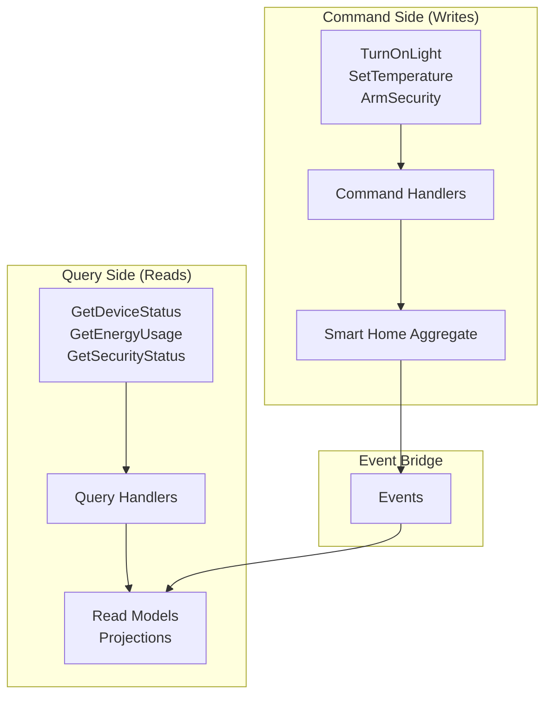

import { Tabs, TabItem, Card, CardGrid, Aside } from '@astrojs/starlight/components';

**Queries** are one of the four core message types in Fluxzero used to retrieve data from read models or projections. They implement the Query side of CQRS (Command Query Responsibility Segregation), providing efficient data access patterns separate from write operations.

<Aside type="tip" title="Real-world analogy">
Think of queries like asking questions about your smart home: "What's the temperature in the living room?", "Which lights are currently on?", or "Show me today's energy usage." Queries retrieve current state information without changing anything, just like checking your smart home app for status updates.
</Aside>

## Key Concepts

<CardGrid>
<Card title="CQRS Separation" icon="document">
Queries handle read operations separately from commands (writes), enabling optimized data retrieval from projections and read models.
</Card>

<Card title="Location Transparency" icon="rocket">
Queries can be handled by any service in the Fluxzero cluster, providing flexible routing and load distribution for read operations.
</Card>

<Card title="Type Safety" icon="setting">
Implement the Request&lt;R&gt; interface for compile-time type safety and better IDE support when retrieving specific data types.
</Card>

<Card title="Sync & Async Support" icon="list-format">
Execute queries synchronously for immediate results or asynchronously for non-blocking operations with CompletableFuture.
</Card>
</CardGrid>

## CQRS Pattern in Smart Home Context



## Defining Queries and Query Handlers

### Basic Query Handler

<Tabs>
<TabItem label="Java">
```java
public class SmartHomeQueryHandler {
    
    @HandleQuery
    DeviceStatus getDeviceStatus(GetDeviceStatus query) {
        // Load device status from read model
        return deviceStatusRepository.findByDeviceId(query.deviceId());
    }
    
    @HandleQuery
    List<Device> getOnlineDevices(GetOnlineDevices query) {
        // Return list of devices that are currently online
        return deviceRepository.findByHomeIdAndOnline(query.homeId(), true);
    }
    
    @HandleQuery
    EnergyReport getDailyEnergyUsage(GetDailyEnergyUsage query) {
        // Calculate energy usage for the specified day
        return energyService.calculateDailyUsage(query.homeId(), query.date());
    }
}
```
</TabItem>
<TabItem label="Kotlin">
```kotlin
class SmartHomeQueryHandler {
    
    @HandleQuery
    fun getDeviceStatus(query: GetDeviceStatus): DeviceStatus {
        // Load device status from read model
        return deviceStatusRepository.findByDeviceId(query.deviceId)
    }
    
    @HandleQuery
    fun getOnlineDevices(query: GetOnlineDevices): List<Device> {
        // Return list of devices that are currently online
        return deviceRepository.findByHomeIdAndOnline(query.homeId, true)
    }
    
    @HandleQuery
    fun getDailyEnergyUsage(query: GetDailyEnergyUsage): EnergyReport {
        // Calculate energy usage for the specified day
        return energyService.calculateDailyUsage(query.homeId, query.date)
    }
}
```
</TabItem>
</Tabs>

### Self-Handling Queries

Embed query handling logic directly in the query class:

<Tabs>
<TabItem label="Java">
```java
public class GetRoomTemperature {
    private final RoomId roomId;
    
    public GetRoomTemperature(RoomId roomId) {
        this.roomId = roomId;
    }
    
    @HandleQuery
    TemperatureReading handle() {
        // Load the room and get current temperature
        Room room = FluxCapacitor.loadEntity(roomId);
        
        // Find the thermostat in this room
        Device thermostat = room.devices().stream()
            .filter(d -> d.type() == DeviceType.THERMOSTAT)
            .findFirst()
            .orElse(null);
            
        if (thermostat != null && thermostat.isOnline()) {
            double currentTemp = (Double) thermostat.settings().get("currentTemperature");
            return new TemperatureReading(roomId, currentTemp, Instant.now());
        }
        
        return new TemperatureReading(roomId, null, Instant.now());
    }
}

public record TemperatureReading(RoomId roomId, Double temperature, Instant timestamp) {}
```
</TabItem>
<TabItem label="Kotlin">
```kotlin
data class GetRoomTemperature(val roomId: RoomId) {
    
    @HandleQuery
    fun handle(): TemperatureReading {
        // Load the room and get current temperature
        val room = FluxCapacitor.loadEntity<Room>(roomId)
        
        // Find the thermostat in this room
        val thermostat = room.devices.find { it.type == DeviceType.THERMOSTAT }
        
        return if (thermostat != null && thermostat.isOnline) {
            val currentTemp = thermostat.settings["currentTemperature"] as? Double
            TemperatureReading(roomId, currentTemp, Instant.now())
        } else {
            TemperatureReading(roomId, null, Instant.now())
        }
    }
}

data class TemperatureReading(val roomId: RoomId, val temperature: Double?, val timestamp: Instant)
```
</TabItem>
</Tabs>

### Type-Safe Queries with Request Interface

Use the `Request<R>` interface for compile-time type safety:

<Tabs>
<TabItem label="Java">
```java
// Type-safe query definitions
public record GetDeviceStatus(DeviceId deviceId) implements Request<DeviceStatus> {}

public record GetHomeSecurityStatus(HomeId homeId) implements Request<SecurityStatus> {}

public record GetEnergyUsageSummary(HomeId homeId, LocalDate date) 
    implements Request<EnergyUsageSummary> {}

public record SearchDevices(HomeId homeId, String searchTerm, DeviceType type) 
    implements Request<List<Device>> {}

// Usage with type safety
public class SmartHomeService {
    
    public DeviceStatus checkDevice(DeviceId deviceId) {
        // Type-safe query - returns DeviceStatus
        return FluxCapacitor.queryAndWait(new GetDeviceStatus(deviceId));
    }
    
    public SecurityStatus getSecurityStatus(HomeId homeId) {
        // Compile-time type checking ensures correct return type
        return FluxCapacitor.queryAndWait(new GetHomeSecurityStatus(homeId));
    }
    
    public List<Device> findLights(HomeId homeId) {
        return FluxCapacitor.queryAndWait(
            new SearchDevices(homeId, "light", DeviceType.LIGHT));
    }
}
```
</TabItem>
<TabItem label="Kotlin">
```kotlin
// Type-safe query definitions
data class GetDeviceStatus(val deviceId: DeviceId) : Request<DeviceStatus>

data class GetHomeSecurityStatus(val homeId: HomeId) : Request<SecurityStatus>

data class GetEnergyUsageSummary(val homeId: HomeId, val date: LocalDate) : Request<EnergyUsageSummary>

data class SearchDevices(val homeId: HomeId, val searchTerm: String, val type: DeviceType) : Request<List<Device>>

// Usage with type safety
class SmartHomeService {
    
    fun checkDevice(deviceId: DeviceId): DeviceStatus {
        // Type-safe query - returns DeviceStatus
        return FluxCapacitor.queryAndWait(GetDeviceStatus(deviceId))
    }
    
    fun getSecurityStatus(homeId: HomeId): SecurityStatus {
        // Compile-time type checking ensures correct return type
        return FluxCapacitor.queryAndWait(GetHomeSecurityStatus(homeId))
    }
    
    fun findLights(homeId: HomeId): List<Device> {
        return FluxCapacitor.queryAndWait(
            SearchDevices(homeId, "light", DeviceType.LIGHT))
    }
}
```
</TabItem>
</Tabs>

## Synchronous vs Asynchronous Queries

### Synchronous (Blocking) Queries

<Tabs>
<TabItem label="Java">
```java
public class SmartHomeDashboardService {
    
    public DashboardData loadDashboard(HomeId homeId) {
        // Synchronous queries - block until results are available
        
        // Get current security status
        SecurityStatus security = FluxCapacitor.queryAndWait(
            new GetHomeSecurityStatus(homeId));
        
        // Get all online devices
        List<Device> onlineDevices = FluxCapacitor.queryAndWait(
            new GetOnlineDevices(homeId));
        
        // Get today's energy usage
        EnergyUsageSummary energyUsage = FluxCapacitor.queryAndWait(
            new GetEnergyUsageSummary(homeId, LocalDate.now()));
        
        // Get recent alerts
        List<SecurityAlert> alerts = FluxCapacitor.queryAndWait(
            new GetRecentSecurityAlerts(homeId, Duration.ofHours(24)));
        
        return new DashboardData(security, onlineDevices, energyUsage, alerts);
    }
}
```
</TabItem>
<TabItem label="Kotlin">
```kotlin
class SmartHomeDashboardService {
    
    fun loadDashboard(homeId: HomeId): DashboardData {
        // Synchronous queries - block until results are available
        
        // Get current security status
        val security = FluxCapacitor.queryAndWait(
            GetHomeSecurityStatus(homeId))
        
        // Get all online devices
        val onlineDevices = FluxCapacitor.queryAndWait(
            GetOnlineDevices(homeId))
        
        // Get today's energy usage
        val energyUsage = FluxCapacitor.queryAndWait(
            GetEnergyUsageSummary(homeId, LocalDate.now()))
        
        // Get recent alerts
        val alerts = FluxCapacitor.queryAndWait(
            GetRecentSecurityAlerts(homeId, Duration.ofHours(24)))
        
        return DashboardData(security, onlineDevices, energyUsage, alerts)
    }
}
```
</TabItem>
</Tabs>

### Asynchronous (Non-blocking) Queries

<Tabs>
<TabItem label="Java">
```java
public class AsyncSmartHomeService {
    
    public CompletableFuture<DashboardData> loadDashboardAsync(HomeId homeId) {
        // Execute all queries in parallel for better performance
        
        CompletableFuture<SecurityStatus> securityFuture = 
            FluxCapacitor.query(new GetHomeSecurityStatus(homeId));
            
        CompletableFuture<List<Device>> devicesFuture = 
            FluxCapacitor.query(new GetOnlineDevices(homeId));
            
        CompletableFuture<EnergyUsageSummary> energyFuture = 
            FluxCapacitor.query(new GetEnergyUsageSummary(homeId, LocalDate.now()));
            
        CompletableFuture<List<SecurityAlert>> alertsFuture = 
            FluxCapacitor.query(new GetRecentSecurityAlerts(homeId, Duration.ofHours(24)));
        
        // Combine all results when complete
        return CompletableFuture.allOf(securityFuture, devicesFuture, energyFuture, alertsFuture)
            .thenApply(v -> new DashboardData(
                securityFuture.join(),
                devicesFuture.join(),
                energyFuture.join(),
                alertsFuture.join()
            ));
    }
    
    public CompletableFuture<DeviceControlResponse> controlDeviceAsync(DeviceId deviceId, boolean turnOn) {
        // First query current state, then issue command
        return FluxCapacitor.query(new GetDeviceStatus(deviceId))
            .thenCompose(status -> {
                if (status.isOnline()) {
                    if (turnOn) {
                        return FluxCapacitor.sendAndWait(new TurnOnDevice(deviceId))
                            .thenApply(result -> DeviceControlResponse.success());
                    } else {
                        return FluxCapacitor.sendAndWait(new TurnOffDevice(deviceId))
                            .thenApply(result -> DeviceControlResponse.success());
                    }
                } else {
                    return CompletableFuture.completedFuture(
                        DeviceControlResponse.offline("Device is offline"));
                }
            });
    }
}
```
</TabItem>
<TabItem label="Kotlin">
```kotlin
class AsyncSmartHomeService {
    
    fun loadDashboardAsync(homeId: HomeId): CompletableFuture<DashboardData> {
        // Execute all queries in parallel for better performance
        
        val securityFuture = FluxCapacitor.query(GetHomeSecurityStatus(homeId))
        val devicesFuture = FluxCapacitor.query(GetOnlineDevices(homeId))
        val energyFuture = FluxCapacitor.query(GetEnergyUsageSummary(homeId, LocalDate.now()))
        val alertsFuture = FluxCapacitor.query(GetRecentSecurityAlerts(homeId, Duration.ofHours(24)))
        
        // Combine all results when complete
        return CompletableFuture.allOf(securityFuture, devicesFuture, energyFuture, alertsFuture)
            .thenApply {
                DashboardData(
                    securityFuture.join(),
                    devicesFuture.join(),
                    energyFuture.join(),
                    alertsFuture.join()
                )
            }
    }
    
    fun controlDeviceAsync(deviceId: DeviceId, turnOn: Boolean): CompletableFuture<DeviceControlResponse> {
        // First query current state, then issue command
        return FluxCapacitor.query(GetDeviceStatus(deviceId))
            .thenCompose { status ->
                if (status.isOnline) {
                    if (turnOn) {
                        FluxCapacitor.sendAndWait(TurnOnDevice(deviceId))
                            .thenApply { DeviceControlResponse.success() }
                    } else {
                        FluxCapacitor.sendAndWait(TurnOffDevice(deviceId))
                            .thenApply { DeviceControlResponse.success() }
                    }
                } else {
                    CompletableFuture.completedFuture(
                        DeviceControlResponse.offline("Device is offline"))
                }
            }
    }
}
```
</TabItem>
</Tabs>

### Asynchronous Query Handlers

Query handlers can also return CompletableFuture for async processing:

<Tabs>
<TabItem label="Java">
```java
public class AsyncDeviceQueryHandler {
    
    @HandleQuery
    CompletableFuture<List<Device>> getDevicesWithExternalData(GetDevicesWithExternalData query) {
        // Load devices from local storage first
        List<Device> devices = deviceRepository.findByHomeId(query.homeId());
        
        // Enhance with external API data asynchronously
        List<CompletableFuture<Device>> futures = devices.stream()
            .map(device -> externalDeviceService.enrichDeviceDataAsync(device))
            .toList();
        
        return CompletableFuture.allOf(futures.toArray(new CompletableFuture[0]))
            .thenApply(v -> futures.stream().map(CompletableFuture::join).toList());
    }
    
    @HandleQuery
    CompletableFuture<WeatherForecast> getWeatherForecast(GetWeatherForecast query) {
        // Async call to external weather service
        return weatherService.getForecastAsync(query.latitude(), query.longitude());
    }
}
```
</TabItem>
<TabItem label="Kotlin">
```kotlin
class AsyncDeviceQueryHandler {
    
    @HandleQuery
    fun getDevicesWithExternalData(query: GetDevicesWithExternalData): CompletableFuture<List<Device>> {
        // Load devices from local storage first
        val devices = deviceRepository.findByHomeId(query.homeId)
        
        // Enhance with external API data asynchronously
        val futures = devices.map { device -> 
            externalDeviceService.enrichDeviceDataAsync(device)
        }
        
        return CompletableFuture.allOf(*futures.toTypedArray())
            .thenApply { futures.map { it.join() } }
    }
    
    @HandleQuery
    fun getWeatherForecast(query: GetWeatherForecast): CompletableFuture<WeatherForecast> {
        // Async call to external weather service
        return weatherService.getForecastAsync(query.latitude, query.longitude)
    }
}
```
</TabItem>
</Tabs>

## Query Routing and Targeting

### Routing with @RoutingKey

Use routing keys to ensure queries are handled by the appropriate service instance:

<Tabs>
<TabItem label="Java">
```java
// Route queries based on homeId for data locality
public record GetDeviceStatus(@RoutingKey HomeId homeId, DeviceId deviceId) 
    implements Request<DeviceStatus> {}

public record GetRoomTemperature(@RoutingKey HomeId homeId, RoomId roomId) 
    implements Request<TemperatureReading> {}

// Route security queries to specialized security service instances
public record GetSecurityEvents(@RoutingKey("security") HomeId homeId, 
                               Duration timeRange) 
    implements Request<List<SecurityEvent>> {}
```
</TabItem>
<TabItem label="Kotlin">
```kotlin
// Route queries based on homeId for data locality
data class GetDeviceStatus(@RoutingKey val homeId: HomeId, val deviceId: DeviceId) : Request<DeviceStatus>

data class GetRoomTemperature(@RoutingKey val homeId: HomeId, val roomId: RoomId) : Request<TemperatureReading>

// Route security queries to specialized security service instances
data class GetSecurityEvents(@RoutingKey("security") val homeId: HomeId, 
                            val timeRange: Duration) : Request<List<SecurityEvent>>
```
</TabItem>
</Tabs>

### Handler-Level Routing

Override routing at the handler level for fine-grained control:

<Tabs>
<TabItem label="Java">
```java
public class SpecializedQueryHandler {
    
    @HandleQuery
    @RoutingKey("organizationId")
    OrganizationReport getOrganizationReport(GetOrganizationReport query) {
        // Routes based on organizationId in metadata or payload
        return reportService.generateReport(query.organizationId());
    }
    
    @HandleQuery
    @RoutingKey("#metadata.tenantId")
    TenantData getTenantData(GetTenantData query) {
        // Routes based on tenantId in message metadata
        return tenantService.loadTenantData(query);
    }
}
```
</TabItem>
<TabItem label="Kotlin">
```kotlin
class SpecializedQueryHandler {
    
    @HandleQuery
    @RoutingKey("organizationId")
    fun getOrganizationReport(query: GetOrganizationReport): OrganizationReport {
        // Routes based on organizationId in metadata or payload
        return reportService.generateReport(query.organizationId)
    }
    
    @HandleQuery
    @RoutingKey("#metadata.tenantId")
    fun getTenantData(query: GetTenantData): TenantData {
        // Routes based on tenantId in message metadata
        return tenantService.loadTenantData(query)
    }
}
```
</TabItem>
</Tabs>

### Using QueryGateway

Access queries through the dedicated gateway for consistent usage patterns:

<Tabs>
<TabItem label="Java">
```java
@Component
public class SmartHomeApiController {
    
    @Autowired
    private QueryGateway queryGateway;
    
    @GetMapping("/homes/{homeId}/devices")
    public List<Device> getDevices(@PathVariable HomeId homeId) {
        return queryGateway.sendAndWait(new GetOnlineDevices(homeId));
    }
    
    @GetMapping("/homes/{homeId}/energy/today")
    public EnergyUsageSummary getTodaysEnergyUsage(@PathVariable HomeId homeId) {
        return queryGateway.sendAndWait(
            new GetEnergyUsageSummary(homeId, LocalDate.now()));
    }
    
    @GetMapping("/devices/{deviceId}/status")
    public CompletableFuture<DeviceStatus> getDeviceStatus(@PathVariable DeviceId deviceId) {
        // Async query for web endpoint
        return queryGateway.send(new GetDeviceStatus(deviceId));
    }
}
```
</TabItem>
<TabItem label="Kotlin">
```kotlin
@Component
class SmartHomeApiController {
    
    @Autowired
    private lateinit var queryGateway: QueryGateway
    
    @GetMapping("/homes/{homeId}/devices")
    fun getDevices(@PathVariable homeId: HomeId): List<Device> {
        return queryGateway.sendAndWait(GetOnlineDevices(homeId))
    }
    
    @GetMapping("/homes/{homeId}/energy/today")
    fun getTodaysEnergyUsage(@PathVariable homeId: HomeId): EnergyUsageSummary {
        return queryGateway.sendAndWait(
            GetEnergyUsageSummary(homeId, LocalDate.now()))
    }
    
    @GetMapping("/devices/{deviceId}/status")
    fun getDeviceStatus(@PathVariable deviceId: DeviceId): CompletableFuture<DeviceStatus> {
        // Async query for web endpoint
        return queryGateway.send(GetDeviceStatus(deviceId))
    }
}
```
</TabItem>
</Tabs>

## Performance Considerations

### Query Timeouts

Configure timeouts for queries that might take longer to process:

<Tabs>
<TabItem label="Java">
```java
// Configure timeout at query level
@Timeout(value = 5, timeUnit = TimeUnit.SECONDS)
public record GenerateEnergyReport(HomeId homeId, LocalDate startDate, LocalDate endDate) 
    implements Request<EnergyReport> {}

@Timeout(value = 30, timeUnit = TimeUnit.SECONDS)
public record AnalyzeUsagePatterns(HomeId homeId, Duration period) 
    implements Request<UsageAnalysis> {}

// Usage with manual timeout for async operations
public class ReportService {
    
    public CompletableFuture<EnergyReport> generateReportWithTimeout(HomeId homeId) {
        return FluxCapacitor.query(new GenerateEnergyReport(homeId, 
                LocalDate.now().minusDays(30), LocalDate.now()))
            .orTimeout(10, TimeUnit.SECONDS);
    }
}
```
</TabItem>
<TabItem label="Kotlin">
```kotlin
// Configure timeout at query level
@Timeout(value = 5, timeUnit = TimeUnit.SECONDS)
data class GenerateEnergyReport(val homeId: HomeId, val startDate: LocalDate, val endDate: LocalDate) : Request<EnergyReport>

@Timeout(value = 30, timeUnit = TimeUnit.SECONDS)
data class AnalyzeUsagePatterns(val homeId: HomeId, val period: Duration) : Request<UsageAnalysis>

// Usage with manual timeout for async operations
class ReportService {
    
    fun generateReportWithTimeout(homeId: HomeId): CompletableFuture<EnergyReport> {
        return FluxCapacitor.query(GenerateEnergyReport(homeId, 
                LocalDate.now().minusDays(30), LocalDate.now()))
            .orTimeout(10, TimeUnit.SECONDS)
    }
}
```
</TabItem>
</Tabs>

### Optimized Document Store Queries

Use Fluxzero's document store for high-performance read operations:

<Tabs>
<TabItem label="Java">
```java
public class OptimizedDeviceQueryHandler {
    
    @HandleQuery
    List<Device> searchDevices(SearchDevicesByFeatures query) {
        // Use document store for fast search with faceted filters
        return FluxCapacitor
            .search(Device.class)
            .match(query.homeId().toString(), "homeId")
            .matchFacet("status", "ONLINE")
            .query(query.searchTerm(), "name", "description") 
            .sortBy("name")
            .fetch(query.limit());
    }
    
    @HandleQuery
    List<EnergyReading> getEnergyUsageInRange(GetEnergyUsageInRange query) {
        // Time-range optimized query
        return FluxCapacitor
            .search(EnergyReading.class)
            .match(query.deviceId().toString(), "deviceId")
            .between(query.startTime(), query.endTime(), "timestamp")
            .sortBy("timestamp", "asc")
            .fetchAll();
    }
    
    @HandleQuery
    Map<String, Long> getDeviceTypeCounts(GetDeviceTypeCounts query) {
        // Faceted aggregation for analytics
        return FluxCapacitor
            .search(Device.class)
            .match(query.homeId().toString(), "homeId")
            .match("true", "isOnline")
            .facet("type")
            .aggregate();
    }
}
```
</TabItem>
<TabItem label="Kotlin">
```kotlin
class OptimizedDeviceQueryHandler {
    
    @HandleQuery
    fun searchDevices(query: SearchDevicesByFeatures): List<Device> {
        // Use document store for fast search with faceted filters
        return FluxCapacitor
            .search(Device::class.java)
            .match(query.homeId.toString(), "homeId")
            .matchFacet("status", "ONLINE")
            .query(query.searchTerm, "name", "description") 
            .sortBy("name")
            .fetch(query.limit)
    }
    
    @HandleQuery
    fun getEnergyUsageInRange(query: GetEnergyUsageInRange): List<EnergyReading> {
        // Time-range optimized query
        return FluxCapacitor
            .search(EnergyReading::class.java)
            .match(query.deviceId.toString(), "deviceId")
            .between(query.startTime, query.endTime, "timestamp")
            .sortBy("timestamp", "asc")
            .fetchAll()
    }
    
    @HandleQuery
    fun getDeviceTypeCounts(query: GetDeviceTypeCounts): Map<String, Long> {
        // Faceted aggregation for analytics
        return FluxCapacitor
            .search(Device::class.java)
            .match(query.homeId.toString(), "homeId")
            .match("true", "isOnline")
            .facet("type")
            .aggregate()
    }
}
```
</TabItem>
</Tabs>

## Passive Query Handlers

Use passive handlers for cross-cutting concerns like logging, metrics, and monitoring:

<Tabs>
<TabItem label="Java">
```java
@Component
public class QueryMetricsHandler {
    
    @HandleQuery(passive = true)
    void recordQueryMetrics(Object query) {
        // Log all queries for monitoring
        String queryType = query.getClass().getSimpleName();
        metrics.increment("query.count", "type", queryType);
        
        // Track query timing
        Timer.Sample sample = Timer.start(meterRegistry);
        // Note: In real implementation, you'd need to track completion elsewhere
    }
    
    @HandleQuery(passive = true)
    void auditSecurityQueries(Object query, Message<?> message) {
        // Audit security-related queries
        if (query.getClass().getSimpleName().contains("Security")) {
            String userId = message.getMetaData().get("userId", String.class);
            auditService.logSecurityQuery(userId, query);
        }
    }
    
    @HandleQuery(passive = true) 
    void logHighFrequencyQueries(Object query) {
        // Log queries that might indicate performance issues
        String queryType = query.getClass().getSimpleName();
        if (highFrequencyQueries.contains(queryType)) {
            log.warn("High frequency query detected: {} at {}", queryType, Instant.now());
        }
    }
}
```
</TabItem>
<TabItem label="Kotlin">
```kotlin
@Component
class QueryMetricsHandler {
    
    @HandleQuery(passive = true)
    fun recordQueryMetrics(query: Any) {
        // Log all queries for monitoring
        val queryType = query::class.simpleName
        metrics.increment("query.count", "type", queryType)
        
        // Track query timing
        val sample = Timer.start(meterRegistry)
        // Note: In real implementation, you'd need to track completion elsewhere
    }
    
    @HandleQuery(passive = true)
    fun auditSecurityQueries(query: Any, message: Message<*>) {
        // Audit security-related queries
        if (query::class.simpleName?.contains("Security") == true) {
            val userId = message.metaData["userId"] as String?
            auditService.logSecurityQuery(userId, query)
        }
    }
    
    @HandleQuery(passive = true) 
    fun logHighFrequencyQueries(query: Any) {
        // Log queries that might indicate performance issues
        val queryType = query::class.simpleName
        if (queryType in highFrequencyQueries) {
            log.warn("High frequency query detected: $queryType at ${Instant.now()}")
        }
    }
}
```
</TabItem>
</Tabs>

## Testing Query Handlers

### Basic Query Testing

<Tabs>
<TabItem label="Java">
```java
public class SmartHomeQueryTest {
    
    @Test
    void shouldReturnDeviceStatus() {
        DeviceId deviceId = DeviceId.generate();
        HomeId homeId = HomeId.generate();
        
        testFixture
            .givenCommands(new CreateSmartHome(homeId, "123 Main St", "John Doe"),
                          new AddDevice(homeId, new Device(deviceId, "Living Room Light", 
                                       DeviceType.LIGHT, true, Map.of("brightness", 75))))
            .whenQuery(new GetDeviceStatus(deviceId))
            .expectResult(status -> status.deviceId().equals(deviceId) && status.isOnline());
    }
    
    @Test
    void shouldReturnOnlineDevicesOnly() {
        HomeId homeId = HomeId.generate();
        
        testFixture
            .givenCommands("create-smart-home-with-devices.json")
            .whenQuery(new GetOnlineDevices(homeId))
            .expectResult((List<Device> devices) -> 
                devices.stream().allMatch(Device::isOnline));
    }
    
    @Test
    void shouldCalculateEnergyUsage() {
        HomeId homeId = HomeId.generate();
        LocalDate today = LocalDate.now();
        
        testFixture
            .givenEvents("device-energy-events.json")
            .whenQuery(new GetEnergyUsageSummary(homeId, today))
            .expectResult(summary -> summary.totalKwh() > 0 && 
                         summary.date().equals(today));
    }
}
```
</TabItem>
<TabItem label="Kotlin">
```kotlin
class SmartHomeQueryTest {
    
    @Test
    fun shouldReturnDeviceStatus() {
        val deviceId = DeviceId.generate()
        val homeId = HomeId.generate()
        
        testFixture
            .givenCommands(CreateSmartHome(homeId, "123 Main St", "John Doe"),
                          AddDevice(homeId, Device(deviceId, "Living Room Light", 
                                   DeviceType.LIGHT, true, mapOf("brightness" to 75))))
            .whenQuery(GetDeviceStatus(deviceId))
            .expectResult { status -> status.deviceId == deviceId && status.isOnline }
    }
    
    @Test
    fun shouldReturnOnlineDevicesOnly() {
        val homeId = HomeId.generate()
        
        testFixture
            .givenCommands("create-smart-home-with-devices.json")
            .whenQuery(GetOnlineDevices(homeId))
            .expectResult { devices: List<Device> -> 
                devices.all { it.isOnline }
            }
    }
    
    @Test
    fun shouldCalculateEnergyUsage() {
        val homeId = HomeId.generate()
        val today = LocalDate.now()
        
        testFixture
            .givenEvents("device-energy-events.json")
            .whenQuery(GetEnergyUsageSummary(homeId, today))
            .expectResult { summary -> summary.totalKwh > 0 && summary.date == today }
    }
}
```
</TabItem>
</Tabs>

### Chained Testing with Commands and Queries

<Tabs>
<TabItem label="Java">
```java
@Test
void shouldCreateDeviceAndQueryStatus() {
    HomeId homeId = HomeId.generate();
    DeviceId deviceId = DeviceId.generate();
    
    Device newDevice = new Device(deviceId, "Smart Thermostat", 
                                 DeviceType.THERMOSTAT, false, 
                                 Map.of("targetTemperature", 22.0));
    
    testFixture
        .givenCommands(new CreateSmartHome(homeId, "456 Oak St", "Jane Smith"))
        .whenCommand(new AddDevice(homeId, newDevice))
        .expectEvents(new DeviceAdded(homeId, newDevice))
        .andThen()
        .whenQuery(new GetDeviceStatus(deviceId))
        .expectResult(status -> status.deviceId().equals(deviceId) && 
                               !status.isOnline());
}

@Test
void shouldTurnOnDeviceAndReflectInQuery() {
    DeviceId deviceId = DeviceId.generate();
    
    testFixture
        .givenCommands("create-home-with-light.json")
        .whenCommand(new TurnOnLight(deviceId))
        .expectEvents(new LightTurnedOn(deviceId))
        .andThen()
        .whenQuery(new GetDeviceStatus(deviceId))
        .expectResult(status -> status.isOnline() && 
                               status.settings().get("power").equals(true));
}
```
</TabItem>
<TabItem label="Kotlin">
```kotlin
@Test
fun shouldCreateDeviceAndQueryStatus() {
    val homeId = HomeId.generate()
    val deviceId = DeviceId.generate()
    
    val newDevice = Device(deviceId, "Smart Thermostat", 
                          DeviceType.THERMOSTAT, false, 
                          mapOf("targetTemperature" to 22.0))
    
    testFixture
        .givenCommands(CreateSmartHome(homeId, "456 Oak St", "Jane Smith"))
        .whenCommand(AddDevice(homeId, newDevice))
        .expectEvents(DeviceAdded(homeId, newDevice))
        .andThen()
        .whenQuery(GetDeviceStatus(deviceId))
        .expectResult { status -> status.deviceId == deviceId && !status.isOnline }
}

@Test
fun shouldTurnOnDeviceAndReflectInQuery() {
    val deviceId = DeviceId.generate()
    
    testFixture
        .givenCommands("create-home-with-light.json")
        .whenCommand(TurnOnLight(deviceId))
        .expectEvents(LightTurnedOn(deviceId))
        .andThen()
        .whenQuery(GetDeviceStatus(deviceId))
        .expectResult { status -> status.isOnline && status.settings["power"] == true }
}
```
</TabItem>
</Tabs>

## Web Integration

Queries integrate seamlessly with web endpoints:

<Tabs>
<TabItem label="Java">
```java
@RestController
public class SmartHomeWebController {
    
    @HandleGet
    @Path("/homes/{homeId}/dashboard")
    CompletableFuture<DashboardData> getDashboard(@PathVariable HomeId homeId) {
        // Web endpoint directly handles query
        return FluxCapacitor.query(new GetDashboardData(homeId));
    }
    
    @HandleGet  
    @Path("/devices/search")
    CompletableFuture<List<Device>> searchDevices(@QueryParam String term,
                                                 @QueryParam DeviceType type,
                                                 @QueryParam HomeId homeId) {
        return FluxCapacitor.query(new SearchDevices(homeId, term, type));
    }
    
    @HandleGet
    @Path("/energy/{homeId}/usage") 
    EnergyUsageSummary getEnergyUsage(@PathVariable HomeId homeId,
                                     @QueryParam LocalDate date) {
        // Synchronous query for immediate response
        LocalDate queryDate = date != null ? date : LocalDate.now();
        return FluxCapacitor.queryAndWait(new GetEnergyUsageSummary(homeId, queryDate));
    }
}
```
</TabItem>
<TabItem label="Kotlin">
```kotlin
@RestController
class SmartHomeWebController {
    
    @HandleGet
    @Path("/homes/{homeId}/dashboard")
    fun getDashboard(@PathVariable homeId: HomeId): CompletableFuture<DashboardData> {
        // Web endpoint directly handles query
        return FluxCapacitor.query(GetDashboardData(homeId))
    }
    
    @HandleGet  
    @Path("/devices/search")
    fun searchDevices(@QueryParam term: String,
                     @QueryParam type: DeviceType,
                     @QueryParam homeId: HomeId): CompletableFuture<List<Device>> {
        return FluxCapacitor.query(SearchDevices(homeId, term, type))
    }
    
    @HandleGet
    @Path("/energy/{homeId}/usage") 
    fun getEnergyUsage(@PathVariable homeId: HomeId,
                      @QueryParam date: LocalDate?): EnergyUsageSummary {
        // Synchronous query for immediate response
        val queryDate = date ?: LocalDate.now()
        return FluxCapacitor.queryAndWait(GetEnergyUsageSummary(homeId, queryDate))
    }
}
```
</TabItem>
</Tabs>

## Query Validation

Apply validation to query parameters using Jakarta validation:

<Tabs>
<TabItem label="Java">
```java
// Validated query parameters
public record GetEnergyUsageInRange(@NotNull @RoutingKey HomeId homeId,
                                   @NotNull DeviceId deviceId,
                                   @NotNull @PastOrPresent Instant startTime,
                                   @NotNull @PastOrPresent Instant endTime,
                                   @Min(1) @Max(10000) int limit) 
    implements Request<List<EnergyReading>> {
    
    // Custom validation logic
    @AssertTrue(message = "End time must be after start time")
    boolean isValidTimeRange() {
        return startTime != null && endTime != null && endTime.isAfter(startTime);
    }
    
    @AssertTrue(message = "Time range cannot exceed 1 year")
    boolean isWithinAllowedRange() {
        return startTime != null && endTime != null && 
               Duration.between(startTime, endTime).toDays() <= 365;
    }
}

public record SearchDevices(@NotNull @RoutingKey HomeId homeId,
                           @NotBlank @Size(min = 2, max = 100) String searchTerm,
                           DeviceType type,
                           @Min(1) @Max(1000) int limit) 
    implements Request<List<Device>> {}

public record GetSecurityEvents(@NotNull @RoutingKey HomeId homeId,
                               @Valid @NotNull TimeRange timeRange,
                               @Valid SecurityEventFilter filter) 
    implements Request<List<SecurityEvent>> {
    
    public record TimeRange(@NotNull @PastOrPresent Instant start,
                           @NotNull @PastOrPresent Instant end) {}
    
    public record SecurityEventFilter(@Size(max = 10) List<SecurityEventType> types,
                                     @Size(min = 1, max = 50) String sourceDevice) {}
}
```
</TabItem>
<TabItem label="Kotlin">
```kotlin
// Validated query parameters
data class GetEnergyUsageInRange(@NotNull @RoutingKey val homeId: HomeId,
                                @NotNull val deviceId: DeviceId,
                                @NotNull @PastOrPresent val startTime: Instant,
                                @NotNull @PastOrPresent val endTime: Instant,
                                @Min(1) @Max(10000) val limit: Int) : Request<List<EnergyReading>> {
    
    // Custom validation logic
    @AssertTrue(message = "End time must be after start time")
    fun isValidTimeRange(): Boolean {
        return endTime.isAfter(startTime)
    }
    
    @AssertTrue(message = "Time range cannot exceed 1 year")
    fun isWithinAllowedRange(): Boolean {
        return Duration.between(startTime, endTime).toDays() <= 365
    }
}

data class SearchDevices(@NotNull @RoutingKey val homeId: HomeId,
                        @NotBlank @Size(min = 2, max = 100) val searchTerm: String,
                        val type: DeviceType?,
                        @Min(1) @Max(1000) val limit: Int) : Request<List<Device>>

data class GetSecurityEvents(@NotNull @RoutingKey val homeId: HomeId,
                            @Valid @NotNull val timeRange: TimeRange,
                            @Valid val filter: SecurityEventFilter) : Request<List<SecurityEvent>> {
    
    data class TimeRange(@NotNull @PastOrPresent val start: Instant,
                        @NotNull @PastOrPresent val end: Instant)
    
    data class SecurityEventFilter(@Size(max = 10) val types: List<SecurityEventType>?,
                                  @Size(min = 1, max = 50) val sourceDevice: String?)
}
```
</TabItem>
</Tabs>

## Best Practices

### 1. Design Type-Safe Queries
```java
// Good: Type-safe with Request interface
public record GetDeviceStatus(DeviceId deviceId) implements Request<DeviceStatus> {}

// Bad: Generic Object return type
public record GetDeviceStatus(DeviceId deviceId) {}
```

### 2. Use Appropriate Synchronization
```java
// Sync for simple, fast queries
DeviceStatus status = FluxCapacitor.queryAndWait(new GetDeviceStatus(deviceId));

// Async for complex queries or when combining multiple queries
CompletableFuture<DashboardData> dashboard = loadDashboardAsync(homeId);
```

### 3. Optimize with Document Store
```java
// Use search capabilities for complex queries
List<Device> devices = FluxCapacitor.search(Device.class)
    .match("true", "isOnline")
    .matchFacet("type", "LIGHT")
    .fetch(50);
```

### 4. Apply Proper Validation
```java
public record GetEnergyUsage(@NotNull HomeId homeId, 
                            @PastOrPresent @NotNull Instant startDate,
                            @Min(1) @Max(365) int days) 
    implements Request<EnergyReport> {}
```

### 5. Use Routing Keys for Performance
```java
// Route queries to appropriate service instances
public record GetHomeData(@RoutingKey HomeId homeId) implements Request<HomeData> {}
```

## Common Use Cases

### Smart Home Dashboard Query
<Tabs>
<TabItem label="Java">
```java
@Component
public class SmartHomeDashboardService {
    
    public CompletableFuture<SmartHomeDashboard> loadDashboard(HomeId homeId) {
        // Parallel queries for dashboard data
        CompletableFuture<SecurityStatus> securityFuture = 
            FluxCapacitor.query(new GetSecurityStatus(homeId));
            
        CompletableFuture<List<Device>> devicesFuture = 
            FluxCapacitor.query(new GetOnlineDevices(homeId));
            
        CompletableFuture<EnergyUsageSummary> energyFuture = 
            FluxCapacitor.query(new GetTodaysEnergyUsage(homeId));
            
        CompletableFuture<List<AutomationRule>> rulesFuture = 
            FluxCapacitor.query(new GetActiveAutomationRules(homeId));
            
        CompletableFuture<WeatherForecast> weatherFuture = 
            FluxCapacitor.query(new GetLocalWeatherForecast(homeId));
        
        return CompletableFuture.allOf(securityFuture, devicesFuture, 
                                     energyFuture, rulesFuture, weatherFuture)
            .thenApply(v -> new SmartHomeDashboard(
                securityFuture.join(),
                devicesFuture.join(), 
                energyFuture.join(),
                rulesFuture.join(),
                weatherFuture.join()
            ));
    }
}
```
</TabItem>
<TabItem label="Kotlin">
```kotlin
@Component
class SmartHomeDashboardService {
    
    fun loadDashboard(homeId: HomeId): CompletableFuture<SmartHomeDashboard> {
        // Parallel queries for dashboard data
        val securityFuture = FluxCapacitor.query(GetSecurityStatus(homeId))
        val devicesFuture = FluxCapacitor.query(GetOnlineDevices(homeId))
        val energyFuture = FluxCapacitor.query(GetTodaysEnergyUsage(homeId))
        val rulesFuture = FluxCapacitor.query(GetActiveAutomationRules(homeId))
        val weatherFuture = FluxCapacitor.query(GetLocalWeatherForecast(homeId))
        
        return CompletableFuture.allOf(securityFuture, devicesFuture, 
                                     energyFuture, rulesFuture, weatherFuture)
            .thenApply {
                SmartHomeDashboard(
                    securityFuture.join(),
                    devicesFuture.join(), 
                    energyFuture.join(),
                    rulesFuture.join(),
                    weatherFuture.join()
                )
            }
    }
}
```
</TabItem>
</Tabs>

## Troubleshooting Queries

### Common Issues

<Aside type="caution" title="Query timeouts">
**Symptoms**: Queries taking too long or timing out

**Solutions**:
- Configure appropriate timeouts with `@Timeout`
- Use async queries for long-running operations
- Optimize query handlers and underlying data access
- Consider caching for frequently accessed data
</Aside>

<Aside type="caution" title="Poor query performance">
**Symptoms**: Slow response times for data retrieval

**Solutions**:
- Use document store with proper indexing
- Implement faceted search for filtering
- Add routing keys for data locality
- Cache read models and projections
</Aside>

<Aside type="caution" title="Type safety issues">
**Symptoms**: ClassCastException or incorrect return types

**Solutions**:
- Implement `Request<R>` interface consistently
- Use specific query types instead of Object
- Ensure handler return types match query expectations
- Apply proper validation annotations
</Aside>

## Related Concepts

- **[Commands](/reference/core-components/command)** - The write side of CQRS, triggering state changes
- **[Events](/reference/core-components/event)** - Bridge between command and query sides
- **[Handlers](/reference/core-components/handler)** - Processing queries with @HandleQuery
- **[Document Store](/reference/core-components/document)** - Optimized storage for query operations
- **[Routing Keys](/reference/core-components/routing-key)** - Directing queries to appropriate handlers
- **[Message Log](/reference/core-components/message-log)** - Where queries are stored and tracked
