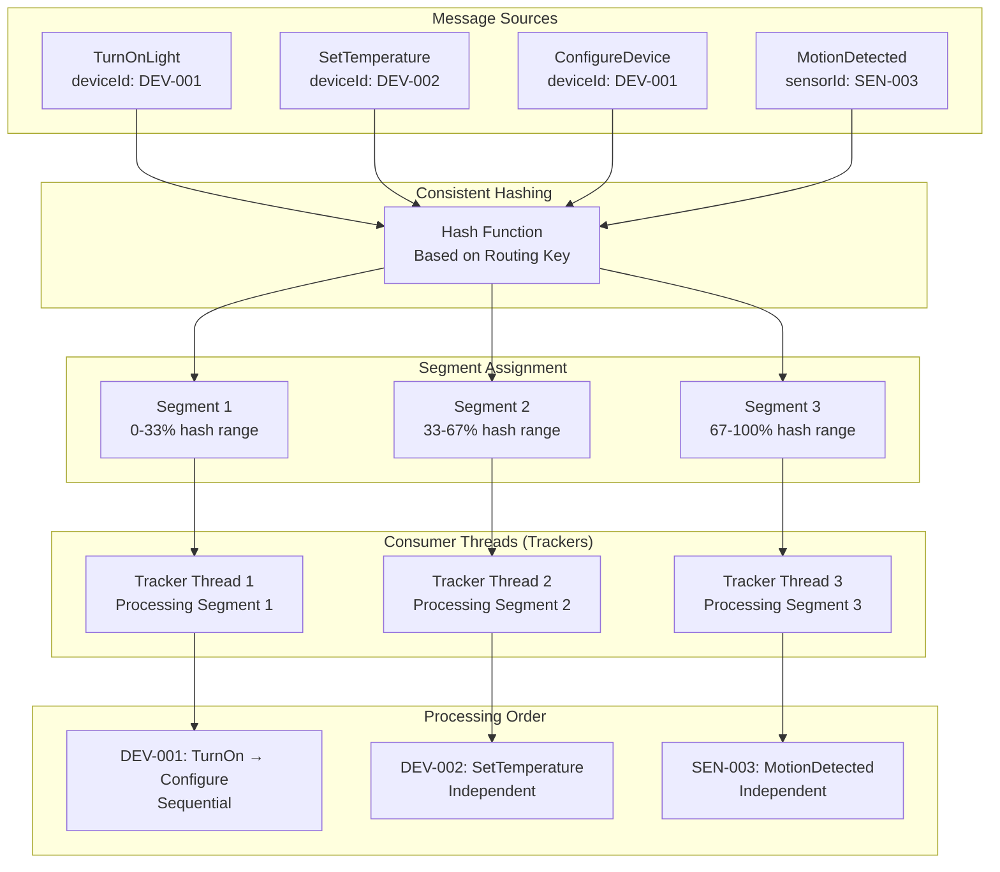

import { Tabs, TabItem, Card, CardGrid, Aside } from '@astrojs/starlight/components';

**Segments** in Fluxzero are processing units that enable both high parallelism and strict ordering guarantees. They use consistent hashing to ensure that messages about the same entity are always handled by the same consumer thread in the correct order, while allowing different entities to be processed concurrently across segments.

<Aside type="tip" title="Real-world analogy">
Think of segments like specialized work stations in a smart home factory. Each station (segment) handles all tasks for specific devices—so all "living room light" operations go to Station A, while "kitchen thermostat" operations go to Station B. This ensures each device's operations happen in the right order, while multiple devices can be worked on simultaneously across different stations.
</Aside>

## Key Concepts

<CardGrid>
<Card title="Consistent Assignment" icon="setting">
Messages are assigned to segments using consistent hashing based on routing keys, ensuring the same entity always routes to the same segment for ordering guarantees.
</Card>

<Card title="Parallel Processing" icon="rocket">
Different segments can process messages concurrently across multiple consumer threads, providing horizontal scalability while maintaining per-entity consistency.
</Card>

<Card title="Data Locality" icon="document">
Related messages processed in the same segment benefit from cache locality, allowing efficient in-memory state management and improved performance.
</Card>

<Card title="Load Distribution" icon="list-format">
Segments are automatically distributed across available consumer threads and instances, providing automatic load balancing and fault tolerance.
</Card>
</CardGrid>

## Segment Architecture



## Consumer Threading and Segment Distribution

### Basic Consumer Configuration

Configure consumers to use multiple threads (trackers) for parallel segment processing:

<Tabs>
<TabItem label="Java">
```java
// Single-threaded consumer processes one segment at a time
@Consumer(name = "basic-device-handler")
public class BasicDeviceHandler {
    
    @HandleCommand
    void handleTurnOnLight(@RoutingKey DeviceId deviceId, TurnOnLight command) {
        // All device operations handled sequentially by one thread
        log.info("Processing TurnOnLight for device: {}", deviceId);
        processLightCommand(deviceId, true);
    }
}

// Multi-threaded consumer processes multiple segments in parallel
@Consumer(
    name = "high-throughput-device-handler",
    threads = 4,           // 4 tracker threads for parallel processing
    maxFetchSize = 2048    // Larger batches for efficiency
)
public class HighThroughputDeviceHandler {
    
    // Thread-safe cache for device state management
    private final ConcurrentHashMap<DeviceId, DeviceState> deviceCache = 
        new ConcurrentHashMap<>();
    
    @HandleCommand
    void handleTurnOnLight(@RoutingKey DeviceId deviceId, TurnOnLight command) {
        // Each thread can process different devices in parallel
        // Same device always goes to same thread for consistency
        
        DeviceState state = deviceCache.computeIfAbsent(deviceId, 
            id -> loadDeviceState(id));
        
        state.turnOn();
        log.info("Thread {} processed TurnOnLight for device: {}", 
                Thread.currentThread().getName(), deviceId);
    }
    
    @HandleCommand
    void handleSetTemperature(@RoutingKey DeviceId deviceId, SetTemperature command) {
        // Thermostat commands for same device go to same thread
        DeviceState state = deviceCache.get(deviceId);
        if (state != null && state.getType() == DeviceType.THERMOSTAT) {
            state.setTemperature(command.temperature());
        }
    }
}
```
</TabItem>
<TabItem label="Kotlin">
```kotlin
// Single-threaded consumer processes one segment at a time
@Consumer(name = "basic-device-handler")
class BasicDeviceHandler {
    
    @HandleCommand
    fun handleTurnOnLight(@RoutingKey deviceId: DeviceId, command: TurnOnLight) {
        // All device operations handled sequentially by one thread
        log.info("Processing TurnOnLight for device: $deviceId")
        processLightCommand(deviceId, true)
    }
}

// Multi-threaded consumer processes multiple segments in parallel
@Consumer(
    name = "high-throughput-device-handler",
    threads = 4,           // 4 tracker threads for parallel processing
    maxFetchSize = 2048    // Larger batches for efficiency
)
class HighThroughputDeviceHandler {
    
    // Thread-safe cache for device state management
    private val deviceCache = ConcurrentHashMap<DeviceId, DeviceState>()
    
    @HandleCommand
    fun handleTurnOnLight(@RoutingKey deviceId: DeviceId, command: TurnOnLight) {
        // Each thread can process different devices in parallel
        // Same device always goes to same thread for consistency
        
        val state = deviceCache.computeIfAbsent(deviceId) { id -> 
            loadDeviceState(id) 
        }
        
        state.turnOn()
        log.info("Thread ${Thread.currentThread().name} processed TurnOnLight for device: $deviceId")
    }
    
    @HandleCommand
    fun handleSetTemperature(@RoutingKey deviceId: DeviceId, command: SetTemperature) {
        // Thermostat commands for same device go to same thread
        val state = deviceCache[deviceId]
        if (state != null && state.type == DeviceType.THERMOSTAT) {
            state.setTemperature(command.temperature)
        }
    }
}
```
</TabItem>
</Tabs>

### Automatic Load Balancing

Fluxzero automatically distributes segments across available consumer instances:

<Tabs>
<TabItem label="Java">
```java
// Scenario: 3 consumer instances with different thread configurations
public class LoadBalancingExample {
    
    // Instance A: 3 threads
    @Consumer(name = "device-processor-A", threads = 3)
    public class DeviceProcessorA {
        // Handles ~33% of segments (0-33% hash range)
        // Thread 1: Processes devices DEV-001, DEV-004, DEV-007...
        // Thread 2: Processes devices DEV-002, DEV-005, DEV-008...
        // Thread 3: Processes devices DEV-003, DEV-006, DEV-009...
    }
    
    // Instance B: 2 threads  
    @Consumer(name = "device-processor-B", threads = 2)
    public class DeviceProcessorB {
        // Handles ~33% of segments (33-67% hash range)
        // Thread 1: Processes devices DEV-010, DEV-013, DEV-016...
        // Thread 2: Processes devices DEV-011, DEV-014, DEV-017...
    }
    
    // Instance C: 1 thread
    @Consumer(name = "device-processor-C", threads = 1)
    public class DeviceProcessorC {
        // Handles ~33% of segments (67-100% hash range)
        // Thread 1: Processes devices DEV-012, DEV-015, DEV-018...
    }
    
    // Total: 6 tracker threads processing all segments in parallel
    // Each device consistently routes to same thread for ordering
}

// Smart home room-based segment distribution
@Consumer(name = "room-automation", threads = 8, maxFetchSize = 1024)
public class RoomAutomationHandler {
    
    private final Map<RoomId, RoomState> roomStateCache = new ConcurrentHashMap<>();
    
    @HandleCommand
    void setRoomAmbiance(@RoutingKey RoomId roomId, SetRoomAmbiance command) {
        // All room operations go to same segment/thread for consistency
        RoomState roomState = roomStateCache.computeIfAbsent(roomId, 
            id -> new RoomState(id));
        
        // Thread-safe since same room always uses same thread
        roomState.setBrightness(command.brightness());
        roomState.setTemperature(command.temperature());
        roomState.setColorScheme(command.colorScheme());
        
        log.info("Thread {} configured ambiance for room: {}", 
                Thread.currentThread().getName(), roomId);
        
        // Coordinate all devices in the room
        coordianteRoomDevices(roomState);
    }
    
    @HandleEvent
    void onDeviceAddedToRoom(@RoutingKey RoomId roomId, DeviceAddedToRoom event) {
        // Device changes for room processed by same thread as room commands
        RoomState roomState = roomStateCache.get(roomId);
        if (roomState != null) {
            roomState.addDevice(event.device());
            log.info("Added device {} to room {}", event.device().deviceId(), roomId);
        }
    }
}
```
</TabItem>
<TabItem label="Kotlin">
```kotlin
// Scenario: 3 consumer instances with different thread configurations
class LoadBalancingExample {
    
    // Instance A: 3 threads
    @Consumer(name = "device-processor-A", threads = 3)
    class DeviceProcessorA {
        // Handles ~33% of segments (0-33% hash range)
        // Thread 1: Processes devices DEV-001, DEV-004, DEV-007...
        // Thread 2: Processes devices DEV-002, DEV-005, DEV-008...
        // Thread 3: Processes devices DEV-003, DEV-006, DEV-009...
    }
    
    // Instance B: 2 threads  
    @Consumer(name = "device-processor-B", threads = 2)
    class DeviceProcessorB {
        // Handles ~33% of segments (33-67% hash range)
        // Thread 1: Processes devices DEV-010, DEV-013, DEV-016...
        // Thread 2: Processes devices DEV-011, DEV-014, DEV-017...
    }
    
    // Instance C: 1 thread
    @Consumer(name = "device-processor-C", threads = 1)
    class DeviceProcessorC {
        // Handles ~33% of segments (67-100% hash range)
        // Thread 1: Processes devices DEV-012, DEV-015, DEV-018...
    }
    
    // Total: 6 tracker threads processing all segments in parallel
    // Each device consistently routes to same thread for ordering
}

// Smart home room-based segment distribution
@Consumer(name = "room-automation", threads = 8, maxFetchSize = 1024)
class RoomAutomationHandler {
    
    private val roomStateCache = ConcurrentHashMap<RoomId, RoomState>()
    
    @HandleCommand
    fun setRoomAmbiance(@RoutingKey roomId: RoomId, command: SetRoomAmbiance) {
        // All room operations go to same segment/thread for consistency
        val roomState = roomStateCache.computeIfAbsent(roomId) { id -> 
            RoomState(id) 
        }
        
        // Thread-safe since same room always uses same thread
        roomState.brightness = command.brightness
        roomState.temperature = command.temperature
        roomState.colorScheme = command.colorScheme
        
        log.info("Thread ${Thread.currentThread().name} configured ambiance for room: $roomId")
        
        // Coordinate all devices in the room
        coordinateRoomDevices(roomState)
    }
    
    @HandleEvent
    fun onDeviceAddedToRoom(@RoutingKey roomId: RoomId, event: DeviceAddedToRoom) {
        // Device changes for room processed by same thread as room commands
        val roomState = roomStateCache[roomId]
        if (roomState != null) {
            roomState.addDevice(event.device)
            log.info("Added device ${event.device.deviceId} to room $roomId")
        }
    }
}
```
</TabItem>
</Tabs>

## Data Locality and Caching Benefits

### Entity-Centric Processing

Segments provide data locality benefits by ensuring related operations are processed together:

<Tabs>
<TabItem label="Java">
```java
@Consumer(name = "device-lifecycle-manager", threads = 6, maxFetchSize = 1024)
public class DeviceLifecycleManager {
    
    // Each thread maintains its own cache for its assigned devices
    // No synchronization needed since same device always goes to same thread
    private final Map<DeviceId, DeviceState> deviceCache = new HashMap<>();
    private final Map<DeviceId, List<DeviceMetric>> metricsCache = new HashMap<>();
    private final Map<DeviceId, DeviceSchedule> scheduleCache = new HashMap<>();
    
    @HandleCommand
    void addDevice(@RoutingKey DeviceId deviceId, AddDevice command) {
        // First operation for this device - initialize caches
        DeviceState state = new DeviceState(deviceId, command.deviceType(), 
                                           DeviceStatus.OFFLINE);
        deviceCache.put(deviceId, state);
        metricsCache.put(deviceId, new ArrayList<>());
        scheduleCache.put(deviceId, new DeviceSchedule(deviceId));
        
        log.info("Device {} initialized in cache by thread {}", 
                deviceId, Thread.currentThread().getName());
    }
    
    @HandleCommand
    void activateDevice(@RoutingKey DeviceId deviceId, ActivateDevice command) {
        // Subsequent operation - efficiently access cached state (no DB lookup)
        DeviceState state = deviceCache.get(deviceId);
        if (state != null) {
            state.setStatus(DeviceStatus.ONLINE);
            state.setActivatedAt(Instant.now());
            
            // Can also access other cached data for this device
            DeviceSchedule schedule = scheduleCache.get(deviceId);
            if (schedule != null && schedule.hasStartupSequence()) {
                executeStartupSequence(state, schedule);
            }
        }
    }
    
    @HandleEvent  
    void recordMetric(@RoutingKey DeviceId deviceId, DeviceMetricRecorded event) {
        // Metrics for same device processed by same thread - efficient aggregation
        List<DeviceMetric> metrics = metricsCache.get(deviceId);
        if (metrics != null) {
            metrics.add(new DeviceMetric(event.metricType(), event.value(), 
                                       event.timestamp()));
            
            // Can perform real-time analysis since all device data is local
            if (metrics.size() >= 100) {
                performRealTimeAnalysis(deviceId, metrics);
                metrics.clear(); // Reset for next batch
            }
        }
    }
    
    @HandleCommand
    void updateDeviceSchedule(@RoutingKey DeviceId deviceId, UpdateSchedule command) {
        // Schedule updates for same device are ordered and can access full context
        DeviceSchedule schedule = scheduleCache.get(deviceId);
        DeviceState state = deviceCache.get(deviceId);
        
        if (schedule != null && state != null) {
            schedule.updateSchedule(command.newSchedule());
            
            // Can immediately apply schedule if device is online
            if (state.getStatus() == DeviceStatus.ONLINE) {
                applyScheduleImmediately(state, schedule);
            }
        }
    }
    
    @HandleCommand
    void removeDevice(@RoutingKey DeviceId deviceId, RemoveDevice command) {
        // Cleanup all cached state when device is removed
        deviceCache.remove(deviceId);
        metricsCache.remove(deviceId);
        scheduleCache.remove(deviceId);
        
        log.info("Device {} removed from all caches", deviceId);
    }
}
```
</TabItem>
<TabItem label="Kotlin">
```kotlin
@Consumer(name = "device-lifecycle-manager", threads = 6, maxFetchSize = 1024)
class DeviceLifecycleManager {
    
    // Each thread maintains its own cache for its assigned devices
    // No synchronization needed since same device always goes to same thread
    private val deviceCache = mutableMapOf<DeviceId, DeviceState>()
    private val metricsCache = mutableMapOf<DeviceId, MutableList<DeviceMetric>>()
    private val scheduleCache = mutableMapOf<DeviceId, DeviceSchedule>()
    
    @HandleCommand
    fun addDevice(@RoutingKey deviceId: DeviceId, command: AddDevice) {
        // First operation for this device - initialize caches
        val state = DeviceState(deviceId, command.deviceType, DeviceStatus.OFFLINE)
        deviceCache[deviceId] = state
        metricsCache[deviceId] = mutableListOf()
        scheduleCache[deviceId] = DeviceSchedule(deviceId)
        
        log.info("Device $deviceId initialized in cache by thread ${Thread.currentThread().name}")
    }
    
    @HandleCommand
    fun activateDevice(@RoutingKey deviceId: DeviceId, command: ActivateDevice) {
        // Subsequent operation - efficiently access cached state (no DB lookup)
        val state = deviceCache[deviceId]
        if (state != null) {
            state.status = DeviceStatus.ONLINE
            state.activatedAt = Instant.now()
            
            // Can also access other cached data for this device
            val schedule = scheduleCache[deviceId]
            if (schedule?.hasStartupSequence() == true) {
                executeStartupSequence(state, schedule)
            }
        }
    }
    
    @HandleEvent  
    fun recordMetric(@RoutingKey deviceId: DeviceId, event: DeviceMetricRecorded) {
        // Metrics for same device processed by same thread - efficient aggregation
        val metrics = metricsCache[deviceId]
        if (metrics != null) {
            metrics.add(DeviceMetric(event.metricType, event.value, event.timestamp))
            
            // Can perform real-time analysis since all device data is local
            if (metrics.size >= 100) {
                performRealTimeAnalysis(deviceId, metrics)
                metrics.clear() // Reset for next batch
            }
        }
    }
    
    @HandleCommand
    fun updateDeviceSchedule(@RoutingKey deviceId: DeviceId, command: UpdateSchedule) {
        // Schedule updates for same device are ordered and can access full context
        val schedule = scheduleCache[deviceId]
        val state = deviceCache[deviceId]
        
        if (schedule != null && state != null) {
            schedule.updateSchedule(command.newSchedule)
            
            // Can immediately apply schedule if device is online
            if (state.status == DeviceStatus.ONLINE) {
                applyScheduleImmediately(state, schedule)
            }
        }
    }
    
    @HandleCommand
    fun removeDevice(@RoutingKey deviceId: DeviceId, command: RemoveDevice) {
        // Cleanup all cached state when device is removed
        deviceCache.remove(deviceId)
        metricsCache.remove(deviceId)
        scheduleCache.remove(deviceId)
        
        log.info("Device $deviceId removed from all caches")
    }
}
```
</TabItem>
</Tabs>

## Segment Configuration and Performance Tuning

### Consumer Configuration Options

Configure consumer threading and batch processing for optimal segment utilization:

<Tabs>
<TabItem label="Java">
```java
// Low-latency real-time processing
@Consumer(
    name = "security-alerts", 
    threads = 1,        // Single thread for minimal latency
    maxFetchSize = 64   // Small batches for quick response
)
public class SecurityAlertHandler {
    
    @HandleEvent
    void handleSecurityBreach(@RoutingKey HomeId homeId, SecurityBreach event) {
        // Process security events immediately with minimal batching
        triggerAlarm(homeId, event);
        notifySecurityService(event);
    }
}

// High-throughput batch processing
@Consumer(
    name = "analytics-processor",
    threads = 8,         // Multiple threads for parallel processing
    maxFetchSize = 4096  // Large batches for efficiency
)
@Stateful(commitInBatch = true)  // Defer database commits for better performance
public class AnalyticsProcessor {
    
    private final Map<DeviceId, DeviceAnalytics> analyticsBuffer = new ConcurrentHashMap<>();
    
    @HandleEvent
    void processDeviceReading(@RoutingKey DeviceId deviceId, SensorReading event) {
        // Buffer readings for batch processing - commits happen at end of batch
        DeviceAnalytics analytics = analyticsBuffer.computeIfAbsent(deviceId, 
            id -> new DeviceAnalytics(id));
        
        analytics.addReading(event.getValue(), event.getTimestamp());
        
        // Real-time calculations can be done without persistence until batch commit
        if (analytics.hasAnomalousReading()) {
            flagForInvestigation(deviceId, analytics);
        }
    }
    
    // Batch commit happens automatically when message batch completes
    // All analytics updates are persisted together for better performance
}

// Balanced configuration for typical business logic
@Consumer(
    name = "device-command-processor",
    threads = 4,          // Moderate parallelism
    maxFetchSize = 1024   // Standard batch size
)
public class DeviceCommandProcessor {
    
    @HandleCommand
    void processDeviceCommand(@RoutingKey DeviceId deviceId, DeviceCommand command) {
        // Standard processing with good balance of latency and throughput
        DeviceState state = loadDeviceState(deviceId);
        
        switch (command.getType()) {
            case TURN_ON -> handleTurnOn(state, command);
            case TURN_OFF -> handleTurnOff(state, command);
            case CONFIGURE -> handleConfigure(state, command);
            case CALIBRATE -> handleCalibrate(state, command);
        }
        
        saveDeviceState(state);
    }
}
```
</TabItem>
<TabItem label="Kotlin">
```kotlin
// Low-latency real-time processing
@Consumer(
    name = "security-alerts", 
    threads = 1,        // Single thread for minimal latency
    maxFetchSize = 64   // Small batches for quick response
)
class SecurityAlertHandler {
    
    @HandleEvent
    fun handleSecurityBreach(@RoutingKey homeId: HomeId, event: SecurityBreach) {
        // Process security events immediately with minimal batching
        triggerAlarm(homeId, event)
        notifySecurityService(event)
    }
}

// High-throughput batch processing
@Consumer(
    name = "analytics-processor",
    threads = 8,         // Multiple threads for parallel processing
    maxFetchSize = 4096  // Large batches for efficiency
)
@Stateful(commitInBatch = true)  // Defer database commits for better performance
class AnalyticsProcessor {
    
    private val analyticsBuffer = ConcurrentHashMap<DeviceId, DeviceAnalytics>()
    
    @HandleEvent
    fun processDeviceReading(@RoutingKey deviceId: DeviceId, event: SensorReading) {
        // Buffer readings for batch processing - commits happen at end of batch
        val analytics = analyticsBuffer.computeIfAbsent(deviceId) { id -> 
            DeviceAnalytics(id) 
        }
        
        analytics.addReading(event.value, event.timestamp)
        
        // Real-time calculations can be done without persistence until batch commit
        if (analytics.hasAnomalousReading()) {
            flagForInvestigation(deviceId, analytics)
        }
    }
    
    // Batch commit happens automatically when message batch completes
    // All analytics updates are persisted together for better performance
}

// Balanced configuration for typical business logic
@Consumer(
    name = "device-command-processor",
    threads = 4,          // Moderate parallelism
    maxFetchSize = 1024   // Standard batch size
)
class DeviceCommandProcessor {
    
    @HandleCommand
    fun processDeviceCommand(@RoutingKey deviceId: DeviceId, command: DeviceCommand) {
        // Standard processing with good balance of latency and throughput
        val state = loadDeviceState(deviceId)
        
        when (command.type) {
            CommandType.TURN_ON -> handleTurnOn(state, command)
            CommandType.TURN_OFF -> handleTurnOff(state, command)
            CommandType.CONFIGURE -> handleConfigure(state, command)
            CommandType.CALIBRATE -> handleCalibrate(state, command)
        }
        
        saveDeviceState(state)
    }
}
```
</TabItem>
</Tabs>

### Segment Routing Override

Use segment routing overrides for specialized processing patterns:

<Tabs>
<TabItem label="Java">
```java
// Override routing for specialized processing
@Consumer(ignoreSegment = true)  // Required when overriding routing keys
public class SpecializedDeviceHandler {
    
    @HandleCommand
    @RoutingKey("deviceType")  // Route by device type instead of device ID
    void handleDeviceCalibration(CalibrateDevice command) {
        // All thermostat calibrations go to thermostat specialist thread
        // All camera calibrations go to camera specialist thread
        // This provides specialized expertise per device type
        
        DeviceType type = command.deviceType();
        
        switch (type) {
            case THERMOSTAT -> {
                // Specialized thermostat calibration logic
                ThermostatCalibrator calibrator = getThermostatCalibrator();
                calibrator.calibrate(command.deviceId(), command.settings());
                
                log.info("Thermostat {} calibrated by specialist", command.deviceId());
            }
            case CAMERA -> {
                // Specialized camera calibration logic  
                CameraCalibrator calibrator = getCameraCalibrator();
                calibrator.calibrate(command.deviceId(), command.settings());
                
                log.info("Camera {} calibrated by specialist", command.deviceId());
            }
            case LIGHT -> {
                // Specialized lighting calibration logic
                LightCalibrator calibrator = getLightCalibrator();
                calibrator.calibrate(command.deviceId(), command.settings());
                
                log.info("Light {} calibrated by specialist", command.deviceId());
            }
        }
    }
    
    @HandleEvent
    @RoutingKey("#metadata.tenantId")  // Route by tenant ID from metadata
    void handleMultiTenantAnalytics(DeviceEvent event, Message<?> message) {
        // All analytics for same tenant processed together
        String tenantId = message.getMetaData().get("tenantId", String.class);
        
        TenantAnalyticsProcessor processor = getTenantProcessor(tenantId);
        processor.processEvent(event);
        
        log.info("Event processed for tenant {} by specialized handler", tenantId);
    }
    
    @HandleQuery
    @RoutingKey("regionId")  // Route by geographic region
    List<DeviceStats> getRegionalDeviceStats(GetRegionalDeviceStats query) {
        // Regional queries handled by region-specialized threads
        // Provides geographic data locality and compliance
        
        String regionId = query.regionId();
        RegionalStatsProcessor processor = getRegionalProcessor(regionId);
        
        return processor.generateStats(query.fromDate(), query.toDate());
    }
}

// Consumer configuration for programmatic segment management
@Service
public class ConsumerConfigurationService {
    
    public void configureReplayConsumer(String consumerName, Instant replayFrom, Instant replayTo) {
        long minIndex = IndexUtils.indexFromTimestamp(replayFrom);
        long maxIndex = IndexUtils.indexFromTimestamp(replayTo);
        
        // Create time-bounded replay consumer that processes specific segments
        ConsumerConfiguration replayConfig = ConsumerConfiguration.builder()
            .name(consumerName)
            .minIndex(minIndex)
            .maxIndexExclusive(maxIndex)
            .exclusive(false)      // Run alongside live consumers
            .threads(2)            // Dedicated threads for replay
            .maxFetchSize(4096)    // Large batches for efficiency
            .build();
        
        // Register consumer for specific message types
        FluxCapacitor.client()
            .addConsumerConfiguration(replayConfig, MessageType.EVENT);
            
        log.info("Configured replay consumer {} for period {} to {}", 
                consumerName, replayFrom, replayTo);
    }
    
    public void reconfigureConsumerThreads(String consumerName, int newThreadCount) {
        // Dynamically adjust consumer threading for load management
        ConsumerConfiguration newConfig = ConsumerConfiguration.builder()
            .name(consumerName)
            .threads(newThreadCount)
            .build();
            
        FluxCapacitor.client()
            .updateConsumerConfiguration(newConfig);
            
        log.info("Updated consumer {} to use {} threads", consumerName, newThreadCount);
    }
}
```
</TabItem>
<TabItem label="Kotlin">
```kotlin
// Override routing for specialized processing
@Consumer(ignoreSegment = true)  // Required when overriding routing keys
class SpecializedDeviceHandler {
    
    @HandleCommand
    @RoutingKey("deviceType")  // Route by device type instead of device ID
    fun handleDeviceCalibration(command: CalibrateDevice) {
        // All thermostat calibrations go to thermostat specialist thread
        // All camera calibrations go to camera specialist thread
        // This provides specialized expertise per device type
        
        val type = command.deviceType
        
        when (type) {
            DeviceType.THERMOSTAT -> {
                // Specialized thermostat calibration logic
                val calibrator = getThermostatCalibrator()
                calibrator.calibrate(command.deviceId, command.settings)
                
                log.info("Thermostat ${command.deviceId} calibrated by specialist")
            }
            DeviceType.CAMERA -> {
                // Specialized camera calibration logic  
                val calibrator = getCameraCalibrator()
                calibrator.calibrate(command.deviceId, command.settings)
                
                log.info("Camera ${command.deviceId} calibrated by specialist")
            }
            DeviceType.LIGHT -> {
                // Specialized lighting calibration logic
                val calibrator = getLightCalibrator()
                calibrator.calibrate(command.deviceId, command.settings)
                
                log.info("Light ${command.deviceId} calibrated by specialist")
            }
        }
    }
    
    @HandleEvent
    @RoutingKey("#metadata.tenantId")  // Route by tenant ID from metadata
    fun handleMultiTenantAnalytics(event: DeviceEvent, message: Message<*>) {
        // All analytics for same tenant processed together
        val tenantId = message.metaData["tenantId"] as String
        
        val processor = getTenantProcessor(tenantId)
        processor.processEvent(event)
        
        log.info("Event processed for tenant $tenantId by specialized handler")
    }
    
    @HandleQuery
    @RoutingKey("regionId")  // Route by geographic region
    fun getRegionalDeviceStats(query: GetRegionalDeviceStats): List<DeviceStats> {
        // Regional queries handled by region-specialized threads
        // Provides geographic data locality and compliance
        
        val regionId = query.regionId
        val processor = getRegionalProcessor(regionId)
        
        return processor.generateStats(query.fromDate, query.toDate)
    }
}

// Consumer configuration for programmatic segment management
@Service
class ConsumerConfigurationService {
    
    fun configureReplayConsumer(consumerName: String, replayFrom: Instant, replayTo: Instant) {
        val minIndex = IndexUtils.indexFromTimestamp(replayFrom)
        val maxIndex = IndexUtils.indexFromTimestamp(replayTo)
        
        // Create time-bounded replay consumer that processes specific segments
        val replayConfig = ConsumerConfiguration.builder()
            .name(consumerName)
            .minIndex(minIndex)
            .maxIndexExclusive(maxIndex)
            .exclusive(false)      // Run alongside live consumers
            .threads(2)            // Dedicated threads for replay
            .maxFetchSize(4096)    // Large batches for efficiency
            .build()
        
        // Register consumer for specific message types
        FluxCapacitor.client()
            .addConsumerConfiguration(replayConfig, MessageType.EVENT)
            
        log.info("Configured replay consumer $consumerName for period $replayFrom to $replayTo")
    }
    
    fun reconfigureConsumerThreads(consumerName: String, newThreadCount: Int) {
        // Dynamically adjust consumer threading for load management
        val newConfig = ConsumerConfiguration.builder()
            .name(consumerName)
            .threads(newThreadCount)
            .build()
            
        FluxCapacitor.client()
            .updateConsumerConfiguration(newConfig)
            
        log.info("Updated consumer $consumerName to use $newThreadCount threads")
    }
}
```
</TabItem>
</Tabs>

## Segment Configuration Summary

| Configuration | Default | Purpose | Example Use Case |
|---------------|---------|---------|------------------|
| **threads** | 1 | Number of parallel tracker threads | `threads = 4` for high-throughput processing |
| **maxFetchSize** | 1024 | Messages fetched per batch | `maxFetchSize = 4096` for bulk operations |
| **exclusive** | true | Whether consumer excludes others | `exclusive = false` for replay consumers |
| **ignoreSegment** | false | Required for handler-level routing overrides | `ignoreSegment = true` with `@RoutingKey` on handlers |

## Best Practices

### 1. Choose Thread Count Based on Workload
```java
// CPU-intensive work: Match thread count to CPU cores
@Consumer(name = "analytics", threads = Runtime.getRuntime().availableProcessors())

// I/O-intensive work: Higher thread count for better utilization  
@Consumer(name = "external-api-calls", threads = 16)

// Low-latency work: Single thread to minimize context switching
@Consumer(name = "real-time-alerts", threads = 1, maxFetchSize = 32)
```

### 2. Optimize Batch Sizes for Performance
```java
// Large batches for throughput-focused consumers
@Consumer(name = "bulk-processing", maxFetchSize = 4096)
@Stateful(commitInBatch = true)

// Small batches for latency-focused consumers  
@Consumer(name = "interactive-commands", maxFetchSize = 64)
```

### 3. Use Data Locality for Caching
```java
// Leverage segment consistency for efficient caching
@Consumer(name = "device-state-manager")
public class DeviceStateManager {
    
    // No synchronization needed - same device always on same thread
    private final Map<DeviceId, DeviceState> deviceCache = new HashMap<>();
    
    @HandleCommand
    void updateDevice(@RoutingKey DeviceId deviceId, UpdateDevice command) {
        // Efficiently access cached state
        DeviceState state = deviceCache.computeIfAbsent(deviceId, 
            id -> loadFromDatabase(id));
        state.update(command);
    }
}
```

### 4. Handle Routing Overrides Carefully
```java
// Always use ignoreSegment = true with handler-level routing
@Consumer(ignoreSegment = true)  // REQUIRED - prevents silent message skipping
public class SpecializedHandler {
    
    @HandleCommand
    @RoutingKey("specialField")  // Override default routing
    void handleSpecialCase(SpecialCommand command) {
        // Custom routing logic
    }
}
```

### 5. Monitor Segment Performance
```java
// Track segment load and processing metrics
@HandleEvent
void trackProcessingMetrics(DeviceEvent event) {
    String threadName = Thread.currentThread().getName();
    String segmentId = extractSegmentFromThread(threadName);
    
    metricsGateway.publish(new SegmentProcessingMetric(
        segmentId, event.getClass().getSimpleName(), Instant.now()));
}
```

## Common Segment Patterns

### Smart Home Segment Strategies

<Tabs>
<TabItem label="Java">
```java
public class SmartHomeSegmentPatterns {
    
    // 1. Device-level segments - Maximum parallelism
    @Consumer(name = "device-operations", threads = 8)
    public class DeviceOperationHandler {
        @HandleCommand
        void handle(@RoutingKey DeviceId deviceId, DeviceCommand command) {
            // Each device processed independently across segments
        }
    }
    
    // 2. Room-level segments - Coordinated device control
    @Consumer(name = "room-automation", threads = 4)  
    public class RoomAutomationHandler {
        @HandleCommand
        void handle(@RoutingKey RoomId roomId, RoomCommand command) {
            // All devices in room coordinated by same segment
        }
    }
    
    // 3. Home-level segments - System-wide coordination
    @Consumer(name = "home-management", threads = 2)
    public class HomeManagementHandler {
        @HandleCommand  
        void handle(@RoutingKey HomeId homeId, HomeCommand command) {
            // Entire home state managed by same segment
        }
    }
    
    // 4. Specialized segments - Expert processing
    @Consumer(name = "security-specialist", threads = 1, ignoreSegment = true)
    public class SecuritySpecialistHandler {
        @HandleEvent
        @RoutingKey("eventType") // Route by event type for specialization
        void handle(SecurityEvent event) {
            // Security events handled by specialized processor
        }
    }
}
```
</TabItem>
<TabItem label="Kotlin">
```kotlin
class SmartHomeSegmentPatterns {
    
    // 1. Device-level segments - Maximum parallelism
    @Consumer(name = "device-operations", threads = 8)
    class DeviceOperationHandler {
        @HandleCommand
        fun handle(@RoutingKey deviceId: DeviceId, command: DeviceCommand) {
            // Each device processed independently across segments
        }
    }
    
    // 2. Room-level segments - Coordinated device control
    @Consumer(name = "room-automation", threads = 4)  
    class RoomAutomationHandler {
        @HandleCommand
        fun handle(@RoutingKey roomId: RoomId, command: RoomCommand) {
            // All devices in room coordinated by same segment
        }
    }
    
    // 3. Home-level segments - System-wide coordination
    @Consumer(name = "home-management", threads = 2)
    class HomeManagementHandler {
        @HandleCommand  
        fun handle(@RoutingKey homeId: HomeId, command: HomeCommand) {
            // Entire home state managed by same segment
        }
    }
    
    // 4. Specialized segments - Expert processing
    @Consumer(name = "security-specialist", threads = 1, ignoreSegment = true)
    class SecuritySpecialistHandler {
        @HandleEvent
        @RoutingKey("eventType") // Route by event type for specialization
        fun handle(event: SecurityEvent) {
            // Security events handled by specialized processor
        }
    }
}
```
</TabItem>
</Tabs>

## Troubleshooting Segments

### Common Issues

<Aside type="caution" title="Hot segments (uneven load distribution)">
**Symptoms**: Some threads overloaded while others idle, poor overall performance

**Solutions**:
- Review routing key distribution patterns
- Use more granular routing keys for better spread
- Monitor segment load with metrics
- Consider using composite routing keys for better hashing
- Avoid routing keys with low cardinality (few unique values)
</Aside>

<Aside type="caution" title="Message ordering violations">
**Symptoms**: Operations for same entity processed out of order

**Solutions**:
- Ensure consistent routing key usage across related messages
- Verify @RoutingKey annotations are correctly applied
- Check for handler-level routing overrides without ignoreSegment = true
- Confirm entity IDs are used correctly as routing keys
</Aside>

<Aside type="caution" title="Poor cache performance">
**Symptoms**: High database load, slow response times despite caching

**Solutions**:
- Verify same entity routes to same segment consistently
- Check thread count vs. cache size - too many threads dilute cache effectiveness
- Monitor cache hit rates per thread
- Consider entity-centric routing strategies
</Aside>

<Aside type="caution" title="Handler routing override issues">
**Symptoms**: Messages silently skipped, inconsistent processing

**Solutions**:
- Always use ignoreSegment = true with handler-level @RoutingKey
- Test routing overrides thoroughly in development
- Monitor message processing counts for unexpected drops
- Use handler-level routing sparingly - prefer field-level routing
</Aside>

## Testing Segment Behavior

<Tabs>
<TabItem label="Java">
```java
public class SegmentBehaviorTest {
    
    @Test
    void shouldProcessSameEntityInOrder() {
        DeviceId deviceId = DeviceId.generate();
        
        testFixture
            .whenCommand(new AddDevice(deviceId, "Smart Light"))
            .expectEvents(new DeviceAdded(deviceId, "Smart Light"))
            .andThen()
            .whenCommand(new ActivateDevice(deviceId))
            .expectEvents(new DeviceActivated(deviceId))
            .andThen()
            .whenCommand(new TurnOnLight(deviceId))
            .expectEvents(new LightTurnedOn(deviceId));
            
        // All commands for same device processed sequentially by same segment
    }
    
    @Test 
    void shouldProcessDifferentEntitiesInParallel() {
        DeviceId device1 = DeviceId.generate();
        DeviceId device2 = DeviceId.generate();
        
        testFixture
            .whenCommands(
                new TurnOnLight(device1),
                new TurnOnLight(device2)
            )
            .expectEvents(
                new LightTurnedOn(device1),
                new LightTurnedOn(device2)
            );
            
        // Commands for different devices can be processed in parallel
    }
    
    @Test
    void shouldMaintainDataLocality() {
        // Test that cache benefits work correctly
        DeviceId deviceId = DeviceId.generate();
        
        // Simulate multiple operations that should benefit from caching
        IntStream.range(0, 10)
            .forEach(i -> testFixture
                .whenCommand(new UpdateDeviceSettings(deviceId, 
                    Map.of("brightness", i * 10)))
                .expectEvents(new DeviceSettingsUpdated(deviceId, 
                    Map.of("brightness", i * 10))));
                    
        // All operations should be processed by same segment/thread for caching
    }
}
```
</TabItem>
<TabItem label="Kotlin">
```kotlin
class SegmentBehaviorTest {
    
    @Test
    fun shouldProcessSameEntityInOrder() {
        val deviceId = DeviceId.generate()
        
        testFixture
            .whenCommand(AddDevice(deviceId, "Smart Light"))
            .expectEvents(DeviceAdded(deviceId, "Smart Light"))
            .andThen()
            .whenCommand(ActivateDevice(deviceId))
            .expectEvents(DeviceActivated(deviceId))
            .andThen()
            .whenCommand(TurnOnLight(deviceId))
            .expectEvents(LightTurnedOn(deviceId))
            
        // All commands for same device processed sequentially by same segment
    }
    
    @Test 
    fun shouldProcessDifferentEntitiesInParallel() {
        val device1 = DeviceId.generate()
        val device2 = DeviceId.generate()
        
        testFixture
            .whenCommands(
                TurnOnLight(device1),
                TurnOnLight(device2)
            )
            .expectEvents(
                LightTurnedOn(device1),
                LightTurnedOn(device2)
            )
            
        // Commands for different devices can be processed in parallel
    }
    
    @Test
    fun shouldMaintainDataLocality() {
        // Test that cache benefits work correctly
        val deviceId = DeviceId.generate()
        
        // Simulate multiple operations that should benefit from caching
        (0..9).forEach { i ->
            testFixture
                .whenCommand(UpdateDeviceSettings(deviceId, 
                    mapOf("brightness" to i * 10)))
                .expectEvents(DeviceSettingsUpdated(deviceId, 
                    mapOf("brightness" to i * 10)))
        }
                    
        // All operations should be processed by same segment/thread for caching
    }
}
```
</TabItem>
</Tabs>

## Related Concepts

- **[Routing Keys](/reference/core-components/routing-key)** - How messages are assigned to specific segments
- **[Handlers](/reference/core-components/handler)** - Processing components that run within segments  
- **[Aggregates](/reference/core-components/aggregate)** - How entity IDs automatically provide segment routing
- **[Message Log](/reference/core-components/message-log)** - Storage system that segments read messages from
- **[Commands](/reference/core-components/command)** - Messages that are distributed across segments for processing
- **[Events](/reference/core-components/event)** - Messages processed by segments to maintain consistency